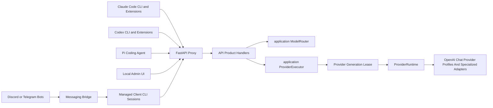
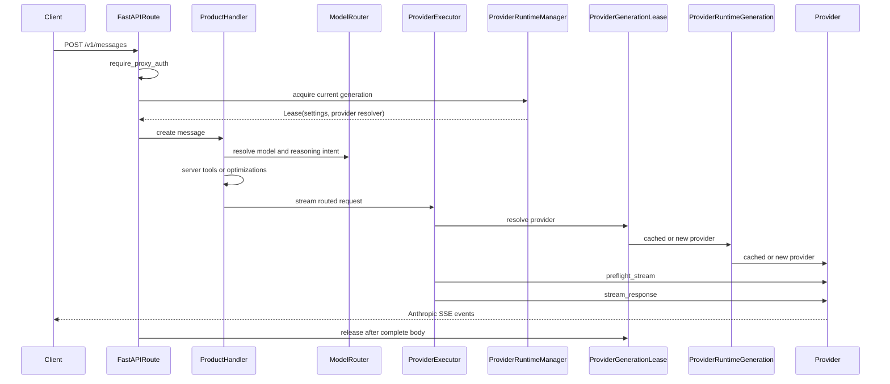
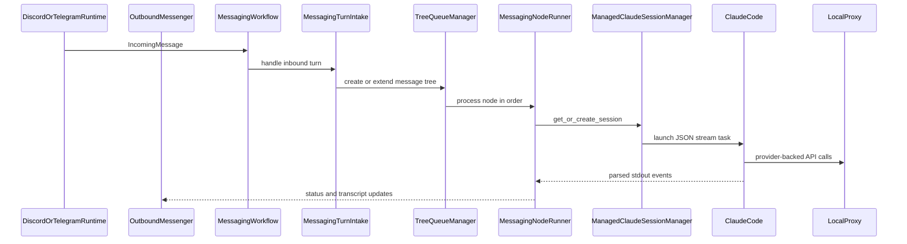

# Architecture

This document is a maintainer-oriented map of My Claude Code (MCC). It explains the
runtime boundaries, request flows, provider abstraction, configuration model,
optional messaging bridge, and verification strategy.

For installation, provider setup, and user-facing usage, see
[README.md](README.md). This file focuses on where behavior lives in the codebase
and how contributors should extend it.

## System Overview

My Claude Code is a local proxy for agent clients. It accepts Anthropic
Messages traffic from Claude Code and Pi clients and OpenAI Responses traffic
from Codex clients, routes the request to a configured upstream provider, and
preserves the wire protocol expected by the caller.

There are three runtime surfaces:

- HTTP proxy: FastAPI routes expose Anthropic-compatible, Responses-compatible,
  health, model-listing, stop, and admin endpoints.
- CLI launchers: wrapper entrypoints prepare Claude Code, Codex, Pi, OpenCode, OpenCode 2 and Kilo sessions
  so they target the local proxy.
- Messaging bridge: optional Discord or Telegram adapters turn chat messages
  into managed client CLI sessions.



## Package Boundaries

The installable wheel packages are declared in [pyproject.toml](pyproject.toml):

- [src/my_claude_code/application/](src/my_claude_code/application/) is the dependency-leaf application boundary. It
  owns immutable routing/model-metadata values, model routing, shared provider
  execution, the consumer-facing `ProviderPort`, request-runtime lease ports,
  task control, and deterministic request/readiness errors. It depends only on
  configuration and core protocol-neutral logic.
- [src/my_claude_code/api/](src/my_claude_code/api/) is the HTTP adapter. It owns the FastAPI app, routes, API product
  handlers, local optimizations, model-catalog responses, HTTP error mapping,
  response commit timing, and Admin-specific ports. It consumes application and
  protocol types instead of defining use cases or wire schemas.
- [src/my_claude_code/cli/](src/my_claude_code/cli/) owns console entrypoints, client CLI launchers, process/session
  management, and client adapter contracts.
- [src/my_claude_code/config/](src/my_claude_code/config/) owns settings, provider metadata, filesystem paths,
  logging setup, constants, and provider ID catalogs.
- [src/my_claude_code/core/](src/my_claude_code/core/) owns provider-neutral protocol logic: wire request and response
  models, Anthropic conversion, SSE construction, OpenAI Responses conversion,
  canonical execution-failure semantics, credential-safe diagnostics, token
  counting, and structured trace helpers. It never classifies provider SDK or
  HTTP client exceptions.
- [src/my_claude_code/messaging/](src/my_claude_code/messaging/) owns optional platform adapters, incoming message
  handling, tree queues, transcript rendering, persistence, commands, and voice
  support.
- [src/my_claude_code/providers/](src/my_claude_code/providers/) owns provider construction, the shared OpenAI-chat
  provider, specialized adapters, SDK/HTTP failure classification, retry and
  recovery policy (including the fleet-wide upstream recovery ladder in
  [providers/recovery/](src/my_claude_code/providers/recovery/)), rate limiting, model
  listing, and concrete provider adapters.
- [src/my_claude_code/runtime/](src/my_claude_code/runtime/) is the process composition root. It owns application
  startup and shutdown, provider generations, Admin runtime operations, and the
  concrete wiring between API, providers, messaging, and managed CLI sessions.

[tests/](tests/) contains deterministic unit and contract coverage.
[smoke/](smoke/) contains local and live product smoke tests that can launch
subprocesses or touch real services.

Production package imports follow one least-privilege dependency policy. Every
listed edge is exercised by the current code; removing the last use of an edge
also removes that permission:

| Package | Exact allowed direct dependencies |
| --- | --- |
| `config` | none |
| `core` | none |
| `application` | `config`, `core` |
| `messaging` | `core` |
| `providers` | `application`, `config`, `core` |
| `api` | `application`, `config`, `core` |
| `cli` | `config`, `core` |
| `runtime` | `api`, `application`, `cli`, `config`, `core`, `messaging`, `providers` |

There is one exact exception:
`my_claude_code.cli.entrypoints` imports
`my_claude_code.runtime.bootstrap` because the installed server executable
delegates construction to the process composition root. The exception does not
permit any broader dependency from `cli` to `runtime`. Every new top-level
package or cross-package edge must be added to the policy deliberately.

Internal modules do not import an ancestor package facade; package initializers
may import dependency leaves to publish supported exports. Code outside
`core.openai_responses` and `messaging.trees` consumes those owners through their
package facades. The supported top-level messaging extension surface is
`IncomingMessage`, `MessageScope`, `ManagedClaudeSessionProtocol`,
`ManagedClaudeSessionManagerProtocol`, and `OutboundMessenger`; workflow,
persistence, parsing, and mutable tree implementations remain internal.

Optional voice dependencies also have exact lazy owners:

| Dependency | Owner |
| --- | --- |
| `torch`, `transformers`, `librosa` | `messaging.transcription` |
| `riva.client` | `providers.nvidia_nim.voice` |

They must be imported below a function boundary so importing the application or
server does not require an optional extra. Static AST enforcement cannot observe
dynamic imports. Deliberate provider factory loading is instead protected by the
provider catalog, supported-ID, and factory synchronization contract.

Four *required* dependencies are also imported below a function boundary, for
cost rather than optionality. Building the ASGI app must not load them, because
nothing between process launch and the first `/health` 200 asks any of them a
question:

| Dependency | First caller that loads it |
| --- | --- |
| `openai` | `providers.openai_chat.provider.OpenAIChatProvider.__init__` builds the client through a module-level `__getattr__`, so `provider.AsyncOpenAI` is still the patchable seam every provider test uses; the exception-class questions in `providers.failure_policy`, `providers.credential_rotation`, `providers.stream_recovery`, `providers.recovery.complaint`, `providers.openai_chat.usage` and `providers.nvidia_nim.client` import the SDK inside the function that asks |
| `openpyxl` | `core.export.render_xlsx` |
| `aiohttp` | `api.web_tools.outbound`, reached from `api.handlers.messages` only for a request carrying a web server tool, and never through the `api.web_tools` package facade (its re-exports resolve through `__getattr__`) |
| `tiktoken` | `core.token_encoder.cl100k_encoder`, the one shared `cl100k_base` build behind every token count |

`tests/contracts/test_startup_import_cost.py` pins this: a fresh interpreter
that imports `runtime.bootstrap` and `api.app` must have loaded none of the
four. Adding an eager import of any of them, anywhere the app builder reaches,
fails that contract.

[core/version.py](src/my_claude_code/core/version.py) is the sole runtime owner
of the FCC release version. It reads installed distribution metadata for
FastAPI/OpenAPI, FCC-owned CLI `--version` output, and the outbound web-tools
user agent. A source-only checkout without installed metadata reports the
explicit `0+unknown` fallback; runtime code never parses `pyproject.toml` or
duplicates a release literal. Client launcher arguments remain transparent to
their wrapped clients except for FCC-owned ephemeral provider configuration.

The main ownership rule is that Anthropic and Responses protocol schemas and
shared protocol behavior belong in [src/my_claude_code/core/](src/my_claude_code/core/), while request routing and
provider execution belong in [src/my_claude_code/application/](src/my_claude_code/application/). Routes use core schemas
directly for wire validation and call application use cases. Provider modules use
the same concrete request types and neutral helpers instead of importing the API
adapter or another provider.
Protocol consumers use the public `core.anthropic` and
`core.openai_responses` facades. Low-level Anthropic core and provider modules
may import the dependency-leaf Anthropic `models.py` module directly so their
type dependency is explicit; Responses consumers outside its owner remain
facade-only. Package initialization and those leaves must remain import-order safe.
The model-list schema stays beside its API-owned construction policy in
`api/model_catalog.py`; there is no generic API model package.

## Customer-Facing Contract

FCC optimizes for installed user workflows, not internal compatibility. The
behavior that must be preserved is that these user-facing surfaces run correctly
for real prompts against supported providers:

- `fcc-server` and the local Admin UI for configuring supported providers,
  model routing, auth, server tools, messaging, and diagnostics.
- `fcc-claude`/`fcc-claude-old`, Claude Code, and the Anthropic-compatible proxy
  behavior Claude Code relies on, including streaming text, native/interleaved
  thinking, tool use/results, model discovery, token counting, retries/recovery,
  and supported local server-tool behavior.
- `fcc-codex`, Codex CLI/extensions, and the streaming OpenAI Responses behavior
  Codex relies on, including native/interleaved reasoning, function and custom
  tool calls, generated `/model` catalog support, Responses stream lifecycle
  events, and Responses-to-Anthropic conversion at the adapter boundary.
- `fcc-pi`, Pi, and the Anthropic-compatible proxy behavior Pi relies on,
  including an FCC-scoped model catalog, streaming text and reasoning, and tool
  use/results.
- Configured Discord and Telegram messaging bridges, including command handling,
  reply-based conversation branches, status updates, transcript rendering,
  managed Claude/Codex task execution where configured, task stop/clear flows,
  persistence, and optional voice-note transcription.
- Installation, update, init, and uninstall scripts insofar as they make the
  above workflows available on a user's machine.

Internal modules, class designs, helper APIs, route implementations, and tests
are not stable contracts. Refactors may replace or remove them when doing so
simplifies the system, improves correctness, or better matches these
architecture boundaries. When tests primarily encode an obsolete internal shape,
update the tests to assert the customer-facing behavior instead. Features,
compatibility shims, endpoints, or helper paths that do not serve one of the
surfaces above are not product requirements and should be removed rather than
preserved.

The supported messaging extension surface consists of transport ingress values,
platform ports, and managed-session protocols. Tree aggregates, processors,
repositories, transition values, and package-level re-exports of those
implementation types are internal; they are not a versioned Python SDK surface.

## Design Pressure And Refactor Targets

The current package boundaries are intentional, but several modules still carry
large orchestration responsibilities. Treat these as refactor targets, not as
new places to add unrelated behavior:

- [api/handlers/](src/my_claude_code/api/handlers/) owns customer-facing API product flows:
  Claude Messages, OpenAI Responses, and token counting. Keep route handlers
  thin, keep Claude-only behavior in the Messages handler, and use
  [application/execution.py](src/my_claude_code/application/execution.py) only for shared
  provider resolution, preflight, tracing, token counting, and streaming.
- [providers/openai_chat/](src/my_claude_code/providers/openai_chat/) owns the common upstream provider
  behavior. It separates immutable vendor profiles from per-request stream
  execution, recovery, request policy, and tool-call assembly. Shared
  protocol rules belong in [src/my_claude_code/core/](src/my_claude_code/core/).
- [messaging/workflow.py](src/my_claude_code/messaging/workflow.py) coordinates messaging runtime
  dependencies. Inbound turn intake, queued node execution, slash command
  dependencies, and tree queue internals live in separate modules so new
  behavior has one owner instead of growing the workflow object.
- [config/admin/](src/my_claude_code/config/admin/) owns Admin UI config behavior. Keep
  provider fields catalog-driven, and keep manifest, source loading, validation,
  env rendering, value presentation, and status metadata in their package owners.

## Runtime Startup And Lifecycle

Console scripts are registered in [pyproject.toml](pyproject.toml):

- `mcc-server` (legacy aliases `fcc-server`, `free-claude-code`) calls
  `my_claude_code.cli.entrypoints:serve`.
- `mcc-init` (legacy alias `fcc-init`) calls `my_claude_code.cli.entrypoints:init`.
- `fcc-claude` calls `my_claude_code.cli.launchers.claude:launch`.
- `fcc-claude-old` calls `my_claude_code.cli.launchers.claude:launch_legacy`.
- `fcc-codex` calls `my_claude_code.cli.launchers.codex:launch`.
- `fcc-pi` calls `my_claude_code.cli.launchers.pi:launch`.
- `mcc-opencode` / `mcc-opencode2` / `mcc-kilo` call
  `my_claude_code.cli.launchers.opencode:launch` / `:launch_v2` / `:launch_kilo`.
- `mcc-commandcode` calls `my_claude_code.cli.launchers.commandcode:launch`.
- `mcc-kimi` calls `my_claude_code.cli.launchers.kimi:launch`.
- `mcc-qwen` calls `my_claude_code.cli.launchers.qwen:launch`.
- `mcc-crush` calls `my_claude_code.cli.launchers.crush:launch`.
- `mcc-cline` calls `my_claude_code.cli.launchers.cline:launch`.
- `mcc-goose` calls `my_claude_code.cli.launchers.goose:launch`.
- `mcc-aider` calls `my_claude_code.cli.launchers.aider:launch`.
- `mcc-droid` calls `my_claude_code.cli.launchers.droid:launch`.
  These eleven have no `fcc-` alias: no installed copy of MCC ever published
  one, so inventing it would ship a command that never had users.
- `mcc-desktop` (legacy alias `fcc-desktop`) calls `my_claude_code.cli.desktop_entrypoint:main`;
  [cli/desktop.py](src/my_claude_code/cli/desktop.py) is the controller that owns the `mcc-server`
  child process — spawn, health check, restart, stop — while
  [cli/desktop_tray.py](src/my_claude_code/cli/desktop_tray.py) owns the pystray menu.
- `mcc-rtk` (legacy alias `fcc-rtk`) calls `my_claude_code.cli.entrypoints:rtk`,
  which dispatches to [cli/rtk_commands.py](src/my_claude_code/cli/rtk_commands.py).

[scripts/install.sh](scripts/install.sh) and [scripts/install.ps1](scripts/install.ps1)
install or update the uv tool plus optional voice extras. [scripts/uninstall.sh](scripts/uninstall.sh)
and [scripts/uninstall.ps1](scripts/uninstall.ps1) remove only the FCC uv tool and always
delete the managed `~/.fcc/` tree from [config/paths.py](src/my_claude_code/config/paths.py); they do not remove
uv, Claude Code, Codex, Pi, or uv-managed Python runtimes. [scripts/ci.sh](scripts/ci.sh) and
[scripts/ci.ps1](scripts/ci.ps1) mirror [.github/workflows/tests.yml](.github/workflows/tests.yml)
for local pre-push verification.

[cli/entrypoints.py](src/my_claude_code/cli/entrypoints.py) starts the FastAPI server with Uvicorn.
`serve()` migrates legacy env files when needed, loads cached settings, runs a
supervised server instance, and can restart the server after admin config changes.
An Admin restart constructs the next instance only when the prior
`ApplicationRuntime` reports that its complete ownership graph closed. An
incomplete ASGI shutdown therefore exits the supervisor instead of overlapping
old and replacement graphs. On final shutdown it best-effort kills registered
child processes.

[runtime/bootstrap.py](src/my_claude_code/runtime/bootstrap.py) is the single production composition function. The CLI
supervisor supplies one settings snapshot and its restart callback; bootstrap
configures logging, constructs the runtime owners and the configured voice
  transcriber, constructs the explicit `ApiServices` composition value, and
  returns the ASGI application. Provider request leases and task control satisfy
  the consumer-owned ports in [application/ports.py](src/my_claude_code/application/ports.py); Admin operations retain
  their inbound-adapter port in [api/ports.py](src/my_claude_code/api/ports.py).

A cold start is dominated by imports, not by startup logic. Measured on a
one-provider scratch install (6.41.2, Windows, warm page cache): importing
`runtime.bootstrap` costs about 2.2 s across 1,138 modules; `ApplicationRuntime.start`
adds about 1 s validating the configured models; and the first background
discovery refresh holds the event loop for a further ~2.5 s before `/health`
can answer. Deferring the four heavyweight dependencies above took the whole
process-launch-to-first-`/health`-200 wall clock from 9.39 s to 8.54 s and the
import half of it from 4.66 s to 2.23 s. Anything added to the app-build import
graph is paid on every start, by every user, before the server is reachable.

[api/app.py](src/my_claude_code/api/app.py) registers routers and exception
handlers around an explicit `ApiServices` value, then wraps the application in a
pure ASGI correlation boundary. The boundary surrounds the complete wire send;
it does not proxy streaming responses through `BaseHTTPMiddleware`. The API does
not read global settings or construct runtime resources.
`app.state.services` is the only runtime state published to FastAPI.

[runtime/application.py](src/my_claude_code/runtime/application.py) owns process startup and shutdown, optional messaging,
the selected transcriber, the managed CLI session manager, Admin pending state,
and the injected restart callback. Shutdown is serialized and ordered: quiesce
messaging ingress, cancel and drain workflow/CLI work, flush persistence, close
delivery, close transcription, then close providers. An owner reference is
released only after its cleanup succeeds; cancellation or failure leaves the
incomplete graph retryable. Teardown stops at a failed dependency gate rather
than closing resources that still-live upstream work may need, and the ASGI
adapter reports that incomplete graph as lifespan shutdown failure. Cleanup is
completion-driven: generic timeouts do not cancel half-closed external resources;
the process supervisor owns any force-termination deadline. Optional messaging
startup remains nonfatal only when every partially constructed messaging owner
was successfully cleaned; incomplete startup cleanup fails the application
startup and retains the graph for the next close attempt.
[runtime/asgi.py](src/my_claude_code/runtime/asgi.py) drives that owner from ASGI lifespan messages and preserves
the concise startup-failure contract.

[runtime/provider_manager.py](src/my_claude_code/runtime/provider_manager.py) is the only owner that constructs, publishes,
retires, and closes provider generations. Each request acquires a generation
lease before routing. Non-streaming responses release it after aggregation;
streaming responses bind it to FCC's response owner, which first closes the
entire body chain and then releases the lease on completion, failure,
cancellation, disconnect, or a response-start send failure. A provider-only
Admin Apply prepares a candidate and commits configuration before publication.
New requests then use the candidate while old streams finish on the retired
generation; its last lease closes it exactly once. Final shutdown rejects new
acquisition and replacement, waits every lease, and awaits the same
manager-owned cleanup task even if the initiating request or lease release is
cancelled. Failed generation or unpublished-candidate cleanup remains owned and
retryable; the manager does not become terminal or clear its model catalog until
every owned runtime closes.

The manager also owns one application-lifetime provider model catalog and its
single best-effort discovery task. The catalog survives provider replacement.
This keeps the server model inventory stable without extra synchronization;
Claude clients may independently retain the list they fetched at startup.

[runtime/harness_catalogues.py](src/my_claude_code/runtime/harness_catalogues.py)
fans that inventory out over every registered harness that has a catalogue file.
It builds one neutral
[application/catalogue_model.py](src/my_claude_code/application/catalogue_model.py)
record per routable model from the resolution ladder, runs each harness's own
serialiser under
[application/catalogues/](src/my_claude_code/application/catalogues), and writes
each result through the shared content-aware writer in
[config/atomic_json.py](src/my_claude_code/config/atomic_json.py), so identical
bytes are never rewritten. It refreshes only files that already exist — a
catalogue is created by that harness's own launcher — with one declared
exception: `~/.fcc/codex-model-catalog.json` is created at startup because the
Codex App reads persistent `~/.codex` config and has no launcher to create it.
Because the records come from the ladder rather than from
`build_models_list_response()`, a capability change with no change to the model
list still re-emits every catalogue.

**One resolver, four surfaces.** `context_length`, `supports_vision`,
`supports_tool_calls` and the four price rates each resolve through
`model_*_tiered` in
[providers/runtime/models_dev.py](src/my_claude_code/providers/runtime/models_dev.py)
— siblings of `model_output_limit_tiered`, walking the same ten rungs in the
same order under the same minimum-sample guards, and each reporting the rung
that answered. `capability_payload` (the **Models** page) and
`catalogue_model._resolve` (every generated catalogue, `/admin/api/catalogue-models`
and `GET /v1beta/models`) both consult them, with the routed deployment's own
`ProviderModelInfo` winning outright either way, so a number in a generated
file and the same number on the Models page cannot disagree — about the value
or about its provenance.

`ProviderManager.model_context_length` is deliberately **not** one of them and
stays provider-only. It feeds `application/output_tokens.py`, where the
question is different: an output budget derived from a resold model's
originating window would not fit the deployment actually serving it. What a
picker publishes and what a budget is computed from are two questions, and
conflating them is what the provider-only rule was written to prevent.

`application/catalogues/base.py::visible_entries` is where a catalogue stops
being a protocol surface and becomes a picker: it drops `:batch` pricing tiers,
collapses the `claude-3-freecc-no-thinking/` twin, and re-projects a twin that
survives onto its plain ref. `GET /v1beta/models` goes through it too, because
a Gemini client picks from a list.
Startup publishes only when no prior catalog exists; model-inventory changes
republish it.

## Configuration Model

[config/settings.py](src/my_claude_code/config/settings.py) owns the flat Pydantic Settings schema:
raw env fields, validation, and `get_settings()`. It should not own routing,
model-ref parsing, launcher defaults, or web-tool policy. Dotenv discovery lives
in [config/env_files.py](src/my_claude_code/config/env_files.py) and uses this order:

1. repo-local `.env`;
2. managed `~/.fcc/.env`;
3. optional `FCC_ENV_FILE`, appended when present.

Later dotenv files override earlier dotenv files. Process environment variables
also participate through Pydantic settings resolution. `ANTHROPIC_AUTH_TOKEN`
has an extra guard after settings are built: if any configured dotenv file
defines it, that dotenv value replaces a stale inherited shell token. Auth-token
source detection for startup warnings also belongs to `src/my_claude_code/config/env_files.py`.

[config/paths.py](src/my_claude_code/config/paths.py) defines managed paths:

- config directory: `~/.fcc`;
- managed env file: `~/.fcc/.env`;
- generated harness catalogues and configs, resolved through
  `harness_catalogue_path()`: `~/.fcc/codex-model-catalog.json`,
  `~/.fcc/opencode-config.json`, `~/.fcc/opencode2-config.json` and
  `~/.fcc/kilo-config.json`. Each is created by its own `mcc-<id>` launcher on
  first run (the Codex one also at server startup, because the Codex *App*
  reads it and has no launcher) and refreshed by the fan-out publisher
  thereafter. Command Code has no file here: it reads only its own
  `~/.commandcode/providers.json`, so MCC merges one key into that document
  instead — see the harness registry section;
- messaging state directory: `~/.fcc/agent_workspace`;
- server log: `~/.fcc/logs/server.log`.

Model routing configuration is tiered:

- `MODEL` is the fallback provider-prefixed model ref.
- `MODEL_FABLE`, `MODEL_OPUS`, `MODEL_SONNET`, and `MODEL_HAIKU` override Claude model tiers.
- `REASONING_POLICY` selects `off`, `client`, `low`, `medium`, `high`, `xhigh`,
  or `max` for the fallback route.
- `REASONING_FABLE`, `REASONING_OPUS`, `REASONING_SONNET`, and
  `REASONING_HAIKU` accept the same values plus `inherit`.

[config/reasoning.py](src/my_claude_code/config/reasoning.py) owns the typed
configuration vocabulary. FCC-owned dotenv files receive a one-time rename and
value migration from the retired boolean settings; explicit `FCC_ENV_FILE`
files are never rewritten and instead receive an actionable startup warning.

[config/desktop.py](src/my_claude_code/config/desktop.py) owns the persisted desktop deployment state
(`~/.fcc/desktop.json`) and its per-platform start-at-login registration. It
defines the three `server_mode` values (`spawn` / `attach` / `off`, with a
one-time migration from the retired `server_auto_start` boolean), the tray
preferences (`tray_enabled`, `start_at_login`, `minimize_to_tray`), and the
platform-specific autostart targets: the Windows HKCU Run key, a macOS
LaunchAgent, and a `systemd --user` unit falling back to an XDG autostart
`.desktop` entry for the headless server on WSL/Linux. The dashboard Deployment
card and the tray menu both read and write this state.

[config/rtk.py](src/my_claude_code/config/rtk.py) owns the persisted RTK token-optimizer state
(`~/.fcc/rtk.json`) and machine reconciliation. It pins a RTK release
(v0.45.0) with per-platform SHA-256 digests, downloads and verifies the binary
into `~/.local/bin`, and runs the per-agent `init` commands (`claude`, `codex`,
`pi`) that patch each agent's own config — always with telemetry disabled.
`rtk_status()` reports installed binary metadata plus the desired per-agent
state; `apply_rtk_state()` reconciles the machine against the stored state.

[config/model_refs.py](src/my_claude_code/config/model_refs.py) owns provider-prefixed model ref
parsing and configured `MODEL*` inventory. API routing and provider validation
depend on those helpers instead of adding behavior methods to Settings.

[config/admin/](src/my_claude_code/config/admin/) owns the Admin UI config manifest and
managed env writes. Provider credential, local URL, proxy, and display-name
metadata is generated from [config/provider_catalog.py](src/my_claude_code/config/provider_catalog.py);
admin-only help text stays beside the admin manifest. The package splits source
loading, value presentation, validation, persistence, and provider status into
separate modules. [api/admin_routes.py](src/my_claude_code/api/admin_routes.py) exposes local-only
admin endpoints that load and validate config, then delegate runtime operations
through `AdminRuntimePort`. Provider-only Apply prepares prospective settings,
atomically commits the managed env, and publishes a new provider generation.
Restart-required changes preserve the existing supervisor restart flow and do
not publish an in-process generation first.

[.env.example](.env.example) is the single install/init/admin template source.
It is packaged as a [src/my_claude_code/config/](src/my_claude_code/config/) resource for `fcc-init` and Admin UI
template defaults; runtime settings do not read it as a live config file.

Admin routes call `require_loopback_admin()`, which rejects non-loopback clients
and non-local origins.

## HTTP Request Flow

[api/routes.py](src/my_claude_code/api/routes.py) exposes the public proxy routes:

- `POST /v1/messages`: Anthropic Messages-compatible streaming requests.
- `POST /v1/responses`: OpenAI Responses-compatible requests.
- `POST /v1/chat/completions`: OpenAI Chat Completions-compatible requests.
- `POST /v1/messages/count_tokens`: Anthropic token counting.
- `GET /v1/models`: gateway and Claude-compatible model listing.
- `GET /health`: health check.
- `POST /stop`: stop CLI sessions and pending tasks.
- `HEAD` and `OPTIONS` probes for compatibility on supported endpoints.

[api/gemini_routes.py](src/my_claude_code/api/gemini_routes.py) exposes the
Google Gemini surface, in a module of its own because its path shape is unlike
every other route here:

- `POST /v1beta/models/{model}:generateContent`
- `POST /v1beta/models/{model}:streamGenerateContent` (`?alt=sse`)
- `POST /v1beta/models/{model}:countTokens`
- `GET /v1beta/models` and `GET /v1beta/models/{model}`

Google puts the method in the path after a colon and the model before it, and
MCC's routable ids contain slashes, so the model segment is
`anthropic/openrouter/gpt-5` rather than one path component. Both survive the
wire unescaped -- the bundled `@google/genai` client joins the path as a plain
string and hands it to `new URL()`, which percent-encodes neither `/` nor `:`
in a path. The route therefore matches the whole tail greedily and splits it in
`core/gemini_api/paths.py`, from the right. Route order in that module is
load-bearing: the exact `GET /v1beta/models` collection route is declared before
the greedy describe route that would otherwise swallow it.

Admin routes live beside these in [api/admin_routes.py](src/my_claude_code/api/admin_routes.py).

Authentication is handled by `require_proxy_auth()` in
[api/dependencies.py](src/my_claude_code/api/dependencies.py). If `ANTHROPIC_AUTH_TOKEN` is blank,
proxy auth is disabled. Otherwise FCC accepts exactly `Authorization: Bearer
<token>`. Other credential headers are ignored, so a stale provider API key
cannot mask valid proxy authorization. The complete bearer token is compared
in constant time; no model suffix or other token mutation is accepted.

HTTP request correlation is owned at ingress. A pure ASGI boundary creates one
opaque FCC request ID before routing, places it in log context and request state,
and adds `request-id` while forwarding the actual `http.response.start` message.
OpenAI-compatible Responses and the shared model catalog also expose the same
value as `x-request-id`. Provider execution and trace events receive that
existing ID; they do not create a second identifier. Keeping the context around
the complete inner ASGI call preserves correlation during streaming and leaves
response lifetime finalization under the concrete response owner. Starlette's
outer server-error boundary bypasses user middleware for its catch-all 500, so
that one handler explicitly attaches the same ingress-owned headers.

[api/handlers/](src/my_claude_code/api/handlers/) owns the public API product flows.
`MessagesHandler` validates non-empty messages, resolves models, applies
Claude-only safety-classifier and local optimization policy, handles local web
server tools, then streams Anthropic SSE. `ResponsesHandler` owns streaming-only
OpenAI Responses validation and conversion for Codex clients. `TokenCountHandler`
owns Anthropic token counting. Shared provider execution lives in
[application/execution.py](src/my_claude_code/application/execution.py). `ProviderExecutor` resolves the narrow
consumer-owned `ProviderPort`, synchronously preflights the upstream request,
emits trace events, counts input tokens, and returns an Anthropic SSE iterator.
It receives only a provider resolver and the few scalar collaborators it needs;
it does not depend on FastAPI, provider implementations, or the full settings
object.
[api/response_streams.py](src/my_claude_code/api/response_streams.py) owns public streaming egress
commit timing. It waits for the first protocol chunk before returning a
successful FCC-owned `StreamingResponse`. Its explicit replay iterator owns the
prefetched stream even before replay begins. The response itself owns one
idempotent finalization task: close the body transitively, then release the
provider-generation lease. This finalizer surrounds the real ASGI send and runs
to completion even when sending headers or the first body frame fails. A provider
execution failure before that commit boundary remains a real typed non-2xx JSON
response. Once FCC has finalized the failure, the response includes
`x-should-retry: false` so FCC retains ownership of upstream retry/recovery
without causing a second client retry loop. After the first chunk has escaped,
HTTP status is committed; Messages emits an Anthropic `event: error` and closes
without a synthetic `message_stop`; Responses emits `response.failed` with the
original response ID. Messages are non-streaming unless the client explicitly
sets `stream: true`. Non-streaming Messages aggregate internally and return
non-2xx JSON for any terminal stream error, discarding incomplete content rather
than presenting a partial success.

The public response chain follows a transitive close-ownership rule. A response
owns its replay iterator; replay owns the active protocol adapter; each protocol
adapter owns its direct input; tracing owns the executor body; the executor body
owns the provider iterator; and the provider runner owns its upstream stream.
Each of these response-chain owners closes its direct input on normal completion,
failure, cancellation, and early consumer close. Failures from those explicit
cleanup calls are trace metadata and cannot replace an established wire outcome;
a generation lease is released only after the body chain has finished closing.

Ingress authentication, request validation, model routing, and deterministic
preflight failures remain ordinary HTTP errors and do not receive the terminal
provider-execution retry header. Missing provider configuration and a shutting
down request runtime are application-readiness errors: Messages serializes them
as Anthropic JSON, Responses serializes them as OpenAI JSON, and neither is
misclassified as an already-finalized provider execution failure.



OpenAI Responses uses the same provider execution primitive without importing
Claude-only message intercepts. `ResponsesHandler` delegates protocol work to
the `OpenAIResponsesAdapter` in
[src/my_claude_code/core/openai_responses/adapter.py](src/my_claude_code/core/openai_responses/adapter.py). The adapter
converts the Responses payload into an Anthropic Messages payload before
provider execution, then converts Anthropic SSE back to Responses SSE.

## Model Routing

[application/routing.py](src/my_claude_code/application/routing.py) resolves incoming client model names.
It supports three forms:

- Direct provider model refs such as `nvidia_nim/nvidia/model-name`.
- Gateway model IDs decoded by [core/gateway_model_ids.py](src/my_claude_code/core/gateway_model_ids.py).
- The five coding-agent tier aliases, intercepted ahead of both — see
  [Coding-Agent Tier Aliases](#coding-agent-tier-aliases) below.

If the incoming model is not direct, `ModelRouter` maps it by Claude tier. Names
containing `fable`, `opus`, `sonnet`, or `haiku` use the matching tier override when set,
otherwise they fall back to `MODEL`.

The router also selects the applicable reasoning preference. Direct provider
refs use the root policy; Claude tier routes use a non-inherited tier override
or the root fallback; the no-thinking gateway variant forces `off`.
[application/reasoning.py](src/my_claude_code/application/reasoning.py) then
combines that preference with the concrete client request exactly once. The
resulting `ReasoningPolicy` preserves independent control, named effort, and an
exact client token budget without guessing provider behavior. `ResolvedModel`
owns the selected route and preference; `RoutedMessagesRequest` owns the final
request-scoped policy passed to execution.

`GET /v1/models` advertises:

- configured provider model refs;
- cached provider-discovered models;
- no-thinking variants when appropriate;
- built-in Claude model IDs for compatibility with Claude clients.

Provider model discovery and optional thinking metadata live in the
application-level catalog owned by `ProviderRuntimeManager`.
`ProviderModelInfo.supports_thinking` alone owns discovered per-model thinking
support for model-list presentation; it does not select request behavior.
Provider adapters must never branch on upstream model names or versions to
translate reasoning. The catalog is not part of an individual provider
generation, so a hot replacement does not erase the last useful model list.
Discovery failures retain prior entries.

Per-CLI model picker shaping stays out of this route: `ModelResponse` carries an
id, a display name and no capability fields at all, so nothing built from it
could state a real context window.
[runtime/harness_catalogues.py](src/my_claude_code/runtime/harness_catalogues.py) is the
composition bridge instead: it builds `CatalogueModel` records from the ladder
using the same visibility filter, ref enumeration and two-variant projection as
this route — so a model can never appear in one and not the other — and writes
each harness's catalogue without making a loopback HTTP request.
`ProviderRuntimeManager` invokes the bridge after authoritative settings,
discovery, provider-test, or connected-account changes. `ensure_exists` runs at
startup and may create only a catalogue whose spec sets `created_at_startup`
(today just Codex's, for the launcher-less Codex App); every other missing file
is left for that harness's own first launch. An existing last-known-good
catalogue is preserved whenever the projection resolves no routable models.
Writes are atomic and identical bytes are not rewritten. Projection or filesystem failures emit only a concise
warning and do not fail server startup, Admin operations, discovery, or
inference. Shutdown never publishes the cleared in-memory cache.

The Codex App reads `model_catalog_json` at startup, so it must restart to see a
later catalog publication. `fcc-codex` remains an additional launch-time
synchronizer: it fetches the same `/v1/models` response, uses the same adapter
and writer, and passes the path as an ephemeral override. Codex users open the
native picker with `/model`; FCC does not implement a proxy-level `/models`
alias.

### Coding-Agent Tier Aliases

`mcc/best`, `mcc/good`, `mcc/medium`, `mcc/cheap` and `mcc/vision` are protocol
names for MCC's own global routes, serving harnesses that have no `claude-*`
vocabulary of their own. They are pointers, not models: each names one of
`MODEL`, `MODEL_OPUS`, `MODEL_SONNET`, `MODEL_HAIKU`, `MODEL_VISION` together
with that route's `_FALLBACKS` and `_PAUSED` list, and an unset route collapses
onto `MODEL` exactly as `_resolve_model_ref` already collapses `claude-opus-5`.

Ownership is split across three modules because three layers need the same
answer and none of them may own it alone:

- [core/tier_refs.py](src/my_claude_code/core/tier_refs.py) holds the names,
  their picker order, their labels and the `Settings` attributes each one reads.
  `core` owns it because `application` (the router and the catalogue
  serialisers), `api` (`/v1/models`) and `cli` (the launchers) all need it — the
  same argument `core/catalogue_refs.py` makes for itself.
- [config/harness_tiers.py](src/my_claude_code/config/harness_tiers.py) owns
  `~/.fcc/harness_tiers.json`, the per-agent override store, parsed
  defensively and cached on the file's own `stat` so a dashboard write lands
  without a restart. `config` is a leaf package that imports nothing, so
  `TIER_NAMESPACE` and `MODEL_TIER_NAMES` are mirrored in `config/constants.py`
  and pinned equal to `core` by `tests/contracts/test_import_boundaries.py`,
  exactly as `FAILURE_KIND_NAMES` is.
- [application/tier_chains.py](src/my_claude_code/application/tier_chains.py)
  applies the resolution rule. It has two callers that must never disagree: the
  router answering a request, and `application/catalogue_model.py` writing the
  alias entry whose display name states which model the tier currently points
  at. A picker promising one model while the router served another would be
  worse than having no tiers at all.

`ModelRouter.resolve` and `resolve_chain` intercept a tier **before**
`_direct_provider_model`, and both take an optional `harness` naming the agent
the request came from (the `x-mcc-harness` header, or user-agent
fingerprinting); an unidentified request resolves against the global chain
rather than failing. The tier segment is matched exactly rather than by
substring, unlike the older `_matched_route`. `RoutedMessagesPlan.tier_route`
carries the resolved `TierChain` so `api/request_capture.py` can record `tier`,
`tier_source` and `tier_harness` in the row's `params` — no new column, no
export change, and written only for a request that named a tier.

Emission has the same two-writer discipline as everything else here.
`application/catalogue_model.py` prepends the five records to a harness's
catalogue, each a verbatim copy of the primary's own metadata with only its
identity replaced -- `gateway_id`, `provider_model_ref` and `display_name` --
so no serialiser has to know a tier exists and no capability number is
invented. The alias carries its *own* ref rather than the primary's because the
six agents that key their document on the bare ref would otherwise dedupe the
alias away against the model it points at; `api/model_catalog.py` adds both
spellings to `/v1/models`. Both are gated on `HARNESS_TIER_ALIASES` alone —
`core/model_visibility.py` never sees them, on the same exemption as the
built-in `claude-*` ids, because filtering a protocol name would break an
agent's saved config rather than hide a model. `config/provider_registry.py`
reserves the `mcc` provider id for the same reason: a custom provider slugging
to it would make every alias ambiguous, and the router resolves the alias
first.

## Model visibility has one filter and one writer

`core/model_visibility.py` is the single place that decides whether a
`provider/model` ref is listed, and `api/model_admin.py` is its only writer.
Everything that hides a model -- the pattern textareas, the selection action
bar, a provider's Hide all, the glob migration -- goes through
`apply_visibility_toggle` / `apply_visibility_bulk` in that module and lands in
the two env values `MODEL_VISIBILITY_ALLOW` and `MODEL_VISIBILITY_DENY` through
`apply_admin_config`. There is no second store and no second rule.

That is not decoration. The Models page grew a per-row checkbox *and* a
selection bar, each with its own endpoint and its own client-side repaint; the
two disagreed about who owned the page's state, and a row repainted differently
depending on which control had touched it. It is now one write path
(`/admin/api/model-admin/visibility/bulk`) and one repaint
(`applyModelsBulkResult`). A future page that needs to hide models must reuse
this writer rather than grow a third.

**Hiding never affects routing** (`core/model_visibility.py` module docstring):
the filter is applied at `api/model_catalog.py` and in the admin picker
payloads, never in resolution. A hidden model named in `MODEL` or a fallback
chain still serves.


## Provider Architecture

Provider metadata is neutral and centralized in
[config/provider_catalog.py](src/my_claude_code/config/provider_catalog.py). Each
`ProviderDescriptor` declares provider ID, display name, locality, credential env
var, default base URL, settings attribute names, and proxy support. It does not
select a concrete adapter.

[providers/runtime/](src/my_claude_code/providers/runtime/) owns construction details for one
closable provider generation: construction policy, resolved provider
configuration, lazy provider instances, provider-owned rate limiters, and
cleanup. [providers/runtime/factory.py](src/my_claude_code/providers/runtime/factory.py)
constructs ordinary provider IDs from `OPENAI_CHAT_PROFILES` and keeps a sparse
factory mapping only for adapters with real state or algorithms. The union of
those two construction owners must exactly equal the neutral provider catalog.
`ProviderRuntime` directly guarantees one provider and limiter per provider ID
within a generation; there is no pass-through cache object, process singleton,
or second limiter registry. Provider admission combines a strict proactive window with
one reactive backoff deadline. Positive backoffs can only extend that deadline,
and admission loops until proactive capacity and the final reactive check are
simultaneously available. The proactive timestamp is recorded only when that
check succeeds, so a concurrent 429/5xx cannot be missed, shortened, consume
unused quota, or release queued requests as an expiry burst. Retired generations
retain their own synchronization state until request leases drain, while new
generations and separate server instances never reuse it. Hot replacement
therefore begins with fresh quota state; an old and new generation enforce
independent budgets while old request leases drain. Application-level generation
publication, request leases, model metadata, discovery orchestration, and
configured-model validation belong to `ProviderRuntimeManager` in the runtime
package. This separates a single generation's resources from process-lifetime
state.

### Custom Providers

A user-defined OpenAI-compatible endpoint is not a second kind of provider; it
is an ordinary descriptor injected from a different source.
[config/provider_registry.py](src/my_claude_code/config/provider_registry.py)
persists `CustomProviderEntry` rows in `~/.fcc/custom_providers.json` -- never
in `.env`, because the static credential travels on the descriptor rather than
through a settings field -- and `all_descriptors()` merges them with the frozen
`PROVIDER_CATALOG`. From there
[providers/runtime/factory.py](src/my_claude_code/providers/runtime/factory.py)
builds them through `GENERIC_OPENAI_PROFILE`, which deliberately does not
normalize the base URL: the URL the user typed is the URL called.

One fact a custom provider cannot inherit that way is its host's
`reasoning_effort` vocabulary, because a static provider states that by
*writing a profile* and a dynamic one has none to write. So it is measured
instead. `providers/runtime/reasoning_probe.py` sends at most two 16-token chat
completions -- the first with a deliberately invalid effort value -- and reads
the enum out of the 400 the host answers with;
[config/reasoning_enum.py](src/my_claude_code/config/reasoning_enum.py) owns
that parse and nothing else, so the words are config data with no provider
imports. `CustomProviderEntry.reasoning_effort_enum` persists them,
`descriptor_for()` carries them onto the descriptor, and
`providers/openai_chat/learned_dialect.py` binds them to a
`NamedEffortReasoning` that the factory folds in with one
`dataclasses.replace` of the profile's `reasoning` field. That replace is the
entire seam: it is the same declaration a static profile makes literally, so
reasoning gating, `adapt_reasoning_policy` and every downstream consumer are
untouched and cannot tell a learned dialect from a declared one.

The two ways of retiring a custom provider are answered differently, in
[config/admin/route_refs.py](src/my_claude_code/config/admin/route_refs.py).
Delete removes the provider's refs from every `MODEL*` setting through the
managed-`.env` write path and reports what it removed; disable leaves them and
pauses them through the existing `MODEL_<TIER>_PAUSED` mechanism, recording the
pairs it paused so re-enabling lifts its own pauses and not the operator's.
Neither may take `Settings` down, which is why validation resolves ids through
`configurable_ids()` -- static catalog plus *every* custom entry -- while
`all_descriptors()`, the runtime's question, still drops the disabled ones.

A registry mutation is not a settings change, so it commits nothing and only
republishes the provider generation. That republication is *scoped*: the caller
names the one provider it changed, `replace()` skips its blanket background
sweep, and `ProviderRuntimeManager.refresh_provider_models` runs one awaited,
bounded-retry discovery for that provider alone. The blanket sweep used to race
the route's own probe -- two concurrent `/models` calls to a host registered one
second earlier, one of which came back 403 -- and its failure was only logged,
so a card could report models the catalogue did not have. Discovery outcomes now
travel back as `ProviderDiscoveryFailure`, and `cache_enriched_model_infos` in
[providers/runtime/discovery.py](src/my_claude_code/providers/runtime/discovery.py)
is the single seam through which both discovery and the admin refresh button
enrich from models.dev and publish the catalogue.

### Credential Rotation and Key Health

A provider holding several keys asks two independent questions of one failure,
and answers each from its own allow-list rather than from a single deny-list
that defaulted to blaming the credential.
[providers/credential_rotation.py](src/my_claude_code/providers/credential_rotation.py)
owns both answers.

*Try another key?* An auth rejection, a 429, and a transport fault do justify
it: a different credential means a different account or a different connection.
Nothing else does. Every key in the pool reaches the same model and would meet
the same timeout, 5xx, 410 or 400, so those raise out of the rotating loop and
the fallback chain moves on to the next **model** instead.
`openai.APITimeoutError` subclasses `APIConnectionError` and is excluded by
name, so a model that never answered is not read as a broken socket and spent
against the rest of the pool. Credentials already tried in this request are
passed to `acquire` as an avoid set, so rotation cannot end with keys untried.

*Charge the credential?* Only the three signals that describe it. A 401/403
walks `CREDENTIAL_LOCKOUT_TIERS`; a 429 is benched for exactly the `Retry-After`
the provider published, carried on `ExecutionFailure.retry_after_seconds`, or
for `RATE_LIMIT_COOLDOWN_SECONDS` when it published none, under a one-hour cap;
a `QUOTA` failure whose body named an explicit billing phrase benches the whole
key for `RATE_LIMIT_COOLDOWN_SECONDS`, carried on the same field, through the
same fixed window (`RotationEngine.note_rate_limit`). No bench duration is
invented at this layer, and a bare 402 that named no phrase carries `None` and
charges nothing. That 429 bench is scoped to the
**(key, model)** pair -- `PoolSlot.model_benches`, expired lazily by the same
`refresh()` that expires every other deadline -- and leaves the slot `HEALTHY`,
because a gateway that limits one model has made no statement about the key's
others. The credential itself is benched only once
`CREDENTIAL_MODEL_BENCH_ESCALATION` distinct models hold a live bench on it at
the same time, for the longest window already published and never less than the
triggering 429 asked for.

*Rotate the pool?* Not for a 429, when `RATE_LIMIT_ROUTES_AROUND_MODEL` is on.
`report_failure` still runs first and still decides health; what changed is
what happens after it. The pool raises `ModelRateLimited` -- carrying the
provider, the model, the key and the provider's own `rate_limit`
`ExecutionFailure` -- and the executor moves to the next chain model on that
same provider, because that is where the evidence points: on one measured
request all three keys refused `moonshotai/kimi-k3` inside 0.2s each while
`nemotron` answered on key 0 in the same second. With no such model on the
chain, one bounded diagnostic probe on a model the operator already configured
there decides whether to keep the scoped bench or promote it to the whole key.
The probe's clock is the executor's; the pool still holds none of its own, and
`core/waiting_clock.py` only ever flows the other way -- providers reporting
seconds they already spent asleep, so a first-token deadline measures time an
upstream was actually listening. The deliberate cost is that a key
failing 5xx or transport on every request is retried once per request rather
than benched: the failure classes able to identify a dead key were the same
ones emptying healthy pools.

The mechanism itself exists once, in
[core/credential_rotation.py](src/my_claude_code/core/credential_rotation.py),
and each frontend parameterises it through `RotationTuning`. `PROVIDER_TUNING`
reaches neither the generic cooldown ladder nor the circuit breaker, because
the provider adapter never classifies a failure as transient; `WEBSEARCH_TUNING`
keeps both, since a search key that keeps erroring is worth resting. No
half-open probe state remains in `core/`: a slot reserved on acquire outlived
any request that reported neither success nor failure, leaving the key
unselectable until reset by hand, so a credential now wakes straight to
`HEALTHY` at the cost of at most one extra failed request.

[application/model_metadata.py](src/my_claude_code/application/model_metadata.py) owns the immutable
`ProviderModelInfo` value consumed by the application catalog. Provider-specific
model-list modules retain response parsing and construct that value directly;
there is no provider-layer alias for the former owner.

[application/ports.py](src/my_claude_code/application/ports.py) defines the two provider operations consumed by request
execution: synchronous `preflight_stream()` and lazy `stream_response()`. API
handlers and application execution depend on that structural port, never on a
provider base class. Provider adapters implement it without registration or a
compatibility layer.

[providers/base.py](src/my_claude_code/providers/base.py) defines provider-internal construction and lifecycle contracts:

- `ProviderConfig`: shared provider settings such as API key, base URL, rate
  limits, timeouts, proxy, and logging flags. It is a frozen internal
  value whose base URL has already been resolved from the catalog.
- `BaseProvider`: the abstract implementation base for cleanup, model listing,
  explicit preflight, and `stream_response()`.

There is one upstream provider family:
[providers/openai_chat/](src/my_claude_code/providers/openai_chat/) implements the concrete
`OpenAIChatProvider` used by every OpenAI-compatible `/chat/completions`
upstream. `OpenAIChatProfile` contains immutable request policy, an explicit
reasoning encoder, an explicit history replay mode, its standard
streamed-reasoning field, postprocessors, and base-URL normalization for
ordinary vendors. Configuration differences therefore remain data rather than
empty subclasses. The package also
owns the exactly typed private per-request runner, recovery operations, tool-call
assembly, and streamed usage handling. No obsolete generic transport namespace
or untyped provider backchannel remains.

`OpenAIChatProvider` explicitly implements preflight by constructing the same
upstream request body it will later stream. `BaseProvider` makes that operation
abstract, so a new provider cannot silently omit the commit-boundary validation.
LM Studio composes the OpenAI-chat conversion first and its context-budget probe
second; conversion failure therefore cannot open a stream or run the probe.

Providers call the OpenAI request policy for Anthropic-to-OpenAI conversion,
reasoning replay selection, `extra_body`, and chat-completion field normalization.
Specialized provider packages remain only for true upstream quirks such as
Gemini thought signatures, NIM tool-schema aliases, retry downgrades, and NVCF
deployment-failure classification, or DeepSeek attachment/tool/thinking
compatibility. Local Ollama, Ollama Cloud, llama.cpp, and LM Studio all use the
same OpenAI-compatible Chat Completions provider family;
Ollama's standard `reasoning` delta and history field are profile data rather
than a specialized adapter. DeepSeek intentionally uses its
OpenAI-compatible Chat Completions endpoint because that is the endpoint that
reports prompt-cache hit/miss counters; the provider maps those counters back
into Anthropic usage fields for Claude-compatible clients. DeepSeek reasoning
history is serialized per assistant turn: non-tool reasoning is omitted from
its first replay, while tool-call reasoning is retained independently of the
next generation's thinking mode. Append-only conversations therefore keep an
identical message prefix without violating DeepSeek's tool-call replay contract.
Cloudflare uses its
account-scoped Workers AI OpenAI-compatible Chat Completions endpoint for
`@cf/...` model IDs, while account ID composition, model search, and
Cloudflare-specific reasoning deltas stay in the Cloudflare provider client.
OpenRouter remains specialized for model filtering and reasoning-detail stream
events. Wafer, Kimi, MiniMax, Fireworks, and Z.ai use ordinary declarative
profiles for their thinking, token, and `extra_body` policy. Z.ai is treated as
the GLM Coding Plan provider and uses Z.ai's Coding Plan OpenAI base.
Mistral La Plateforme keeps its native `reasoning_effort` and thinking-chunk
request/stream mapping inside
[providers/mistral/reasoning.py](src/my_claude_code/providers/mistral/reasoning.py), including its
fallback retry when an upstream request rejects reasoning fields.
NIM reasoning budget control is also treated as a provider-owned best-effort
downgrade: if an upstream NIM deployment rejects explicit budget control, FCC
retries without the budget while preserving thinking enablement.

### The Anthropic Subscription Client Gate

An Anthropic subscription credential may serve requests from Anthropic's own
clients only — the Claude Code CLI and the Claude Agent SDK, which drives the
Claude Code binary. Everything else routed through MCC (OpenCode, Cline, Crush,
a bare API call) is refused by the OAuth provider and falls through to a
provider carrying its own credential.

The signal is not an HTTP header. Claude Code stamps an attribution line at the
head of the **system prompt**, in the request body:

```
x-anthropic-billing-header: cc_version=2.1.258; cc_entrypoint=cli;
```

Because the marker travels with the body, it is the one client signal a proxy
can neither forge for traffic it did not receive nor strip from traffic it did.
That property is exactly why the gate reads it — and it is also the limit of
what it proves. **The marker is a good-faith attribution field, not an
authenticator.** Anything that sets `CLAUDE_CODE_ENTRYPOINT` and reuses Claude
Code's system-prompt shape can claim any value. MCC forwards a claim the client
made; it does not verify it, and this gate must never be described as if it
did.

`CLAUDE_CODE_ENTRYPOINTS` is a **closed set**, not a prefix match: `cli`,
`cli-bg`, `sdk-cli`, `sdk-py`, `sdk-ts`. A `sdk-*` wildcard would admit whatever
a future — or a hostile — client decided to call itself, and the point of the
gate is that its membership is a decision somebody made on purpose. Adding an
entrypoint there is a policy change, not a typo fix.

The set is wider than it first shipped, and the measurement is why. Across
120,969 requests carrying a captured user-agent over 14 days, three entrypoints
appeared live: `cli` (30,391), `sdk-py` (77,064) and `sdk-cli` (291). Before
6.36.0 the gate admitted `cli` alone, so 64% of that traffic — all of it
genuinely from Anthropic's own SDK — was being refused.

On the wire the OAuth credential is a **`Authorization: Bearer` token, never
`x-api-key`**, and it is sent with Anthropic's official client headers. A
credential that has expired is refused rather than retried; re-authenticate
with `mcc-anthropic-oauth-login`.

### Reasoning Ownership

[core/reasoning.py](src/my_claude_code/core/reasoning.py) owns the immutable,
provider-neutral `ReasoningPolicy`. It represents three distinct facts:

- `control`: provider default, explicitly off, or explicitly on;
- `effort`: the client's named effort when one was supplied;
- `budget_tokens`: an exact positive client budget when one was supplied.

When a numeric-budget provider needs a budget, `ReasoningPolicy` expresses named
effort through FCC's single product scale: `minimal`/`low=512`, `medium=1024`,
`high=2048`, `xhigh=4096`, and `max=8192`. Exact client budgets take precedence.

The application layer resolves configuration and client input into this value;
the API layer may replace it for a product policy such as the safety classifier;
providers receive it unchanged. Provider adapters alone translate the subset
their documented wire API can represent. The shared OpenAI-chat implementation
uses small encoder objects for named effort, reasoning objects, thinking
objects, chat-template booleans, numeric llama.cpp budgets, and split reasoning
output. Specialized providers keep only translations that cannot be expressed
by those encoders.

`ReasoningDialect`, also in [core/reasoning.py](src/my_claude_code/core/reasoning.py),
states which reasoning *fields* one host parses: an effort field and the words
it accepts, an on/off channel, a numeric budget, an OFF spelling, an adaptive
channel. Every encoder and self-building provider declares one through
`reasoning_dialect(model_id)`, and the provider manager narrows it per model by
the gateway's own published `supported_parameters` -- narrowing only, never
widening. A control is emitted only where the model has that knob *and* the
host has a field to spell it in. Where one of the two is missing, the nearest
thing both can express goes instead: an effort outside the host's vocabulary
clamps to the nearest rung that host spells, and a toggle-only model on an
effort-only host is sent the rung the client asked for, clamped to that host's
enum, rather than the encoder's own default value. Where nothing can be
expressed, nothing is sent, the model's own default applies, and the request log
records that instead of implying an instruction was honoured. Model capability
comes from published metadata, with a curated OpenRouter reference rung
consulted ahead of the cross-provider vote and the more capable of two
disagreeing records winning for reasoning controls. This replaced an earlier
single capability vote that decided the wire without asking what the host reads.

A 400 that names the reasoning field is retried once without it, and that
`(provider, model)` pair is remembered for the life of the process on retry
success only -- never on a complaint naming a sampling field, and an
unrecognised 400 still fails visibly. The learned narrowing is instance-scoped,
so a configuration reload rebuilds the provider and discards it.

Reasoning history replay is a separate request-conversion decision. Every
profile explicitly chooses native `reasoning_content`, native `reasoning`,
`<think>` tags, provider-specific chunks, or no replay. Turning off computation
for the next generation does not silently erase prior assistant state required
for a valid continuation.

The boundary has four hard rules:

1. Never inspect an upstream model name or version to select reasoning behavior.
2. Prefer a provider's named effort vocabulary; use FCC's documented numeric
   scale only when the provider exposes a numeric budget rather than named effort.
3. Never use the output-token limit as a reasoning budget. Forward exact or
   FCC-mapped budgets only through documented numeric fields; otherwise translate
   a supported named or boolean control and leave unsupported precision upstream.
4. Provider-default intent emits no compute-control field. Explicit off requests
   an upstream disable where supported and always suppresses reasoning output at
   the FCC protocol boundary.

The output allowance is resolved separately, in
[application/output_tokens.py](src/my_claude_code/application/output_tokens.py).
`resolve_max_output_tokens` applies one optional widening and then four clamps,
in order. When the resolved policy will ask the model to think, the ask is first
raised to the model's own published output limit -- the *presence* of reasoning
decides this, not the named effort -- because thinking and answer tokens are
spent from one allowance the client sized for the answer alone. Then the model
limit, then `MAX_OUTPUT_TOKENS_UNKNOWN_DEFAULT` where nothing published a limit,
then `MAX_OUTPUT_TOKENS_CEILING`, then context headroom. An unknown limit never
widens an ask, by the same rule that stops it lowering one, and `max_tokens: 0`
is left alone. The ceiling ships set because limiters that reserve `max_tokens`
against a rate bucket charge for a widened allowance before generating anything;
`0` is the sentinel for no ceiling. The effort rung then decides how much of the
resulting allowance the thinking may take, against an unchanged answer reserve
of `min(REASONING_ANSWER_FLOOR_MAX, output // 2)`.

Shared provider responsibilities include upstream rate limiting, model listing,
SDK/HTTP failure classification, safe diagnostic construction, HTTP resource
cleanup, thinking/tool handling, retry or recovery where supported, and
returning successful Anthropic SSE strings to the service layer. Final failures
cross that boundary as `ExecutionFailure`, not as provider-authored wire events.
Every provider receives the same concrete
`MessagesRequest` owned by the Anthropic protocol package. Known wire fields are
accessed through that model; `Any` and dynamic attribute lookup are reserved for
SDK response objects and genuinely open-ended nested extension payloads.
Provider-specific inputs that do not apply to other upstreams, such as
Cloudflare's account ID, stay in that provider's factory/client instead of being
added to shared `ProviderConfig`.
Gateway providers such as Vercel AI Gateway, Hugging Face, and Cohere are
profiles because their documented behavior is expressible as request policy.
GitHub Models remains specialized because it owns API headers, a separate model
catalog client, and capability filtering. The OpenAI-chat provider owns standard
streamed usage handling: it requests
`stream_options.include_usage`, consumes provider `prompt_tokens` and
`completion_tokens` when present, and falls back to local estimates when
providers omit or reject optional usage metadata. Provider modules only own true
usage quirks such as DeepSeek prompt-cache counters.

[providers/google_openai/](src/my_claude_code/providers/google_openai/) is the shared Google base for
OpenAI-compatible Gemini endpoints: `GoogleOpenAIProvider` extends the
OpenAI-chat family with Google thought-signature and request behavior, and
exposes the `VertexReasoningEncoder`. [providers/vertex/](src/my_claude_code/providers/vertex/) builds the
Google Vertex AI adapter on that base, owning ADC authentication, the
OpenAI-compatible Vertex endpoint URL, and Vertex model-page parsing; it has no
API key, so the catalog leaves `credential_env` unset and requires the project
id instead. The connected-account `openai` catalog entry is an alias of the
`chatgpt_oauth` Responses-API provider in
[providers/chatgpt_oauth/](src/my_claude_code/providers/chatgpt_oauth/) — the same adapter constructs both IDs.

### Upstream Recovery Ladder

[providers/recovery/](src/my_claude_code/providers/recovery/) owns the two
safety nets that answer an upstream's own request rejection, for every provider
and every dialect. Until 6.33.0 both lived inside
[providers/openai_chat/](src/my_claude_code/providers/openai_chat/), so the
Anthropic Messages family, ChatGPT OAuth and Command Code's Claude half
bypassed them entirely.

The package is protocol-neutral by construction: the body keys a dialect uses
are arguments, and the matchers read a rejection the same way whether it arrived
as an `openai.BadRequestError` with a parsed `body` or as an
`httpx.HTTPStatusError` carrying the words in its response.

- `complaint.py` extracts the host's **own words**, pruning the keys under
  which a validation error echoes the submitted request back
  (`input`, `body`, `ctx`, `value`, …). Reading that echo is what makes a rung
  fire on the request it just sent, which is why the pruning lives in one place
  and `is_echo_key` is public for the two provider-specific detectors
  (`mistral/reasoning.py`, `deepseek/tool_choice.py`) that walk a structured
  error themselves.
- `output_cap.py` parses the maximum a host **stated** and clamps to it.
- `reasoning_reject.py` decides which reasoning field a 400 **named**, using
  `core.wire_capture.is_reasoning_key` as the candidate set, so a new encoder
  field is covered fleet-wide the day that key is added.
- `memory.py` holds what one provider instance has learned: per-model caps and
  per-model refused reasoning fields. Per process and per instance on purpose —
  nothing is persisted, so a config reload forgets it.
- `ladder.py` is the ordered set of rungs a provider's retry loop consults.

Rung order is narrowest-and-most-certain first, and the generic reasoning strip
is deliberately **last**: where a provider has its own reasoning recovery it is
strictly the better one, and firing the generic rung first would answer the 400
by removing one field, succeed at nothing, and burn the budget the complete
recovery needed. A rejection no rung recognises is raised — an unrecognised 400
fails visibly rather than being answered with a guess.

| Dialect | Seam | Output-cap field(s) | Reasoning field |
| --- | --- | --- | --- |
| OpenAI Chat Completions | `openai_chat/provider.py` `_create_stream` | `max_completion_tokens`, `max_tokens` | any `is_reasoning_key` top-level or `extra_body` key |
| Anthropic Messages | `anthropic_messages/provider.py` `_stream_response` | `max_tokens` | `thinking` |
| OpenAI Responses | `chatgpt_oauth/provider.py` `_stream()` | none emitted | `reasoning` |

`AnthropicProvider`, `AnthropicOAuthProvider` and Command Code's Claude half all
delegate their stream to `AnthropicMessagesProvider`, so one seam covers four
provider ids. `RotatingProvider` forwards `stream_response` to a real
sub-provider per credential, so each key's provider learns its own host.

Every try is already a row in `core/upstream_ladder.py`, written by
`providers/rate_limit.py`, so a recovered request shows the 400 and the retry
that followed it in the request-detail modal; a learned refusal additionally
records a `ReasoningAdaptation` through `core/wire_capture.py`, which is what
relabels the Models page to *learned from the host's own rejection*.

### Adding A Provider

1. Add provider metadata to [config/provider_catalog.py](src/my_claude_code/config/provider_catalog.py).
2. Add credentials and related settings to [config/settings.py](src/my_claude_code/config/settings.py)
   and [.env.example](.env.example) when user configurable.
3. Let Admin UI provider credential, local URL, and proxy fields come from the
   catalog. Add admin-only help text or provider-specific fields under
   [config/admin/](src/my_claude_code/config/admin/) only when the generated manifest is
   insufficient.
4. Add an `OpenAIChatProfile` under [providers/openai_chat/](src/my_claude_code/providers/openai_chat/) when
   request policy fully describes the upstream.
5. Add a specialized provider package and sparse factory entry only when the
   upstream owns state, model-list behavior, stream events, or retry algorithms
   that a profile cannot express.
6. Add deterministic tests under [tests/providers/](tests/providers/) and any
   relevant contract tests.
7. Add smoke coverage or smoke config in [smoke/](smoke/) when the provider can
   be exercised live.
8. Update user-facing provider docs in [README.md](README.md) when users need new
   setup instructions.

## Protocol Conversion And Streaming Contracts

[src/my_claude_code/core/anthropic/](src/my_claude_code/core/anthropic/) owns Anthropic-side protocol behavior:

- `models.py` defines the permissive Messages and token-count wire requests,
  content/tool/thinking blocks, and Anthropic response envelopes;
- trace-safe request snapshots stay beside those models so the generic trace
  module remains protocol-independent and import-order safe;
- text, image, and message conversion for OpenAI-compatible upstreams;
- request serialization primitives shared by provider request policies;
- tool schema and tool-result handling;
- thinking block handling;
- stream lifecycle through `src/my_claude_code/core/anthropic/streaming`, including the neutral
  stream ledger, Anthropic SSE emitter, continuation-body construction, and tool repair;
- token counting and Anthropic-owned failure-kind-to-wire mapping.

`MessagesRequest` is an ingress model; no current provider sends Anthropic wire
requests downstream. Anthropic request models validate transcript data without
merging, hoisting, or reordering semantically meaningful message roles.
Top-level `system` content stays distinct from inline `system` messages.
Target-protocol conversion owns their representation: neutral OpenAI Chat
conversion emits top-level `system` content as the sole leading system message
and maps inline `system` content into ordered `user` turns. After tool-result
dependencies are ordered, adjacent user content is coalesced into one turn so
strict chat templates do not receive consecutive user roles. Conversion
preserves content order and rejects unrepresentable blocks instead of dropping
them. Provider policies do not reinterpret this role mapping.

User image conversion is a pure protocol operation. Core maps Anthropic base64
and URL image sources to ordered OpenAI `image_url` content parts without
fetching remote content. Provider adapters do not gate that conversion behind a
provider-wide vision flag; the selected upstream model owns image capability,
while any deliberate provider-specific attachment removal remains explicit
compatibility policy.

Shared stream behavior lives under
[src/my_claude_code/core/anthropic/streaming/](src/my_claude_code/core/anthropic/streaming/). The shared layer owns the
Anthropic content-block ledger, SSE serialization, continuation request
transformations, and tool JSON repair. It does not import `httpx` or the OpenAI
SDK and does not decide whether an upstream failure is retryable.

[src/my_claude_code/core/gemini_api/](src/my_claude_code/core/gemini_api/) is
the third inbound protocol adapter, and the first that is neither Anthropic nor
OpenAI-shaped. It exists because a whole family of clients speaks Google's
protocol and no other -- Gemini CLI, everything built on the `google-genai`
SDKs -- and none of them can be pointed at an OpenAI-shaped endpoint at any
price. Like the two OpenAI packages it only translates: the request becomes one
`MessagesRequest` and runs through the same `ProviderExecutor`, router, fallback
chain, reasoning gating, wire capture and request log as every other surface.

Three structural differences from the OpenAI adapters drive its shape.

**Gemini does not stream function arguments.** Anthropic sends a `tool_use`
block start and a run of `input_json_delta` fragments; a Gemini `functionCall`
part is whole or absent, and every client `JSON.parse`s `args` on arrival. So
`assembler.py` buffers a tool call until its `content_block_stop` and emits it
once, complete -- which is why two interleaved calls appear in the order they
*finished*.

**Thought parts are opt-in.** `thinkingConfig.includeThoughts` defaults to false
in Google's own schema, and a client that did not ask renders a `thought` part
it did not expect as ordinary answer text. The flag is carried out of request
conversion and into the assembler rather than being assumed.

**The prompt token count includes the cache.** Anthropic's `input_tokens`
excludes what the prompt cache served; Google's `promptTokenCount` includes it
and reports the served part separately in `cachedContentTokenCount`. A straight
rename would under-report the prompt of every cached request, which is most of
them for a coding agent, and Gemini CLI renders that number as its context
gauge.

The error envelope is Google's: `{"error": {"code", "message", "status"}}`,
where `status` is a `google.rpc.Code` name mapped from MCC's neutral
`FailureKind` -- never from an upstream SDK's own vocabulary, exactly as
`core/openai_common/errors.py` does for the two OpenAI surfaces. Gemini CLI
branches on that *string* when it decides whether to retry, so a body missing it
does not merely read badly, it changes what the client does. Because the SDKs
parse a non-2xx body as that envelope and report "unknown error" for anything
else, `api/app.py` also reshapes `HTTPException` bodies -- and only on this
surface, so the other three keep the `{"detail": ...}` body their clients have
always received.

There is deliberately no `[DONE]` sentinel on the Gemini stream: that is
OpenAI's convention, and `@google/genai` would try to `JSON.parse` it.

**The outbound `gemini` provider is a different thing entirely.**
`providers/gemini` is a gateway MCC buys tokens *from*, over Google's
OpenAI-compatible endpoint; `core/gemini_api` is a protocol MCC answers *in*.
They share a word and nothing else, and their ids live in separate namespaces
(`provider_id` and `harness_id`/`WireProtocol`) that are never joined.

[core/failures.py](src/my_claude_code/core/failures.py) defines the immutable,
protocol-neutral `FailureKind` and `ExecutionFailure`. The exception is the
value propagated through async iterators; its semantic fields are immutable,
while Python remains free to attach traceback/cause metadata during unwinding.
[core/diagnostics.py](src/my_claude_code/core/diagnostics.py) owns bounded error
body/cause extraction, credential redaction, safe traceback formatting, and
copyable request-ID diagnostics. Anthropic and Responses packages independently
map the canonical kind and status to their wire error types.

`FailureKind.CONTEXT_LENGTH` is classified separately from
`INVALID_REQUEST` even though both usually arrive as HTTP 400. The distinction
is what the fallback chain does next: a malformed body will be malformed for
every model, so it aborts the chain, while a context overflow is a property of
the *model that was tried* and a larger-window fallback may well serve it. Until
5.43.0 every 400 aborted the chain, which silently truncated failover for long
conversations. `FALLBACK_SKIP_KINDS` lists the kinds that abort rather than
fall through; adding `context_length` to it restores the pre-5.43.0 behaviour.

`FailureKind.QUOTA` (6.34.0) is the same argument one step further out. An
account with no balance also arrives as a 400 on several gateways, and it is a
property of neither the request nor the model: another key may have credits and
another model may be free. It is classified from the provider's own words --
read through `providers/recovery/complaint.upstream_complaint`, which prefers
the structured body and prunes the keys under which a validation error echoes
the submitted request -- and never from a bare token, so a prompt that mentions
credits cannot produce it. It rotates (`error_justifies_rotation`), it does not
end the route, and it does not count toward the chain bench.

[providers/failure_policy.py](src/my_claude_code/providers/failure_policy.py)
owns generic raw OpenAI SDK and `httpx` exception classification,
transient status/body inference, stable provider wording, and final diagnostic
construction for those failures.
Concrete adapters may supply one narrow semantic override for an upstream quirk
that the shared SDK cannot express correctly. The concrete adapter owns the
exact upstream marker, while the shared failure policy owns its canonical
meaning and wording. The limiter uses that meaning for retry qualification and
its existing provider-wide reactive backoff while retaining the raw exception,
so exhausted retries still receive the original HTTP status/body through the
shared redaction and diagnostic path. For NVCF's function-scoped failure this
deliberately keeps the simple one-limiter-per-provider policy; a degraded NIM
function can therefore briefly delay other NIM models during backoff. No
provider-specific marker enters `core/`, another provider, or an API adapter.
[providers/stream_recovery.py](src/my_claude_code/providers/stream_recovery.py)
owns the 0.75-second/0-character/65,536-byte holdback, four transparent early
retries after the first attempt, and five midstream recovery attempts. The
character half of the holdback (`STREAM_COMMIT_HOLDBACK_CHARS`, shipped 0)
withholds output until both the window has elapsed *and* that many visible
characters have arrived, so a model that writes one word and dies inside the
window is an ordinary pre-commit failure and the route restarts on the next
model with nothing shown; the byte ceiling still releases output regardless. Provider opening keeps
its existing five-attempt exponential-backoff budget. `ExecutionFailure.retryable`
records provider-policy eligibility; it never tells the client to retry after FCC
has finalized the failure.

Past the commit boundary the executor owns two endings, both in `core/` and
both pure. [core/anthropic/streaming/truncation.py](src/my_claude_code/core/anthropic/streaming/truncation.py)
follows the frames already forwarded closely enough to close every open block
and end the message with a `stop_reason` meaning "cut short"
(`FALLBACK_END_CLEANLY_AFTER_COMMIT`).
[core/anthropic/streaming/splice.py](src/my_claude_code/core/anthropic/streaming/splice.py)
is the ending after that one (`FALLBACK_RESUME_AFTER_COMMIT`): it freezes what
the reader was shown, and rewrites a *second* model's SSE so the two form one
message -- dropping the continuation's `message_start`, offsetting every block
index above the highest already seen, mapping the continuation's first `text`
block onto the block left open at the failure, dropping a foreign model's
thinking (its signature cannot be valid here), and emitting exactly one
`message_delta`/`message_stop` pair with the output tokens summed across both
models. Neither module decides *when*: the executor's `_can_resume` does, and
the continuation is dispatched through the same `_prepare_from` a pre-commit
fallback uses, so benching, cooldown step-over, `FALLBACK_SKIP_KINDS` and the
attempt's share of the budget all apply unchanged and no new retry layer or
deadline exists. A continuation that restarts the answer rather than continuing
it is rejected before any of it reaches the client, and every unusable
continuation falls through to the truncated message rather than to an error.
The model change is recorded on the attempt row (`params.continuation`), not in
the stream: the protocol's own `fallback` content block is deliberately not
emitted, because `stream_contracts._ALLOWED_BLOCK_START_TYPES` would have to be
widened for a beta the client never opted into.

The OpenAI-chat provider remains an upstream adapter: it converts OpenAI chat
chunks into ledger operations. After retry, continuation, and tool salvage are
exhausted, it discards uncommitted output or flushes committed output, closes
open content blocks, and raises `ExecutionFailure`. It never synthesizes a
terminal Anthropic error event.

The public HTTP commit boundary solely decides whether a final failure can use
non-2xx JSON or must use a terminal protocol event; the protocol packages own
envelope and event serialization. Before the first public frame the boundary
returns typed non-2xx JSON with `x-should-retry: false`; after the first frame
Messages appends one Anthropic `event: error`, while Responses emits
`response.failed` with the original response ID. Non-streaming Messages catches
the same failure and discards its partial aggregate. Unexpected failures use the
same commit-state split but do not acquire provider retry semantics.

[src/my_claude_code/core/openai_responses/](src/my_claude_code/core/openai_responses/) owns OpenAI Responses support:

- the permissive `OpenAIResponsesRequest` ingress model used directly by the
  FastAPI route and the protocol adapter;
- the `OpenAIResponsesAdapter` facade used by the API layer;
- streaming-only `/v1/responses` support for Codex/FCC workflows;
- Responses request conversion into Anthropic Messages payloads;
- Anthropic SSE conversion into Responses SSE;
- OpenAI-compatible error envelopes.

The package intentionally does not implement the full OpenAI Responses surface.
FCC accepts omitted `stream` or `stream: true`; `stream: false` is rejected with
an OpenAI-shaped client error because installed FCC/Codex workflows only need
streaming. Request conversion, stream transformation, Anthropic SSE parsing,
Responses SSE event formatting, output item construction, tool identity mapping,
reasoning mapping, ID generation, and error envelope construction each live
behind the adapter boundary. The concrete request object crosses that boundary
unchanged; nested Responses input and tool data stays permissive and is
interpreted by the conversion functions. `stream.py` is the public streaming
entrypoint;
[src/my_claude_code/core/openai_responses/streaming/](src/my_claude_code/core/openai_responses/streaming/) owns the
block-indexed Responses stream assembler. The package separates Anthropic SSE
dispatch, block state, output ledger ordering, block completion, SSE event
builders, and error mapping. API code should depend on the adapter, not on
those internal module owners directly. Responses output payloads stay
OpenAI-shaped. Canonical execution failures enter the assembler directly, so
Responses does not infer provider failure semantics by parsing an Anthropic
terminal error.
Post-start Responses failures are assembler-owned: the active
`ResponsesStreamAssembler` emits `response.failed` so the terminal event keeps
the same `response.id`, output ledger, and usage state as the earlier
`response.created`.

Responses custom tools are also boundary-owned. The adapter accepts native
Responses `custom` tool declarations, represents them internally as Anthropic
tools with a single string `input` field, and restores `custom_tool_call`,
`custom_tool_call_output`, and `response.custom_tool_call_input.*` shapes at the
Responses edge. Text or grammar format metadata is preserved as model guidance;
FCC does not validate custom-tool grammars.

Responses reasoning is handled as lossless protocol conversion before provider
policy. The adapter preserves `reasoning.effort` in Anthropic `output_config`;
the application reasoning boundary then interprets `none` as off and preserves
all other named efforts. It never translates OpenAI effort names into Anthropic
token budgets.
Prior Responses `reasoning` input items replay plaintext `reasoning_text`, or
fallback `summary_text`, into assistant `reasoning_content`. Encrypted reasoning
input is ignored because the proxy cannot decrypt it.

Provider thinking output maps back to Responses reasoning in the same block
order the upstream Anthropic stream produced. Anthropic `thinking` blocks become
Responses `reasoning` output items and `response.reasoning_text.*` stream
events. Anthropic `redacted_thinking` becomes a Responses `reasoning` item with
`encrypted_content`; the opaque value is not exposed as visible text and FCC
does not synthesize reasoning summaries.

Provider code should delegate protocol details to these modules. Avoid copying
conversion code into individual providers, and avoid provider-to-provider imports
for shared Anthropic behavior.

[core/anthropic/tool_result_trimming.py](src/my_claude_code/core/anthropic/tool_result_trimming.py)
elides the middle of oversized `Read` / `Grep` / `Glob` tool results on the way
upstream. It owns protocol manipulation only: policy — which rules run, at what
size, and how many recent results are protected — is resolved in `config` and
passed in as a `ToolResultTrimPolicy`, so `core` still imports nothing from
`config`. Every elision is announced inline with a marker naming the proxy as
the actor, and a `tool_result` is left byte-for-byte alone whenever its
`tool_use_id` does not resolve to exactly one trimmable tool. `Bash` is
deliberately never touched. The feature ships **off**, and the measured reason
it ships off is recorded in that module's docstring rather than restated here.

## Local Optimizations And Server Tools

[api/optimization_handlers.py](src/my_claude_code/api/optimization_handlers.py) short-circuits
common low-value client requests before they reach a provider:

- title generation;
- suggestion mode.

`OPTIMIZATION_RULES` is the single source of truth for that list, and
`tests/contracts/test_removed_optimization_rules.py` holds it there. Three
further rules — quota probes (`quota_mock`), command prefix detection
(`prefix_detection`) and filepath extraction (`filepath_extraction_mock`) —
were removed outright in 5.44.0 along with their settings, handlers and
detectors: they matched zero requests across 153,198 logged production
requests, because Claude Code no longer sends those shapes. A leftover
`FAST_PREFIX_DETECTION`, `ENABLE_NETWORK_PROBE_MOCK` or
`ENABLE_FILEPATH_EXTRACTION_MOCK` in a user's `.env` is ignored at startup and
dropped on the next admin Save.

Detection derives a read-only semantic view: inline `system` messages contribute
system context but are not counted as conversational turns. The original
request remains ordered and unchanged for provider execution. The suggestion-mode
rule matches only the final user turn, so an earlier turn that happens to carry
the shape cannot short-circuit a live conversation.

The Messages handler runs these only after model routing and after local server-tool
handling. Each optimization is controlled by settings flags.

A request answered by a rule **records no provider**, because none served it.
The request log carries `optimization` (the rule that answered) and
`optimization_tokens_saved` (prompt tokens no provider ever received) for
exactly these rows, and the reported usage on them is counted rather than
asserted — earlier releases wrote a hardcoded `100`/`5`.

Claude Code auto-mode safety-classifier requests are a message-only routing
policy, not a short-circuit response. After routing, the Messages handler detects the
narrow classifier prompt shape and forces reasoning off before provider execution
so Claude Code receives a parser-readable `<block>yes</block>` or
`<block>no</block>` verdict.

Local `web_search` and `web_fetch` handling lives under
[api/web_tools/](src/my_claude_code/api/web_tools/). When `ENABLE_WEB_SERVER_TOOLS` is true, the
Messages handler can stream local Anthropic server-tool responses without sending the
request upstream. [api/web_tools/egress.py](src/my_claude_code/api/web_tools/egress.py) enforces URL
scheme and private-network restrictions for `web_fetch`.

Anthropic server-tool definitions are never passed to upstream OpenAI Chat
providers because that conversion would be lossy. Forced `web_search` or
`web_fetch` requests are handled locally when `ENABLE_WEB_SERVER_TOOLS` is true;
otherwise the Messages handler rejects them before provider execution.

## CLI Launchers And Managed Claude

### The Harness Registry

A *harness* is a third-party coding-agent CLI MCC serves — Claude Code, Codex,
Pi. It is not a *provider*: the names in
[config/provider_catalog.py](src/my_claude_code/config/provider_catalog.py) are
the upstream gateways MCC buys tokens from, several of which share a name with a
CLI (`opencode`, `commandcode`, `cline`, `kimi_coding`, `kilo`). A harness is
downstream of MCC, a provider upstream of it; the two are unrelated, can be on
at once, and are kept in separate namespaces (`harness_id` vs `provider_id`,
`cli/harnesses/` vs `providers/`). They are never joined.

[config/harnesses.py](src/my_claude_code/config/harnesses.py) is the single
declaration of every harness: id, display name, binary, protocol, install hint
(with a Windows override), console-script commands, catalogue format and
filename, passthrough subcommands, binary-identity help markers, and RTK
capability with its enable/uninstall arguments. Eight surfaces are generated
from it rather than restated — `pyproject.toml` console scripts, both
installers' verification, RTK-enable and summary lists, `mcc-help`, the RTK
state file's keys, the RTK CLI, the desktop tray menu and the dashboard's Coding
agents page — and a contract test compares each surface back to the tuple.

It holds *data only*, and it lives under `config/` rather than beside the
launchers for the same reason `config/proxy_auth.py` does: `api/` may not depend
on `cli/`, and the dashboard has to list harnesses.
[cli/harnesses/registry.py](src/my_claude_code/cli/harnesses/registry.py) binds a
spec to launcher behaviour and is the one place the never-install rule is
enforced: a missing binary prints the vendor's own install line and exits 127.
MCC does not fetch, download, or run a package manager for a third-party CLI.

### Capability To Catalogue Mapping

[application/catalogue_model.py](src/my_claude_code/application/catalogue_model.py)
defines `CatalogueModel`: one routable model as MCC's resolution ladder resolves
it — context length, output ceiling, vision, tool support (derived from the
gateway's published `supported_parameters`, never assumed), the full
`ModelReasoningCapability`, prices, and per-field provenance. Every capability
field is `X | None`, and `None` means *no source stated this*, which the ladder
keeps deliberately distinct from a source stating the model lacks the
capability.

[application/catalogues/](src/my_claude_code/application/catalogues) holds one
pure serialiser per CLI schema, looked up by `format_id`. Shared rules live in
`base.py`:

- **Reasoning clamping.** A CLI's effort vocabulary is *intersected* with the
  model's published `supported_efforts`, never extended. Codex's `xhigh`
  disappears for a model that never claimed it; a model that reasons with no
  knob gets reasoning-on and no effort list; a model that cannot reason gets no
  list at all; a `mandatory` model is never offered an "off".
- **Unknown stays unknown.** Where a CLI's schema makes a field optional, a
  `None` omits the key — never a `0`. Where the schema requires a value, the
  serialiser uses *that CLI's* documented default from its module-level
  `CLI_DOCUMENTED_DEFAULTS` and records the substitution, which surfaces in the
  file's `_mcc_defaulted` block, on the launcher's stderr and on the dashboard
  card. `tests/application/test_serialiser_contract.py::test_no_serialiser_hard_codes_a_limit`
  AST-scans the package and fails on any large integer literal bound to a
  limit-shaped key outside that dict.

Launchers cannot reach the ladder: they run in their own process with no
`RequestRuntimePort`, and `/v1/models` carries no capability fields.
[api/admin_harness_routes.py](src/my_claude_code/api/admin_harness_routes.py)
closes that gap with two loopback-only routes — `GET /admin/api/harnesses` for
the dashboard's installed probe and catalogue state, and
`GET /admin/api/catalogue-models` for the neutral records plus each harness's
already-serialised document. A launcher writes the bytes it is handed.

[config/proxy_auth.py](src/my_claude_code/config/proxy_auth.py) owns the
neutral proxy-auth token policy shared by client launchers and by the admin
API. A blank configured token becomes the local-only `fcc-no-auth` sentinel so
clients cross their login gates while FCC continues to run without API
authentication. It lives under `config/` rather than `cli/` because `api/` is
not permitted to depend on `cli/`.

[cli/claude_env.py](src/my_claude_code/cli/claude_env.py) owns the two Claude
Code proxy environment policies used by FCC-launched Claude processes:

- `build_minimal_claude_proxy_env` sets only `ANTHROPIC_BASE_URL` and
  `ANTHROPIC_AUTH_TOKEN` on top of the inherited environment; nothing is
  stripped or otherwise added. It exists because Claude Code's
  `~/.claude/settings.json` takes precedence over environment variables, so
  users who have configured that file don't need — and shouldn't have —
  their environment rewritten. A keyword-only `enable_model_discovery` flag
  (default `False`) additionally sets
  `CLAUDE_CODE_ENABLE_GATEWAY_MODEL_DISCOVERY=1`, which `fcc-claude` wires to
  its `--discover-models` argument.
- `build_claude_proxy_env` is the legacy, more aggressive policy: it strips
  inherited `ANTHROPIC_*` variables, sets `ANTHROPIC_BASE_URL`, enables gateway
  model discovery, configures the auto-compact window, disables nonessential
  Anthropic traffic, and always sets `ANTHROPIC_AUTH_TOKEN`.

Both use the shared local-only sentinel for blank proxy auth so Claude Code
reaches the proxy instead of stopping at its login gate.

[config/claude_settings.py](src/my_claude_code/config/claude_settings.py) owns
reading and patching Claude Code's own `settings.json` for the admin card. It
merges the two proxy entries while preserving every other key, backs the file up
once with a `.fcc-backup` suffix, and writes through a temp file plus
`os.replace`. A document that does not parse as a JSON object — or whose `env`
key is present but is not an object — is refused rather than overwritten, since
replacing either would destroy user data.

[config/paths.py](src/my_claude_code/config/paths.py) owns the location
policy. `claude_settings_candidates()` returns the user-level settings files
that could apply on the current machine, most likely first; under WSL that is
both the Linux home and the Windows home, which are genuinely different files
that different Claude Code installs read. `claude_managed_settings_paths()`
returns the enterprise `managed-settings.json` and its drop-in fragments for the
current platform only.

Override detection covers managed/enterprise settings alone. It deliberately
does not look for a sibling `settings.local.json`: measured against Claude Code
2.1.223, a user-level `settings.local.json` is never read — that scope is
repository-root only. Project-level files do outrank the user file, but the
server cannot know which repository the user is in, so the UI states that as a
caveat rather than scanning for it.

[cli/launchers/claude.py](src/my_claude_code/cli/launchers/claude.py) owns the installed
`fcc-claude` and `fcc-claude-old` launchers, sharing one internal launch
helper parameterized by env builder:

- `fcc-claude` (`launch`) applies `build_minimal_claude_proxy_env` without
  changing the user's Claude command arguments. It additionally recognizes an
  FCC-only `--discover-models` flag, stripped from argv before Claude Code
  ever sees it, that passes `enable_model_discovery=True` to the env builder
  so `CLAUDE_CODE_ENABLE_GATEWAY_MODEL_DISCOVERY=1` is set — without it,
  Claude Code's native model picker does not fetch the FCC catalog. The flag
  is only recognized before the first bare `--` argument separator; a literal
  `--discover-models` after `--` (e.g. inside a `-p` prompt) passes through
  untouched.
- `fcc-claude-old` (`launch_legacy`) applies `build_claude_proxy_env`,
  preserving the previous `fcc-claude` behavior under a new name; it does not
  gain the `--discover-models` flag since gateway model discovery is already
  always on for it.

[cli/launchers/opencode.py](src/my_claude_code/cli/launchers/opencode.py) owns
`mcc-opencode`, `mcc-opencode2` and `mcc-kilo`. These three CLIs read provider
configuration from a **file** rather than from argv, which is the first MCC
harness needing something other than an ephemeral flag list. MCC does not merge
into the user's document: each CLI publishes an environment variable naming an
*extra* config file that joins its precedence chain rather than replacing it
(`OPENCODE_CONFIG`, `KILO_CONFIG`), so the launcher writes an MCC-owned file
under `~/.fcc` and hands over its path. `~/.config/opencode/opencode.json` is
never read, written or backed up. The proxy token stays off disk as well: the
generated document writes `options.apiKey` as OpenCode's own
`{env:MCC_OPENCODE_API_KEY}` substitution and the launcher sets that variable in
the child process only. The two variable names live in `config/harnesses.py`
because the serialiser writes the placeholder and the launcher supplies the
value, and `cli/` may not import `application/`.

[cli/launchers/commandcode.py](src/my_claude_code/cli/launchers/commandcode.py)
owns `mcc-commandcode`, and is the one launcher that edits a document the user
owns. Command Code 1.39.0 publishes no way out: its bundled `dist/cli.mjs`
resolves `$HOME/.commandcode/providers.json` (`USERPROFILE` as the fallback)
in `getUserProvidersConfigPath`, and `loadProvidersConfig` reads that file and
no other — no `--config` path, no environment variable, no project-local file.
So the launcher merges a single key, `provider.mcc`, through
[config/harness_config_merge.py](src/my_claude_code/config/harness_config_merge.py),
which is the only module in the codebase allowed to write a file MCC did not
create. Its four guarantees are one owner (every other key read, carried and
written back byte-for-byte), one backup taken before the first edit and never
refreshed, an idempotent content-compare, and a reversible
`mcc-commandcode --disconnect`. The background fan-out additionally keys off
the *presence of MCC's own key* rather than the file's existence, so a
`provider.mcc` block can never appear in the config of someone who never ran
the launcher.

[cli/launchers/kimi.py](src/my_claude_code/cli/launchers/kimi.py) owns
`mcc-kimi`, and is the first harness pointed at an MCC-owned document by a
**command-line flag** rather than by an environment variable. Kimi Code 1.50.0
resolves its config as `get_share_dir() / "config.toml"`, where `get_share_dir`
is `$KIMI_SHARE_DIR` or `~/.kimi`. That variable is deliberately *not* the
lever used: the share directory also holds the user's sessions, credentials,
plugins and background-worker state, so redirecting it to serve one config file
would hide every session they have. `kimi --config-file PATH` moves the config
alone, so the launcher writes `~/.fcc/kimi-code-config.toml` and passes that
path ahead of the user's arguments — ahead, because the flag binds to Kimi's
root Typer callback and would otherwise be read as an argument to a subcommand.
`~/.kimi/config.toml` is never read, written or backed up. The trade is that
`--config-file` *replaces* the config rather than overlaying it, so an
`mcc-kimi` session takes Kimi's own defaults for `theme`, `hooks` and
`loop_control`; sessions, skills and MCP servers come from elsewhere and are
unaffected.

Kimi's document is also the first generated catalogue that is **not JSON**, so
[config/harness_toml.py](src/my_claude_code/config/harness_toml.py) supplies the
same atomic write-if-changed contract as `config/atomic_json.py` over a narrow
deterministic TOML emitter — `tomllib` reads TOML and does not write it, and
what MCC emits is far narrower than TOML. `HarnessCatalogue.document_format`
selects between the two writers in the launcher and in the fan-out publisher.

[cli/launchers/qwen.py](src/my_claude_code/cli/launchers/qwen.py) and
[cli/launchers/crush.py](src/my_claude_code/cli/launchers/crush.py) own
`mcc-qwen` and `mcc-crush`. Both CLIs publish a variable naming a whole
document, so both get an MCC-owned file and neither user config is read,
written or backed up: Qwen Code 0.15.11 reads
`QWEN_CODE_SYSTEM_SETTINGS_PATH` (a settings *file*) and Crush v0.92.0
reads `CRUSH_GLOBAL_CONFIG` (a config *directory*, which is why the
registry spells that catalogue's filename `crush/crush.json` — the
directory has to be MCC's alone). Crush is the one harness whose
`config_env_var` therefore carries the catalogue's *parent* rather than
the catalogue path.

Neither CLI substitutes anything of its own into a base-URL field, and a
serialiser is a pure function of the model records that cannot know which
port an install listens on, so both write a sentinel that
[config/harness_base_url.py](src/my_claude_code/config/harness_base_url.py)
resolves on the way to disk — in the launcher and in the fan-out
publisher, through the same function. `HarnessCatalogue.base_url_sentinel`
is what selects that step. **The value written is the proxy root, with no
`/v1`.** Both CLIs reach MCC through an official Anthropic SDK
(`@anthropic-ai/sdk` for Qwen, `anthropic-sdk-go` for Crush) and both
append `/v1/messages` themselves; appending `/v1` here — as Command
Code's `@ai-sdk/anthropic` requires — would produce `/v1/v1/messages`.
Verified on the wire for both.

Qwen Code needs **no** settings write for its auth type, which the
original survey assumed it would. `loadCliConfig` resolves
`argv.authType || settings.security.auth.selectedType ||
getAuthTypeFromEnv()`, so the documented environment route is the
*lowest*-precedence source and a saved `selectedType` would outrank it.
`--auth-type anthropic` is a real flag and outranks both, so the launcher
passes it and writes nothing under `~/.qwen`. Because the host is not
`*.anthropic.com`, Qwen's `AnthropicContentGenerator` sets
`useProxyIdentity` and sends `Authorization: Bearer`; Crush sends
`x-api-key`. `api/dependencies.py` already accepts both.

**Crush is the harness where "unknown stays unknown" costs the most.**
Its published schema (`crush schema`) marks ten per-model fields
required, so an unresolved capability cannot be omitted and becomes
Crush's own value, recorded per model under `_mcc_defaulted`. Two of
those values were measured rather than assumed: `default_max_tokens: 0`
leaks `max_tokens: 0` into Crush's title request while its agent request
falls back to 4096, so 4096 is what MCC writes; `context_window: 0` loads
and runs and reaches no request body, so it is written as is. The
generated provider also sets `discover_models: false`, because Crush's
discovery asks `GET <base_url>/models` — a route MCC does not serve, and
one the `/v1` base URL that would reach it cannot be combined with.

[cli/launchers/cline.py](src/my_claude_code/cli/launchers/cline.py),
[cli/launchers/goose.py](src/my_claude_code/cli/launchers/goose.py),
[cli/launchers/aider.py](src/my_claude_code/cli/launchers/aider.py) and
[cli/launchers/droid.py](src/my_claude_code/cli/launchers/droid.py) own the four
harnesses that arrived with the inbound `POST /v1/chat/completions` surface.
Three of them use it; the fourth turned out not to need it.

[cli/launchers/gemini.py](src/my_claude_code/cli/launchers/gemini.py) owns the
one harness that arrived with the inbound Gemini surface, and it is the only
launcher whose *obvious* configuration actively fails. Gemini CLI publishes one
variable for the endpoint -- `GOOGLE_GEMINI_BASE_URL` -- and setting it alone
makes `getAuthTypeFromEnv` infer the auth type `gateway`, which the CLI's own
`validateAuthMethod` then refuses with "Invalid auth method selected." before a
request is made. One settings key, `security.auth.selectedType:
"gemini-api-key"`, short-circuits that inference; everything else stays in the
environment. That key lives in a document MCC owns under `~/.fcc`, handed over
through the CLI's own `GEMINI_CLI_SYSTEM_SETTINGS_PATH`, because
`mergeSettings` merges the *system* scope last -- so MCC's three keys win while
the user's `~/.gemini/settings.json` still supplies everything MCC does not
name. It is never written and never read for auth, and the OAuth tokens beside
it are never read at all: the API-key path returns before the Code Assist client
is constructed.

The base URL is the proxy **root**, with neither `/v1` nor `/v1beta`: the
bundled SDK's `constructUrl` joins `httpOptions.baseUrl` with the API version,
whose default is `v1beta`. That is why this catalogue declares no
`base_url_sentinel` at all -- the CLI publishes a variable for the value, so the
serialiser stays a pure function of the model records with nothing left to
resolve on the way to disk.

The model list is the one place Gemini CLI gives less than the others. It runs
one model at a time and builds its picker from a list compiled into the binary,
so MCC writes `model.name` for the session default and one
`modelConfigs.customAliases` entry per routable id -- `customAliases`, not
`aliases`, because the latter's schema default *is* the built-in preset chain
and naming it would replace it. `getResolvedConfig({model, ...})` is called
unconditionally on the CLI's main chat path, so an alias keyed by MCC's gateway
id really does supply that model's `generateContentConfig`.

**Antigravity is the registry's first `available=False` entry.** `agy` 1.0.14
was measured and cannot be served: every credential path in the binary ends in a
Google OAuth token, and it speaks the private Gemini Code Assist protocol
(`/v1internal:generateContent` on `cloudcode-pa.googleapis.com`) rather than the
public Gemini API. It is listed rather than omitted so the question has a dated
answer on the Coding agents page; an unavailable harness publishes no console
script, no launcher and no catalogue, and `launchable_specs()` is the one place
that filters on the flag.

**Cline** publishes `--config`, which moves its whole configuration
*directory* — and Cline derives its data directory back out of the settings
file inside it, so one flag is enough. MCC owns `~/.fcc/cline/` and writes
`data/settings/providers.json`, which is why that catalogue's `filename` spells
the whole tree. The declared provider is `openai-compatible`, not the
`openai-native` the survey proposed: `openai-native` is OpenAI's own hosted
entry, `openai` is an alias normalising to `openai-compatible`, and only
`openai-compatible` both takes an arbitrary `baseUrl` and carries no
`modelsSourceUrl` — so it issues no discovery call to a route MCC does not
serve under that id. `-P openai-compatible` is passed on every session launch
because a provider block written but not selected leaves Cline falling back to
its own hosted account.

Cline's `baseUrl` is `<root>/v1`, because `@ai-sdk/openai-compatible` appends
`chat/completions` and nothing else. That is the first harness whose sentinel
resolves to the `/v1` form rather than the root, which is what
`HarnessCatalogue.base_url_shape` selects between:
`config/harness_base_url.with_v1_base_url` for an OpenAI SDK,
`with_root_base_url` for an Anthropic one. Getting it wrong produces
`/v1/v1/chat/completions` or `POST /chat/completions`, and both fail after a
launch rather than before one.

**Cline is the second generated file that carries the proxy token, and the
reason is measured rather than structural.** Cline *does* fall back to
`process.env.OPENAI_API_KEY` when `apiKey` is absent — and on 3.0.61 that path
neither authenticated nor terminated, while the same run with the key in the
document answered in 885 ms. The file is MCC's own under `~/.fcc/cline`, mode
`0600`, in the same directory tree as the `.env` that already holds the
identical value; nothing is written into `~/.cline`.

**Cline's schema also has no per-model array**, which is a shape no other
harness has. One provider entry carries `contextWindow` and `maxTokens` for the
model it names. So the serialiser records every routable model's resolved
limits in an inert `_mcc_models` block and
[config/harness_cline.py](src/my_claude_code/config/harness_cline.py) promotes
the one named by `-m`/`--model` into the provider block on the way to disk —
clearing the previous model's keys first, so a model with no published limits
cannot inherit another's. The background fan-out preserves whichever model is
already on disk rather than reverting a running session to the default.

**Goose gets no file at all**, and that is the whole design rather than an
omission. Goose 1.48.0 *does* have a declared-model mechanism —
`<config dir>/custom_providers/<id>.json`, whose `models[]` carry
`context_limit` and per-token costs — but that directory is Goose's own, holds
the user's settings, and Goose publishes no variable or flag moving the config
file alone. Writing there would put an MCC-owned document inside a directory
MCC does not own. Everything is environment instead: `OPENAI_HOST` +
`OPENAI_BASE_PATH=v1/chat/completions` (Goose joins them with RFC 3986 rules
and the path carries no leading slash by its own default), `OPENAI_API_KEY`,
`GOOSE_PROVIDER`, `GOOSE_MODEL`, `GOOSE_CONTEXT_LIMIT` and
`GOOSE_DISABLE_KEYRING`. `GOOSE_CONTEXT_LIMIT` is the one place Goose accepts a
resolved capability, and it is the only reason `mcc-goose` reads the catalogue
route at all — its `HarnessSpec.catalogue` is `None`. Model discovery still
works, because Goose's OpenAI provider fetches `<host>/v1/models`, which MCC
serves.

**Aider is the only harness that reads two documents**, so
`HarnessCatalogue` grew `sidecar_filename` and `sidecar_config_flag`, and
`application/catalogues/__init__.py` grew a `SIDECAR_SERIALISERS` table beside
`SERIALISERS`. `--model-metadata-file` takes LiteLLM's `model_cost` schema —
what the model *is* — and `--model-settings-file` takes a list of
`ModelSettings` records — what it *accepts*, which is what decides whether
`--reasoning-effort` is honoured. The second is constructed with
`ModelSettings(**entry)`, so an unknown key raises; the `_mcc_defaulted` record
therefore lives only in the first, which is a plain `dict.update`. The sidecar
is written as JSON, which `yaml.safe_load` parses identically, so there is one
atomic writer rather than a second encoder. Aider's own file discovery searches
cwd, the git root *and* `~`, which is exactly why both flags are passed.

Aider's metadata file is keyed by the whole `openai/<gateway id>` string,
because `Model.get_model_info` looks the model up by the exact argument given
to `--model`. Prices are converted from the ladder's USD-per-million to
LiteLLM's per-token. The base URL is `<root>/v1` in `OPENAI_BASE_URL` *and*
`OPENAI_API_BASE`, set in the launched process only — both, because LiteLLM
prefers the first and falls back to the second, and leaving an inherited second
in place would let another gateway answer.

**Droid speaks Anthropic Messages, and that is the finding of this batch.** The
survey grouped it with the OpenAI-only CLIs. Measured on 0.210.0,
`customModels[].provider: "anthropic"` accepts an arbitrary `baseUrl`,
instantiates the bundled `@anthropic-ai/sdk` against it and reaches
`POST <baseUrl>/v1/messages`, so `HarnessProtocol.ANTHROPIC_MESSAGES` is what
its spec declares and its base URL is the proxy root. `--settings` is a runtime
overlay merged into Droid's settings hierarchy for that process only, so MCC
owns `~/.fcc/droid-settings.json` and neither `~/.factory/settings.json` nor
its legacy `config.json` is read, merged into or backed up. The key is Droid's
own documented `${VAR}` reference, expanded by its `expandSettingsEnvVarRefs`
pass from the launched environment, and `authMode: "bearer"` moves the SDK off
its default `x-api-key`. No Factory account is required: a custom model is
classified `isByok` and the login check does not gate it.

**Kimi is the one harness whose generated file carries the proxy token, and the
reason is a property of its schema.** `LLMProvider.api_key` is a plain
`SecretStr`: Kimi publishes no `"$VAR"`, `"{env:VAR}"` or `"!command"`
reference form, and `augment_provider_with_env_vars` overrides `api_key` from
the environment only for provider types `kimi`, `openai_legacy` and
`openai_responses` — an `anthropic` provider hits its `case _: pass`. There is
no out-of-band channel, so the choice was a literal or no Kimi Code support.
The literal is written into a file MCC owns under `~/.fcc`, chmod `0600`, in
the same directory as the `~/.fcc/.env` that already stores the identical
`ANTHROPIC_AUTH_TOKEN` in clear; nothing is written into a document the user
owns, and with proxy auth off the value is the non-credential `fcc-no-auth`
marker. Both values are emitted by the serialiser as sentinels
(`KIMI_BASE_URL_SENTINEL`, `KIMI_API_KEY_SENTINEL`) and resolved by
`config/harness_toml.py:with_kimi_credentials`, for the same reason Command
Code's base URL is: the serialiser is a pure function of the model records and
knows neither the port nor the token.

The proxy token stays off disk here too, by a different mechanism: Command Code
rejects a literal key in `providers.json` and expands a `"$VAR"` reference from
the environment, so the merged block carries `"$MCC_COMMANDCODE_API_KEY"` and
the launcher sets that variable in the child process only. The `baseURL` beside
it is written literally, because Command Code validates that field with
`new URL(...)` and substitutes nothing into it; the serialiser is a pure
function of the model records and cannot know this install's port, so it emits
`COMMANDCODE_BASE_URL_SENTINEL` and the caller — launcher or fan-out publisher,
both of which know the proxy root — replaces it before the block reaches disk.

That provider block also drove the one change to
[api/dependencies.py](src/my_claude_code/api/dependencies.py) in this release:
`require_proxy_auth` now accepts the proxy token in `x-api-key` as well as
`Authorization: Bearer`. Both are how a real Anthropic Messages client
authenticates, and Command Code's `authHeadersFor` sends only the former for a
provider declared `api: "anthropic-messages"`. `Authorization` still wins when
both are present, and `anthropic-auth-token` is still not read.

[cli/launchers/codex.py](src/my_claude_code/cli/launchers/codex.py) owns the installed
`fcc-codex` launcher:

- `fcc-codex` strips official OpenAI and Codex credential variables.
- It strips parent-only Codex thread, shell, permission, and origin context so
  each launched client owns an independent runtime identity.
- It creates an ephemeral `fcc` model provider with `wire_api = "responses"` and
  a base URL pointing at the local proxy `/v1` path.
- After proxy health succeeds, it fetches `/admin/api/catalogue-models`, writes
  the Codex document that route already serialised to a
  `model_catalog_json` file under `~/.fcc/`, and injects that path so Codex's
  native `/model` picker lists FCC provider slugs with each model's real limits.
  It fetches that route rather than `/v1/models` because a launcher runs in its
  own process with no `RequestRuntimePort` and `/v1/models` carries no
  capability fields; it writes the bytes the server produced rather than
  re-running the mapping, so the launch-time path and the background refresh
  cannot drift. Catalog generation is fail-open: launch continues with a warning
  if the catalog cannot be prepared. The same content-aware writer is shared
  with [runtime/harness_catalogues.py](src/my_claude_code/runtime/harness_catalogues.py).
- Catalog discovery and inference both authenticate with HTTP bearer authorization.
- It stores the proxy auth token in `FCC_CODEX_API_KEY` for Codex's provider
  `env_key` to read. This process-local variable is a client credential carrier,
  not a second FCC setting. Codex App and IDE processes that are not launched
  through `fcc-codex` read the same `env_key` from the persistent `~/.codex`
  config against the server-published catalog.

[cli/launchers/pi.py](src/my_claude_code/cli/launchers/pi.py) owns the installed
`mcc-pi` launcher and [cli/launchers/pi_extension.ts](src/my_claude_code/cli/launchers/pi_extension.ts)
is its bundled Pi adapter:

- Session commands load the extension from its absolute installed path and
  scope Pi to the ephemeral `free-claude-code/**` provider, whose model IDs
  retain FCC's nested `provider/model` routing reference.
- The extension fetches FCC's `/v1/models` catalog before registration, projects
  only routable provider-model IDs, and registers an `anthropic-messages`
  provider targeting the local proxy. Catalog failure is fail-closed so Pi never
  silently falls back to a different provider.
- Catalog discovery and provider inference use HTTP bearer authorization. Pi's
  provider API-key field remains its process-local credential carrier.
- FCC connection values live only in child-process `FCC_PI_*` variables. Native
  Pi credentials and persistent configuration remain untouched.
- Pi package-management, configuration, help, and version commands pass through
  unchanged because they do not create an FCC-backed session.

[cli/managed/](src/my_claude_code/cli/managed/) owns managed Claude Code subprocesses used by
Discord and Telegram messaging. Managed task invocations extend the same proxy
environment only with non-interactive terminal settings, optional `--resume`,
optional `--fork-session`, `--model fable`, and `--output-format stream-json`.
Messaging pins this Claude tier alias so phone sessions route through
`MODEL_FABLE` or the `MODEL` fallback instead of inheriting a user's interactive
`/model` picker state. Managed execution does not override Claude's
`plansDirectory`; plan files use Claude's native user-level location so the
project workspace may reside on any filesystem volume. The managed session
parser extracts persistent Claude session IDs and yields Claude stream-json
events to the messaging event parser. Managed Claude
also owns subprocess stderr diagnostic classification so known benign Claude
Code notices do not become messaging task errors, while unknown stderr remains
fatal. Before subprocess stop, the manager marks the session closing so new
lookups and aliases cannot borrow it; the session also marks itself terminal so
an already-issued reference cannot launch again. One lifecycle lock linearizes
that terminal transition with subprocess publication. Aliases plus PID
registration remain owned until exit is confirmed. Aggregate shutdown attempts
every distinct mapped or closing session, removes only confirmed successes,
reports a count-only failure, and leaves failures available for the next cleanup
attempt. Real-session registration is collision-safe and becomes durable tree
state only after the manager accepts it.

Codex and Pi are supported through their installed launchers. FCC does not keep
internal managed session runners for them because no user-facing messaging
setting selects either client for Discord or Telegram.

### Catalogue File Materialisation

A generated catalogue is a **file on disk that this server owns and a launcher
only reads.** Every catalogue-carrying harness gets its document written under
`~/.fcc` when the server starts, and rewritten whenever the model list or any
model's resolved capabilities change. `mcc-<agent>` therefore opens a file that
is already there and execs — no HTTP call, no wait, and no dependency on the
server being reachable at launch time.

The launcher asks the server to build a document only when the file is absent
altogether. That one build is bounded by **`CATALOGUE_FETCH_TIMEOUT_SECONDS`**
(Limits & Resilience → Deadlines), and the default is generous because it is a
cold-start path, not a per-request one.

The ownership split matters because it was once the other way round. Before
6.36.1 only the launcher could create a document, and its fetch was given the
1.5 s health-check budget for a route that takes 1.8–4.0 s. The first launch
failed, the file was never created, and every launch after it failed
identically — a permanent failure produced by a timeout that was only ever
wrong by a fraction of a second. Writing from the server, on the server's own
schedule, removes the deadline from the user's path entirely.

Two sentinels keep the serialisers pure. A serialiser is typed
`Iterable[CatalogueModel] -> document` and is a pure function of the model
records, so it cannot know the base URL it is writing for, and — where one
serialiser backs several harnesses — it cannot know which harness it is writing
for either. `config/harness_base_url` and `config/harness_attribution` resolve
those two sentinels at the two call sites that know:
`cli/harnesses/catalogue_client.harness_catalogue` for a launch, and
`runtime/harness_catalogues` for the background refresh.

### Harness Attribution

Every logged request carries the coding agent that made it, so Analytics can
answer "what is this agent costing me" rather than only "what did this model
cost". There are two sources, and the record keeps which one it was:

| Source | How | Confidence |
| --- | --- | --- |
| `header` | The launcher configures the CLI to send `x-mcc-harness` naming itself | Exact |
| `user-agent` | `core/client_fingerprint` matches the agent's own UA string | Inferred |

The header is emitted only by harnesses whose configuration format has
somewhere to put a request header. `HARNESSES_WITHOUT_ATTRIBUTION_HEADER`
records the five that do not — `kimi_code`, `aider`, `droid`, `goose`,
`antigravity` — each with the reason, as data rather than prose, because a
contract test asserts that each of those generated documents carries no header.
Adding a hook later means deleting a line there and watching that test say
where.

The header name lives in `core/client_fingerprint`, beside the classifier that
reads it back, so the emitter and the reader cannot disagree about its
spelling. `config` names the sentinel; `core` names the header; the serialisers
in `application` may import both and put the two together.

**Fingerprinting has one irreducible collision.** Qwen Code and Pi both emit
Claude Code's user-agent verbatim — `claude-cli/<their own version> (external,
cli)`. There is no reliable way to separate the three from the user-agent
alone: a version-range rule would misfile the day Claude Code ships a 0.x or
Qwen Code a 2.x. `CLAUDE_CLI_COLLISION` names the two deliberately, the
classifier answers `claude` for all three, and the explicit header is what
separates them going forward. Every pattern in the UA table except the generic
SDK and script ones was taken from a real row of the live request log or from
the installed CLI's own bundle — guessing a user-agent produces a rule that
matches nothing and is never noticed, because "no rows" and "wrong rule" look
identical in a breakdown.

## Messaging Architecture

Messaging is optional. [runtime/application.py](src/my_claude_code/runtime/application.py) calls
`create_messaging_components()` from
[messaging/platforms/factory.py](src/my_claude_code/messaging/platforms/factory.py) during startup.
If `MESSAGING_PLATFORM` is `none`, or if the selected platform token is missing,
the messaging bridge is skipped.

`ApplicationRuntime` privately owns the selected platform runtime, the
`MessagingWorkflow`, configured `Transcriber`, and managed CLI session manager.
The workflow owns conversation snapshot restoration and terminal close: cancel
work, stop managed CLI sessions, await every processor-owned claim and recovery
task, then flush persistence. Interactive `/stop` keeps its bounded task-drain
behavior; only terminal close waits for full completion.
The API sees only the application-owned `TaskController` used to preserve
`/stop` behavior.

The platform factory returns a `MessagingPlatformComponents` bundle from
[messaging/platforms/ports.py](src/my_claude_code/messaging/platforms/ports.py): a
`MessagingRuntime` with separate `quiesce()` and `close()` phases, an
`OutboundMessenger` for queued sends/edits/deletes, an optional
`VoiceCancellation` port for scoped and bulk voice cancellation during `/stop`
and `/clear`, and an optional immutable startup-notice intent. Workflow code
depends on these ports and values, not on Telegram or Discord SDK objects.

Runtime adapters in
[messaging/platforms/telegram.py](src/my_claude_code/messaging/platforms/telegram.py) and
[messaging/platforms/discord.py](src/my_claude_code/messaging/platforms/discord.py) own SDK client
lifecycle, event subscription, inbound handoff, voice-note handoff, and one
injected `MessagingRateLimiter`. The platform factory creates a fresh limiter
for the selected runtime. `quiesce()` stops new SDK ingress and drains active
handlers while delivery remains available; after workflow tasks settle,
`close()` drains the outbox and limiter. Discord additionally retains, observes,
and drains its long-lived client task and inbound-handler tasks, so an SDK exit
after initial readiness immediately withdraws the runtime's connected state.
Telegram retries initialization and polling as separate repeatable steps; it
never restarts an already-running SDK application after polling bootstrap fails.
Separate application runtimes cannot share or stop each other's queue. Inbound
normalization lives in
[messaging/platforms/telegram_inbound.py](src/my_claude_code/messaging/platforms/telegram_inbound.py)
and [messaging/platforms/discord_inbound.py](src/my_claude_code/messaging/platforms/discord_inbound.py).
Outbound SDK calls live in
[messaging/platforms/telegram_io.py](src/my_claude_code/messaging/platforms/telegram_io.py) and
[messaging/platforms/discord_io.py](src/my_claude_code/messaging/platforms/discord_io.py). Shared
delivery policy lives in [messaging/platforms/outbox.py](src/my_claude_code/messaging/platforms/outbox.py),
which requires that limiter directly and owns queued send/edit/list-based delete,
dedup keys, and retained fire-and-forget tasks. Shutdown cancels and awaits both
queued limiter work and arbitrary outbox work; there is no optional unthrottled
fallback, and both owners reject admission once close begins. Workflow and command code request deletion of
message ID lists; platform IO decides whether to use native batch deletion
(Telegram) or internal per-message deletion (Discord).
Shared voice-note orchestration lives in
[messaging/platforms/voice_flow.py](src/my_claude_code/messaging/platforms/voice_flow.py), which owns
file-size validation, temp-file cleanup, transcription, error replies, and the
handoff to `IncomingMessage`. Before status delivery it reserves an opaque claim
in the `PendingVoiceRegistry` owned by [messaging/voice.py](src/my_claude_code/messaging/voice.py).
That registry atomically owns optional status binding, cancellation by either
message ID, and one child task that retains the exclusive handoff lease through
the complete workflow callback. An explicit stop or clear atomically removes
the exact claim and assumes ownership under the registry lock, then cancels and
joins its published child without holding that lock. Caller cancellation instead
keeps both aliases published while it cancels and drains the child, then removes
only that exact generation. Repeated cancellation cannot abandon either join or
pre-handoff cleanup, and fatal callback failures release the aliases before they
propagate. A cancellation that wins turns late status, transcription, callback
completion, or ordinary callback failure into cleanup-only work. Bulk
cancellation deduplicates the voice/status aliases and excludes the exact
current handoff child plus claims participating in a nested cancellation, so a
voice-transcribed `/stop` or `/clear` cannot cancel itself or form a recursive
join cycle. A stale flow cannot bind or remove a newer generation reusing the
same ID. Pending voice identities use the same
`(platform, chat_id)` `MessageScope` as tree references, so raw IDs from different
transports cannot share cancellation ownership. The flow depends only on the
consumer-owned `Transcriber` protocol. Bootstrap selects either the
instance-owned local Whisper `TranscriptionService` or the provider-owned
`NvidiaNimTranscriber`. Messaging no longer imports a provider adapter, and the
local service retains only one lazy pipeline for its immutable runtime settings;
caller cancellation waits for thread-backed transcription to actually exit
before temporary files, pipelines, or credentials are released. The NIM adapter
closes its per-call authenticated gRPC channel before that worker exits. Changing the
credential used by an active voice backend through Admin is therefore
restart-required, while the same provider credential remains hot-replaceable
when voice does not use it.

[messaging/workflow.py](src/my_claude_code/messaging/workflow.py) contains `MessagingWorkflow`, the
platform-agnostic coordinator. It owns dependencies, render settings, the
state-transaction lock, global stop generation, per-chat clear generations,
stop/clear side effects, and shutdown-visible state. Each inbound turn snapshots
both applicable generations before external status I/O and rechecks them while
committing admission. Global `/stop` invalidates every older provisional turn;
standalone `/clear` invalidates only the invoking `MessageScope`. Before taking
the workflow lock, those commands cancel and join their applicable older voice
handoffs; they then cancel any matching tree that won admission during the join.
Reply-scoped commands first join the matching voice claim and then apply an exact
reference transition, so either the voice cancellation or admitted-tree
transition wins without double-counting. Stop operations return one typed
outcome after assigning every terminal status owner. The outcome records which message scopes own terminal
status feedback. Existing task statuses are the sole success UI when every
affected status is in the invoking scope; the command adapter sends a message
for a no-op, any cross-scope work, or the rare voice cancellation that wins
before a status ID is bound. Generation validation, tree admission, processor
publication, and persistence of the detached snapshot complete as one
workflow-owned operation; caller cancellation is restored only after that
transaction finishes. Stop and clear use the same completion-driven boundary,
so caller cancellation cannot leave a committed state transition without its
remaining cancellation and persistence cleanup. At startup it restores and normalizes
persisted state before ingress begins, then repairs interrupted platform
statuses after outbound delivery starts. Diagnostic detail policy is captured
at construction and passed into the processor; messaging does not read global
settings while executing callbacks or failures.

Clearable lifecycle notices are workflow-owned rather than SDK-runtime side
effects. After transport readiness and restored-status repair,
`ApplicationRuntime` hands the platform's semantic startup-notice intent to the
workflow. The workflow owns platform rendering and snapshots the notice chat's
clear generation before sending outside its state lock. Once delivery returns a
message ID, a cancellation-safe finalizer briefly reacquires the lock: it records
the ID only if no standalone clear in that chat or startup cancellation crossed
the reservation;
otherwise it releases the lock and deletes the notice. Failed compensation
attempts to restore the ID to the current managed-message log so a later `/clear` can
retry. No platform I/O runs under the workflow lock. Ordinary notice-send
failure is privacy-safe and nonfatal, while cancellation before a delivery
receipt remains immediate and cannot create a phantom message ID.

[messaging/turn_intake.py](src/my_claude_code/messaging/turn_intake.py) owns slash command dispatch,
status-echo filtering, initial status messages, and rendering detached frozen
admission/queue effects. The workflow records each accepted inbound prompt,
voice note, or command before intake performs external status I/O. Intake asks
the workflow to resolve and admit turns rather than receiving a mutable tree.
Reply lookup is always scoped by platform and chat; an unknown or cross-chat
reference starts an independent root. A previously resolved exact parent that a
concurrent clear removes is instead rejected as `PARENT_REMOVED`; intake then
best-effort deletes both the stale child prompt and its provisional status.
Duplicate delivery deletes only its provisional status.

[messaging/node_runner.py](src/my_claude_code/messaging/node_runner.py) owns managed CLI session
lifecycle for queued nodes: parent-session fork/resume, session registration,
CLI event parsing, transcript/status updates, cancellation, error propagation,
and session cleanup. It executes an immutable `NodeClaim`; session, completion,
and failure writes return through `TreeQueueManager` with that claim identity. A
non-exit CLI error may render an error immediately, but only a terminal failure
propagates to queued descendants; a later successful exit is authoritative for
the same live, non-cancelled claim. A stale runner receives no snapshot and
cannot restore a branch removed by `/clear`.

[messaging/event_parser.py](src/my_claude_code/messaging/event_parser.py) normalizes managed Claude
JSON events into low-level transcript events.
[messaging/transcript/](src/my_claude_code/messaging/transcript/) owns transcript assembly and
rendering: open content-block tracking, Task/subagent display state, segment
models, render context, and truncation. Platform markdown details stay in
[messaging/rendering/](src/my_claude_code/messaging/rendering/).

[messaging/command_context.py](src/my_claude_code/messaging/command_context.py) defines the typed
dependency surface for `/stop`, `/clear`, and `/stats`; commands should not
depend on the concrete workflow object or on platform SDK runtimes.

[messaging/trees/runtime.py](src/my_claude_code/messaging/trees/runtime.py) contains the
`MessageTree` aggregate. Its lock is private, and complete operations own every
graph/queue/claim invariant: add-and-admit, enqueue-or-claim,
finish-and-claim-next, semantic state writes, cancellation, and atomic branch
removal. Logical `parent_id` owns execution/session ancestry, while
`parent_reference_id` records the exact prompt or FCC status that received the
platform reply. The aggregate derives literal reference adjacency from those
canonical fields instead of maintaining a second graph. Removing a prompt
therefore removes its status and every literal descendant; removing a status
preserves its prompt and prompt-level siblings while invalidating that prompt's
session. `TreeIdentity` is `(platform, chat_id, root_message_id)`, because
platform message IDs are not globally unique. Every execution receives a fresh
opaque claim ID, so a task from an older runtime generation cannot mutate or
collide with a re-admitted tree. Active execution ownership is separate from the
node's UI state: cancellation can still reach a task that already rendered
complete/error but is cleaning up, while a cancellation tombstone prevents late
success from reviving a stopped node. Only the matching finish transition may
select the FIFO successor. Duplicate node/status admission and terminal-node
re-admission are rejected without changing active state.

[messaging/trees/transitions.py](src/my_claude_code/messaging/trees/transitions.py) owns frozen,
slotted claims, queue entries, read views, and cancellation/removal effects.
These values copy the UI and execution facts callers need and never contain a
mutable `MessageNode`, lock, or `asyncio.Task`.

[messaging/trees/manager.py](src/my_claude_code/messaging/trees/manager.py) is the only external
tree facade. It keeps one structural lock across aggregate membership changes
and repository index publication/removal, registers node and status references
together under `MessageScope`, coordinates cross-tree requests, and returns
transition-owned snapshots. Claim completion re-enters that same lock: the
manager verifies the exact aggregate is still published and publishes any
successor task slot before a competing detach can commit. Cancellation and
removal entrypoints finish their exact transition despite caller cancellation,
so a committed detach cannot lose its persistence result. Reply `/clear` is one
exact-reference cancel-and-detach transition before platform I/O; standalone
clear atomically detaches every aggregate in the invoking scope before task
draining. Reply `/stop` cancels exactly one request; its matching finisher
releases execution ownership and advances the next eligible queued request.
Global `/stop` drains every queue instead, and reply `/clear` removes the selected
literal message subtree before any survivor can advance. Separate scopes and
trees still progress independently. Subtree transitions return exact reference
IDs for both repository unindexing and authorized platform deletion, including
user-authored messages selected by the explicit command.
[messaging/trees/repository.py](src/my_claude_code/messaging/trees/repository.py)
is manager-private and owns only aggregate/reference indexes.
[messaging/trees/processor.py](src/my_claude_code/messaging/trees/processor.py) owns every
`asyncio.Task`, keyed by globally unique claim ID. It publishes a task slot
before task creation, which is safe under Python's eager task factory, then
launches claims returned by the aggregate, cancels the exact matching task,
drains cleanup outside tree locks, and feeds matching completion back to the
aggregate. Cancellation before a task body starts has an explicit recovery path;
the cancellation flag is rechecked after callbacks, and best-effort UI callback
failure cannot prevent successor launch. If a node processor unexpectedly
escapes, the processor routes failure through the manager-owned aggregate
transition; the workflow persists its snapshot and schedules its UI effect as
normal queue advancement continues. The processor's completion event covers the
published slot from launch through normal completion, successor publication,
and pre-run recovery, so terminal workflow close cannot release delivery while
cleanup is still active. A failed aggregate-completion callback releases its
finished task slot, records the failure, and hands it to the terminal waiter
exactly once; a failed close therefore retains the workflow for reconciliation
instead of hanging on ownership that no longer exists.
[messaging/trees/node.py](src/my_claude_code/messaging/trees/node.py) owns
`MessageNode` and `MessageState`; each node keeps only the copied scope and
prompt needed by the aggregate rather than retaining a mutable ingress value,
[messaging/trees/graph.py](src/my_claude_code/messaging/trees/graph.py) owns parent/child and
status-message lookup state, and
[messaging/trees/snapshot.py](src/my_claude_code/messaging/trees/snapshot.py) owns typed persisted
conversation snapshots. New snapshots serialize scoped trees as a list, while
loading derives scope from existing pre-scope `sessions.json` tree roots. Nodes
persist logical and exact-reference parent relations; runtime child indexes are
rebuilt on restore, and transport ingress payloads do not leak into aggregate
storage. Old snapshots without an exact parent reference attach conservatively
to the logical parent prompt. A cleared optional status is valid only for an
inert node; runnable restored nodes must still have a status.
A malformed tree carrying neither current scope nor legacy root ingress is
reported and skipped because assigning it to an inferred chat would violate the
same ownership boundary.

[messaging/session/](src/my_claude_code/messaging/session/) persists typed conversation snapshots
and message IDs to a JSON file under the managed messaging state directory.
`SessionStore` reads existing `sessions.json` files but exposes typed snapshot
APIs to runtime code and deep-copies snapshot ingress and egress so no caller
shares mutable persisted state. Debounced atomic writes live in
[messaging/session/persistence.py](src/my_claude_code/messaging/session/persistence.py). One writer
lock serializes physical replaces, and a generation check under that lock
prevents an older timer snapshot from landing after a newer flush or clear.
Timer-triggered saves are best effort and leave the store dirty on failure;
explicit flushes and authoritative writes propagate failure while preserving
that dirty state for retry. Successful retry writes the current in-memory
snapshot and is the only operation that marks it clean.
Standalone `/clear` detaches and drains only the invoking scope, then writes an
authoritative scoped removal while other chats remain intact. Per-chat deletion
ownership lives in
[messaging/session/managed_message_log.py](src/my_claude_code/messaging/session/managed_message_log.py).
The registry accepts managed inbound prompts, voice notes, and commands as well
as FCC output. It migrates legacy `message_log` entries and persists the final
shape as `managed_messages`. Startup notices use the same registry. An incoming
standalone `/clear` defers insertion because the command handler already owns its
ID on success; this prevents the command from evicting an older deletion target
when an explicit cap is configured. Failed or cancelled clear attempts record
the command before propagating so a later clear can discover it.

`/clear` commits FCC state cleanup first and then best-effort deletes the exact
authorized message-ID set through the list-based outbound port. Standalone clear
deletes every tracked user and FCC message in its chat; reply clear deletes only
the selected literal reply subtree plus its command. Discord/Telegram can still
reject individual deletions for platform reasons such as permissions, age, or
missing messages; such failures never restore cleared FCC state.



## Observability, Diagnostics, And Safety

[core/trace.py](src/my_claude_code/core/trace.py) emits structured trace events across stages such
as ingress, routing, provider, egress, messaging, and client CLI execution. Trace
payloads are intended to connect API, provider, CLI, and messaging activity
without requiring raw transport logs by default.

Logging defaults are conservative:

- The JSON file sink defaults to `INFO`. Detailed structured request traces use
  `DEBUG`, so normal customer logs retain lifecycle and failure events without
  recording request-by-request trace payloads.
- The active server log rotates at 50 MB and retains five rotated files,
  bounding normal on-disk usage to roughly 300 MB.
- API payloads and SSE events are not logged raw unless explicitly enabled.
- Provider and application errors log metadata by default; verbose traceback and
  message logging are opt-in.
- Messaging text, transcription previews, CLI diagnostics, and detailed
  messaging exception strings are controlled by separate diagnostic flags.
- Process logging, server/managed-CLI authentication, and messaging diagnostics
  are captured by their lifecycle owners at construction. Admin marks those
  settings restart-required so an Apply cannot report success while an existing
  runtime continues using stale security or privacy policy.
- Values under keys that look like API keys, authorization, tokens, or secrets
  are redacted by trace helpers where structured traces are emitted.

Important safety boundaries:

- Admin UI and admin APIs are loopback-only.
- Proxy API auth is controlled by `ANTHROPIC_AUTH_TOKEN`.
- `web_fetch` egress defaults to configured URL schemes and blocks private
  network targets unless explicitly allowed.
- Local provider URLs are user-configurable, but local-provider status checks are
  exposed only through the local admin API.

## Testing And CI Strategy

Deterministic tests live under [tests/](tests/). They cover API routes, config,
provider conversion, upstream adapters, streaming contracts, messaging, CLI
adapters, import boundaries, provider catalog contracts, and other invariants.
The import-boundary contract derives every static production edge with one AST
scanner and checks the package matrix, exact exceptions, facade ownership, and
lazy optional imports. The resulting first-party module graph must remain
acyclic. The same contract rejects untyped provider collaborators and private
provider access from helper modules. These tests protect current architectural
properties rather than preserving deleted modules or an exact internal file
layout.

Live and local product tests live under [smoke/](smoke/). See
[smoke/README.md](smoke/README.md) for target taxonomy, environment variables,
failure classes, and examples. Smoke tests can launch subprocesses, call real
providers, touch local model servers, and optionally send bot messages.

CI is defined in [.github/workflows/tests.yml](.github/workflows/tests.yml). It
enforces:

- `Ban type ignore suppressions`;
- `ruff-format`;
- `ruff-check`;
- `ty`;
- `pytest`.

Contributor verification commands:

```powershell
uv run ruff format
uv run ruff check
uv run ty check
uv run pytest
```

For docs-only architecture changes, a source-link and accuracy review is usually
sufficient. Full CI can still be run when the doc accompanies runtime changes or
when maintainers want branch-level assurance.

## Extension Checklists

### Add An Admin Setting

1. Add or expose the setting in [config/settings.py](src/my_claude_code/config/settings.py).
2. Add the template key to [.env.example](.env.example) if users configure it.
3. Add a `ConfigFieldSpec` under [config/admin/](src/my_claude_code/config/admin/), or add
   provider catalog metadata when the setting is provider credential, local URL,
   proxy, or display-name metadata.
4. Mark `restart_required` or `session_sensitive` when runtime state cannot be
   updated in place.
5. Add tests under [tests/api/](tests/api/) or [tests/config/](tests/config/).

### Add A Coding Agent Harness

1. Add one `HarnessSpec` to
   [config/harnesses.py](src/my_claude_code/config/harnesses.py). Set
   `rtk_agent` only after someone has confirmed RTK's shell-tool wrapper
   applies to that agent.
2. Add its `mcc-<id>` console script to [pyproject.toml](pyproject.toml)
   (an `fcc-<id>` alias only if that spelling already shipped), and add the
   command to both installers' verification, cleanup and summary lists.
   `tests/cli/test_harness_registry.py` and
   `tests/scripts/test_installer_harnesses.py` fail until all of them agree.
3. Add a launcher under [cli/launchers/](src/my_claude_code/cli/launchers/) that
   resolves its binary through `cli/harnesses/registry.py` and keeps credential
   stripping local to that client. Prefer process-local configuration; only
   merge into a user's own file when the CLI offers no other mechanism, and then
   through `config/atomic_json.py` after a backup.
4. If MCC must generate a model list for it, add a serialiser under
   [application/catalogues/](src/my_claude_code/application/catalogues), register
   it in that package's `SERIALISERS`, and name its `format_id` in the spec.
   Leave `created_at_startup` false unless the consumer has no launcher at all.
5. Never add an install step. A missing binary exits 127 with the vendor's own
   line, and `test_installers_never_install_a_third_party_cli` enforces it.
6. Add tests under [tests/cli/](tests/cli/) and
   [tests/application/](tests/application/), plus a jsdom case for the card.

### Add An Inbound Protocol

1. Add a package under [core/](src/my_claude_code/core/) that translates that
   protocol's request into `MessagesRequest` and MCC's internal Anthropic SSE
   back into that protocol's response. It may not import `application`.
2. Add it to `FACADE_ONLY_BOUNDARIES` in
   [tests/contracts/test_import_boundaries.py](tests/contracts/test_import_boundaries.py)
   so nothing reaches past its `__init__`.
3. Add a handler under [api/handlers/](src/my_claude_code/api/handlers/) that
   builds the capture with a new `protocol` value, and extend `WireProtocol` in
   [api/request_capture.py](src/my_claude_code/api/request_capture.py), `WireApi`
   in [application/execution.py](src/my_claude_code/application/execution.py) and
   [api/response_streams.py](src/my_claude_code/api/response_streams.py), and the
   two trace-namespace maps beside `WireApi`.
4. Add the surface to [api/wire_surfaces.py](src/my_claude_code/api/wire_surfaces.py)
   so every error boundary can ask which envelope it owes, and wire that answer
   into `ordinary_application_error_response` and `api/app.py`.
5. Extend `require_proxy_auth` for that protocol's credential form only if the
   clients genuinely send a different one; keep the constant-time compare and
   leave `Authorization` outranking everything.
6. Add the equivalents of `tests/api/test_execution_failure_contract.py`,
   `test_ordinary_error_phases.py` and `tests/core/test_protocol_model_ownership.py`
   for the new surface, and say so in the Guide.

### Add Or Change A Client Surface

1. For an installed wrapper, add or update a launcher under
   [cli/launchers/](src/my_claude_code/cli/launchers/) and keep credential stripping local to that
   client.
2. For messaging-managed execution, update [cli/managed/](src/my_claude_code/cli/managed/) only
   when Discord or Telegram should actually run a different managed client.
3. Ensure managed task parsing emits the event shapes expected by
   [messaging/event_parser.py](src/my_claude_code/messaging/event_parser.py) and
   [messaging/node_event_pipeline.py](src/my_claude_code/messaging/node_event_pipeline.py).
4. Add launcher, managed-session, and customer-flow tests under
   [tests/cli/](tests/cli/) and [tests/messaging/](tests/messaging/).

### Add A Messaging Platform

1. Implement a `MessagingRuntime`, `OutboundMessenger`, and inbound normalizer
   under [messaging/platforms/](src/my_claude_code/messaging/platforms/).
2. Reuse [messaging/platforms/outbox.py](src/my_claude_code/messaging/platforms/outbox.py) for
   queued outbound delivery and
   [messaging/platforms/voice_flow.py](src/my_claude_code/messaging/platforms/voice_flow.py) for
   voice-note handoff when the platform supports audio.
3. Add construction logic to
   [messaging/platforms/factory.py](src/my_claude_code/messaging/platforms/factory.py).
4. Add settings and admin fields for tokens, allowlists, and platform-specific
   runtime options.
5. Add rendering profile support in
   [messaging/rendering/profiles.py](src/my_claude_code/messaging/rendering/profiles.py) if needed.
6. Add deterministic runtime/outbound/workflow tests and optional live smoke
   targets.

### Add Protocol Behavior

1. Put shared Anthropic behavior under [src/my_claude_code/core/anthropic/](src/my_claude_code/core/anthropic/).
2. Put OpenAI Responses behavior under
   [src/my_claude_code/core/openai_responses/](src/my_claude_code/core/openai_responses/).
3. Keep provider-specific request quirks inside the provider profile or specialized
   provider subclass.
4. Add stream contract tests under [tests/contracts/](tests/contracts/) or
   [tests/core/](tests/core/) when event shape or ordering changes.
5. Add provider tests when the behavior changes upstream request or response
   handling.

## Maintenance Rules For This Document

Update this file when a change adds or meaningfully changes:

- a top-level package or installable runtime boundary;
- a public route or wire protocol;
- startup, shutdown, or resource ownership;
- configuration precedence or managed config behavior;
- provider runtime, catalog, or upstream-adapter architecture;
- model routing or reasoning behavior;
- CLI adapter behavior;
- messaging platform behavior;
- protocol conversion or streaming contracts;
- CI, smoke, or verification strategy.

Docs-only changes to this file do not require a semver bump. Production code
changes still follow the versioning rules in [AGENTS.md](AGENTS.md) and
[CLAUDE.md](CLAUDE.md).

