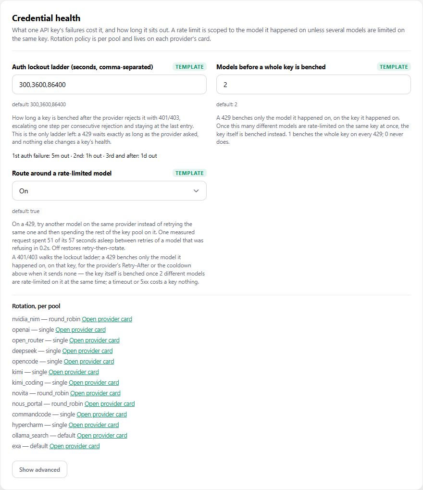
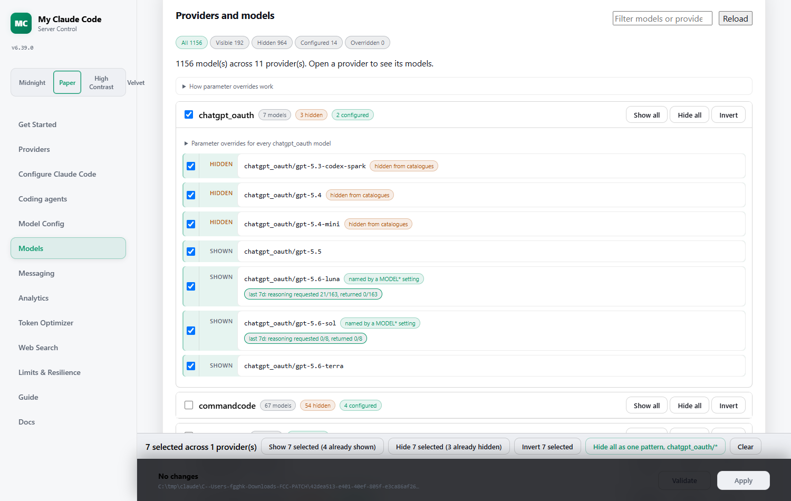
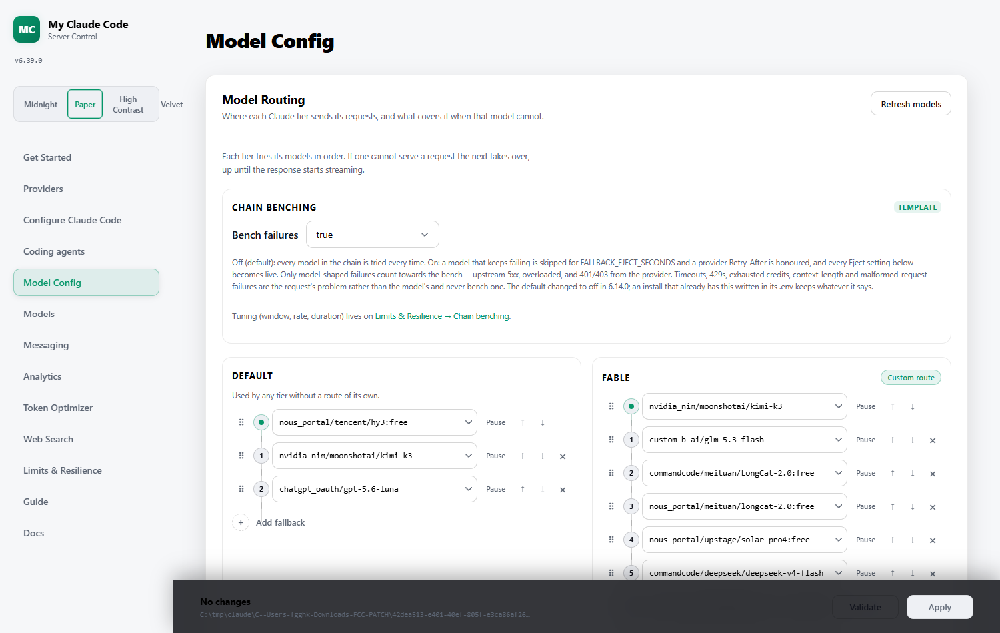
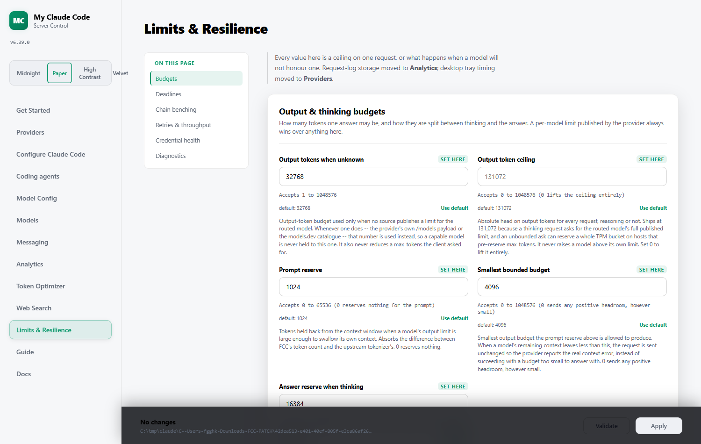
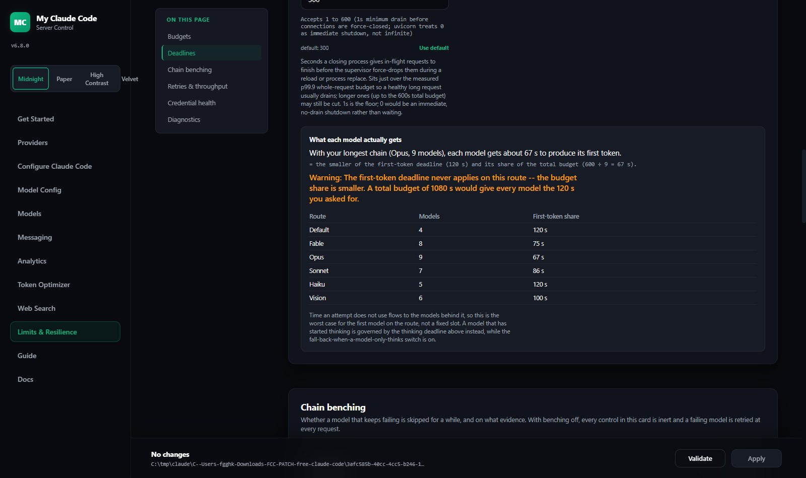
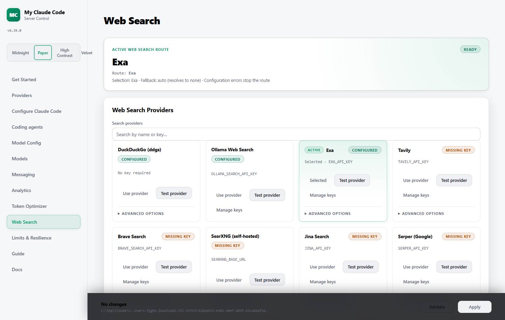
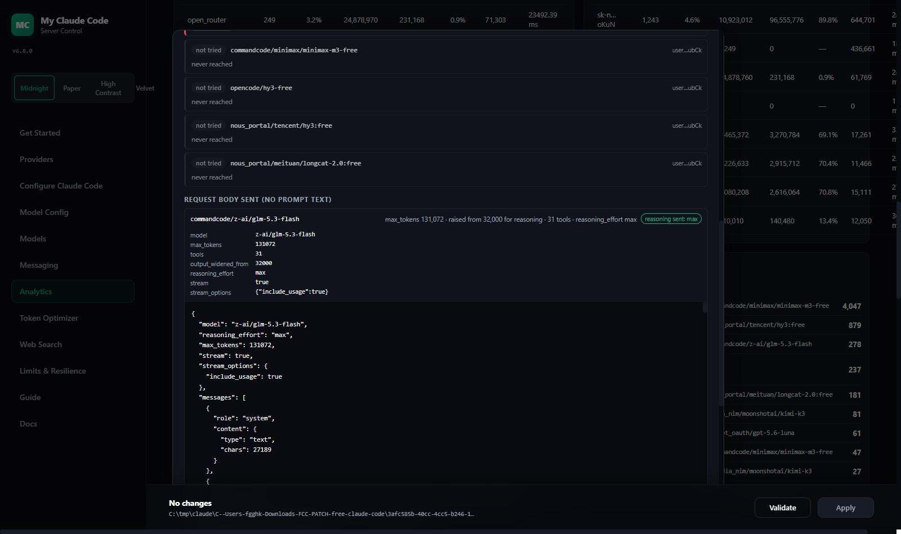
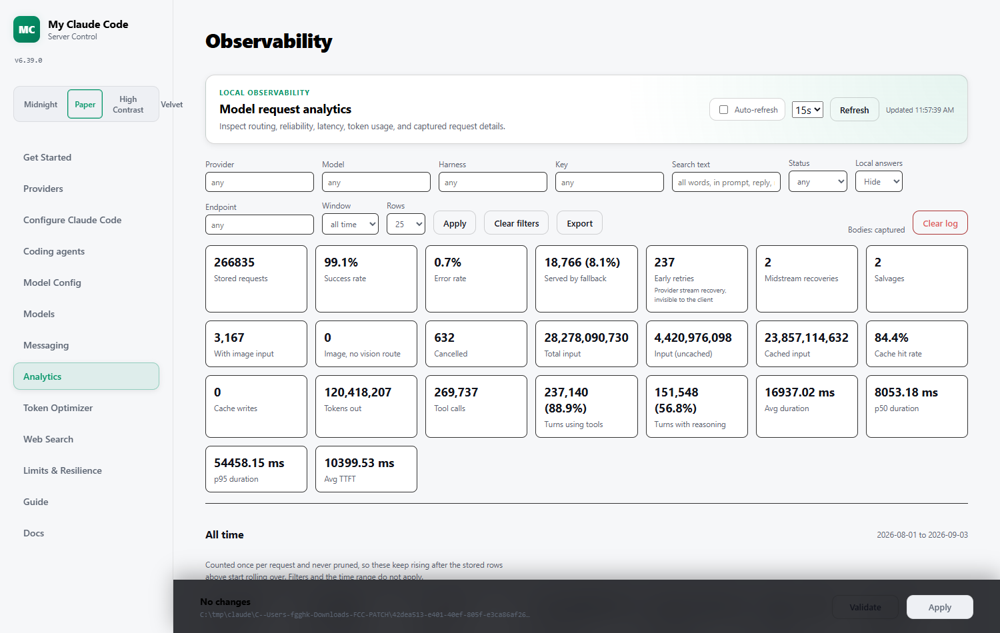

<div align="center">


# My Claude Code

An Anthropic-compatible local proxy for Claude Code, Codex, Pi, and their IDE extensions — backed by 56 model providers, with multi-key rotation everywhere, built-in web search providers, and full request analytics.

[](https://polyformproject.org/licenses/noncommercial/1.0.0)
[](https://www.python.org/downloads/)
[](https://github.com/astral-sh/uv)
[](https://github.com/FiredMosquito831/my-claude-code/actions/workflows/tests.yml)
[](https://pypi.org/project/ty/)
[](https://github.com/astral-sh/ruff)
[](https://github.com/Delgan/loguru)

Run your coding agents with free, paid, or local models. Choose and validate providers from one local Admin UI.

[Usage Guide](docs/USAGE.md) · [Features](#features) · [Quick Start](#quick-start) · [Model Providers](#model-providers) · [Web Search](#web-search) · [Admin Dashboard](#admin-dashboard) · [Updates](#version--updates) · [Clients](#connect-your-client) · [Integrations](#optional-integrations) · [Manage](#manage-your-installation)

</div>

<div align="center">
  
  <p><em>Claude Code running through the My Claude Code proxy.</em></p>
</div>

<div align="center">
  
  <p><em>Codex CLI using the local MCC Responses provider.</em></p>
</div>

<a id="model-picker"></a>

<div align="center">
  
  <p><em>Claude Code native <code>/model</code> picker with MCC gateway models — requires <code>mcc-claude --discover-models</code> (or <code>mcc-claude-old</code>).</em></p>
</div>

<div align="center">
  
  <p><em>Codex native <code>/model</code> picker with the generated MCC catalog.</em></p>
</div>

<a id="features"></a>

## Features

| Area | What you get |
| --- | --- |
| **Coding agents** | Launch Claude Code with `mcc-claude`, Codex with `mcc-codex`, or Pi with `mcc-pi`; Codex and Pi's native model pickers always list the MCC catalog, Claude Code's needs `mcc-claude --discover-models` (or `mcc-claude-old`). Legacy `fcc-claude`, `fcc-codex`, and `fcc-pi` aliases still work. |
| **Model providers** | 56 cloud and local providers, including Anthropic's own Claude API, Kimi For Coding, and experimental ChatGPT OAuth. Switch and validate providers from the Admin UI. |
| **Claude, direct** | `anthropic` speaks Anthropic's native Messages API with a Claude Console API key, billed per token. A separate `anthropic_oauth` provider can use a Pro/Max subscription instead — **which Anthropic does not permit**; read [docs/ANTHROPIC-SUBSCRIPTION.md](docs/ANTHROPIC-SUBSCRIPTION.md) before enabling it. |
| **Model-tier routing** | Route Fable, Opus, Sonnet, Haiku, and fallback traffic to different models, each with an ordered fallback chain. |
| **Vision adapter** | Image requests are diverted to a model that can see when the tier's own model cannot, with its own fallback chain. |
| **Protocol fidelity** | Streaming, tool use, reasoning, and image input preserved across compatible models, with configurable reasoning control. |
| **Key rotation** | Multi-key credential rotation for both model and web search providers: comma-separated keys, four rotation policies, key health driven only by the provider's own auth and rate-limit signals, and per-key admin management. |
| **Web search** | Claude Code's official `web_search` server tool fulfilled at the proxy level by 14 search providers, with 66 advanced per-provider options, full-page-text retrieval, domain filtering, rich result digests, and zero-config keyless fallback. |
| **Limits & Resilience** | Deadlines, output budgets, chain benching, provider retries and credential health on one page, each field with a stated cost and an enforced range — plus a calculator that tells you what each model on *your* chains actually gets, which is rarely the number in the box. |
| **Observability** | Persistent local request and web-search analytics with consistent filters, range-aware rollups, provider/key health, latency, errors, known spend, export, and auto-refresh. |
| **Editor integrations** | Claude Code and Codex in VS Code, or Claude Code through JetBrains ACP. |
| **Messaging** | Optionally run Claude Code sessions through Discord or Telegram with voice-note transcription. |
| **Version & updates** | The dashboard shows the running version, announces new releases, and installs them for you with checksum verification. |
| **Desktop & server deployment** | Run `mcc-server` headless, or launch the `mcc-desktop` tray in one of three server modes — `spawn`, `attach`, or `off` — with per-platform start-at-login (HKCU Run key on Windows, LaunchAgent on macOS, `systemd --user` or `.desktop` autostart for `mcc-server` on WSL/Linux). See [docs/USAGE.md](docs/USAGE.md#running-the-server-with-the-desktop-tray). |
| **Token Optimizer page** | A dashboard page measuring what never reached a provider: tokens never sent, per-rule fire counts, on-demand discovery of recurring request families no rule covers, and prompt-cache effectiveness per provider. Includes the opt-in tool-result trimming controls, which ship off — see [Tool-result trimming](#tool-result-trimming) for the measurement that says leave them off. |
| **Token optimizer (RTK)** | `mcc-rtk` installs and manages a Rust Token Killer binary (v0.45.0) that filters noisy terminal output before it reaches the model, per agent (Claude Code, Codex, Pi). Managed from the CLI, the dashboard "Token optimizer" card, and the desktop tray. See [docs/USAGE.md](docs/USAGE.md#the-rtk-token-optimizer). |
| **Security** | Optional token authentication for the local proxy. |

Everything is configured through the same `.env` file (see [.env.example](.env.example)) and the Admin UI.

> **New here?** The [Usage Guide](docs/USAGE.md) walks through install, adding keys, mapping models, connecting Claude Code and Claude Desktop, web search, and analytics — with screenshots.

## Quick Start

<a id="install"></a>

### 1. Install Or Update

**Pick one environment and stay in it.** On Windows you can install either in **PowerShell** or in **WSL** — both work, but install in the one where you'll actually run your coding agent. Installing in both is the most common way to end up confused, because you get two separate configs (`C:\Users\<you>\.fcc` and `~/.fcc` inside WSL) and only one of them is the one your server is reading.

> Not sure? If you already do your development inside WSL, install in WSL. Otherwise use PowerShell.

<details open>
<summary><b>Windows (PowerShell)</b></summary>

Open **Windows PowerShell** (no admin rights needed) and run:

```powershell
& ([scriptblock]::Create((irm "https://raw.githubusercontent.com/FiredMosquito831/my-claude-code/main/scripts/install.ps1")))
```

If PowerShell blocks the script, run it for this session only:

```powershell
Set-ExecutionPolicy -Scope Process -ExecutionPolicy Bypass
```

</details>

<details open>
<summary><b>WSL, Linux, or macOS</b></summary>

Open your shell (in WSL, open the **Ubuntu** terminal — not PowerShell) and run:

```bash
curl -fsSL "https://raw.githubusercontent.com/FiredMosquito831/my-claude-code/main/scripts/install.sh" | sh
```

</details>

**Then close and reopen your terminal.** The installer adds `~/.local/bin` to your `PATH`, and an already-open shell won't see it. This is the single most common reason `mcc-server` appears "not found" straight after a successful install.

Verify it worked:

```bash
mcc-server --version
```

#### What the installer actually does

1. Installs `uv` (the Python tool runner) if it's missing or too old.
2. Looks up the **latest** release, downloads its wheel, and **verifies the SHA-256 that GitHub publishes for that asset** — a mismatch aborts rather than running unverified code.
3. Installs My Claude Code and puts `mcc-server`, `mcc-claude`, `mcc-claude-old`, `mcc-codex`, and `mcc-pi` on your `PATH` (the legacy `fcc-*` spellings remain as aliases).

That's all it does. **It does not install Claude Code, Codex, or Pi** — those are separate third-party tools, and My Claude Code doesn't need any of them to run. Install whichever you actually use, yourself. The `mcc-*` launchers just point an agent you already have at the proxy.

The command always installs the **newest** release, so re-running it is how you update from the command line. To install a specific release instead:

```bash
sh install.sh --version 5.5.1      # PowerShell: -Version 5.5.1
```

Want to see what it would do without changing anything? Add `--dry-run` (PowerShell: `-DryRun`).

You can review both installers before running them: [install.sh](scripts/install.sh) and [install.ps1](scripts/install.ps1).

#### Updating later

You don't need to re-run the install command. The Admin UI shows your version, announces new releases, and installs them for you — see [Version & Updates](#version--updates). Re-running the install command does the same thing.

### 2. Start The Server

```bash
mcc-server
```

To print the installed My Claude Code version without starting the server,
run `mcc-server --version`.

Keep this process running. By default, the Admin UI opens in your browser once
the server is healthy. Its address is always shown in the startup log:

```text
INFO:     Admin UI: http://127.0.0.1:8082/admin (local-only)
```

Use the port shown in your terminal if it differs from `8082`.

<a id="nvidia-nim-provider"></a>

### 3. Configure NVIDIA NIM

1. Create an API key at [build.nvidia.com/settings/api-keys](https://build.nvidia.com/settings/api-keys).
2. Open the Admin UI URL from the server log.
3. Paste the key into `NVIDIA_NIM_API_KEY`.
4. Leave `MODEL` on the default `nvidia_nim/nvidia/nemotron-3-super-120b-a12b`, or search the model dropdown and select another model.
5. Click **Validate**, then **Apply**.

<div align="center">
  
</div>

### 4. Run Your Coding Agent

Claude Code:

```bash
mcc-claude
```

`mcc-claude` sets only `ANTHROPIC_BASE_URL` and `ANTHROPIC_AUTH_TOKEN` on top of
your inherited shell environment — nothing else is changed or stripped. This
means its native model picker does **not** list the MCC catalog by default,
since that requires an extra request to the proxy on every launch; pass
`mcc-claude --discover-models` to opt in without adopting the rest of the
legacy behavior. If you want the previous behavior (also enables gateway
model discovery, sets the auto-compact window, disables telemetry/autoupdate,
and clears any inherited `ANTHROPIC_*` variables), use `mcc-claude-old`
instead.

Codex:

```bash
mcc-codex
```

Pi:

```bash
mcc-pi
```

All three launchers use the current Admin UI settings. Codex and Pi's native model pickers always list the models MCC exposes; for Claude Code, add `--discover-models` to `mcc-claude` (or use `mcc-claude-old`) to populate its picker the same way — otherwise pick a model tier by name. Normal CLI arguments still work, for example:

```bash
mcc-codex exec "hello"
```

`mcc-pi` registers MCC only for that Pi process; your existing Pi settings, sessions, credentials, and extensions remain unchanged. The legacy `fcc-claude`, `fcc-codex`, and `fcc-pi` aliases behave identically.

<a id="install-troubleshooting"></a>

### Install Troubleshooting

| Symptom | Cause and fix |
| --- | --- |
| `mcc-server: command not found` right after installing | Your shell's `PATH` is stale. **Close and reopen the terminal.** If it persists, check that `~/.local/bin` (Windows: `%USERPROFILE%\.local\bin`) is on `PATH`. |
| The install stopped partway with an error about `claude`, `codex`, or `pi` | An old installer tried to install those for you and aborted when one failed. The current installer doesn't touch them at all — just re-run the command above. |
| I want Claude Code / Codex / Pi installed too | The installer no longer installs them. Install each from its own official installer; then `mcc-claude`, `mcc-codex`, and `mcc-pi` will launch them through the proxy. |
| `MCC release wheel checksum mismatch; refusing to install` | The download was corrupted or incomplete. Re-run the command. This check is deliberate: it will not install a wheel it can't verify. |
| PowerShell refuses to run the script | `Set-ExecutionPolicy -Scope Process -ExecutionPolicy Bypass`, then re-run. This only affects the current window. |
| Admin UI won't open, or settings don't seem to apply | You probably installed in **both** PowerShell and WSL and are editing one config while the server reads the other. Run `mcc-server --version` in each and pick one environment. |
| Server starts but the browser can't reach it | Use the exact URL from the startup log. In WSL, `http://127.0.0.1:8082/admin` works from a Windows browser via WSL's localhost forwarding. |
| `address already in use` on startup | A server is already running on that port. Stop it first, or set `PORT` to something else. |

Still stuck? Run the installer with `--dry-run` (PowerShell: `-DryRun`) and share the output — it prints every command it would run without changing anything.

## Connect Claude Code (CLI & Desktop)

Two ways to point Claude Code at your local MCC server (`http://127.0.0.1:8082`, auth token `freecc` — match these to the Admin UI if you changed them). MCC exposes native **Fable / Opus / Sonnet / Haiku** tier models, so no custom model overrides are needed either way — but Claude Code's built-in picker only *lists* them once model discovery is turned on (below).

### Claude Code CLI

The easiest route is the **Admin UI → Configure Claude Code** page. It lists every user-level `settings.json` it can find on this machine — under WSL that is two different files, your Linux home *and* your Windows home — shows whether each already points here, and configures or unsets the one you pick. It backs the file up first and refuses to touch one it cannot parse. It also warns when an enterprise `managed-settings.json` sets `ANTHROPIC_*`, because that outranks the file you are editing.

Prefer a per-session setup that leaves normal Claude Code untouched? Run `mcc-claude` to point only the current shell session at My Claude Code, or `mcc-claude --discover-models` to also list the gateway models in the `/model` picker. Normal `claude` keeps using your standard Anthropic account.

To do it by hand instead, edit `~/.claude/settings.json` (`%USERPROFILE%\.claude\settings.json` on Windows) and **add the `env` block — or replace these values if they already exist**:

```json
{
  "env": {
    "ANTHROPIC_AUTH_TOKEN": "freecc",
    "ANTHROPIC_BASE_URL": "http://127.0.0.1:8082"
  }
}
```

Notes:

- Keep any other keys you already have in the file — just merge the `env` entries.
- `ANTHROPIC_AUTH_TOKEN` sends the key as a bearer token (what MCC expects). The settings file wins over shell exports.
- This gives you a working proxy connection, but the native `/model` picker stays empty until model discovery is on — add `"CLAUDE_CODE_ENABLE_GATEWAY_MODEL_DISCOVERY": "1"` to the same `env` block, or launch with `mcc-claude --discover-models` instead of editing the file.
- A `.claude/settings.json` or `.claude/settings.local.json` **inside a project directory** takes precedence over this user-level file. A user-level `settings.local.json` is *not* read — that scope is repository-root only.
- Restart Claude Code after editing, then verify with `/status` — it should show `Anthropic base URL: http://127.0.0.1:8082` and your auth token.
- Official reference: [Claude Code LLM gateway docs](https://code.claude.com/docs/en/llm-gateway-connect) · [settings.json reference](https://code.claude.com/docs/en/settings).

### Claude Code Desktop

The desktop app routes its **Code tab** through the same `~/.claude/settings.json` above, but it also has a native gateway setting (no file editing). Menu labels vary slightly by app version — the current documented path is:

**1. Enable Developer Mode.** Open **Help → Troubleshooting → Enable Developer Mode**. The app restarts with a **Developer** menu. (On older builds: **Settings → enable Developer mode**, which exposes **Settings → Developer** instead.)

**2. Open Developer → Configure Third-Party Inference…**

<div align="center">
  
</div>

**3. Fill in the Connection section**, then click **Apply Changes**:

| Field | Value |
| --- | --- |
| **Connection** | `Gateway` |
| **Gateway base URL** | `http://127.0.0.1:8082` |
| **Gateway API key** | `freecc` |
| **Gateway auth scheme** | `bearer` |
| **Credential kind** | `Static API key` |
| **Model discovery** | on |

<div align="center">
  
</div>

Use the port from your server's startup log if it isn't `8082`, and match the API key to `AUTH_TOKEN` if you changed it from the default `freecc`.

**4. Restart the app.**

**Test connection** and **Test model discovery** in that dialog both hit your running MCC server, so use them to confirm the setup before restarting — the server must be running for either to succeed.

With **Model discovery** on, the app auto-populates its picker from MCC's `/v1/models` at launch; you can leave **Model list** empty. The **initial warning dialog can be safely ignored** — the picker fills in once discovery completes. One limitation: with a gateway active, the desktop app runs **local sessions only** (no Anthropic-hosted cloud environments).

<a id="desktop-app"></a>

## Desktop App

`mcc-desktop` is a system-tray app that wraps a **window** around the same server `mcc-server` runs headless. It doesn't replace `mcc-server` — it is a second, optional process that can own one for you, sit in the tray, and open a window onto the dashboard.

### Server modes

The tray's **Server mode** — set from the dashboard's Deployment card or the tray menu — picks one of three:

| Mode | Meaning |
| --- | --- |
| `spawn` | The tray owns `mcc-server` as a child process. On launch, if nothing is listening on `:8082`, it starts the server itself. |
| `attach` | The tray connects to an existing server on `:8082` and never spawns one — for people who already run `mcc-server` themselves. |
| `off` | Tray only; the desktop app does not touch the server at all. |

See [docs/USAGE.md](docs/USAGE.md#running-the-server-with-the-desktop-tray) for the full walkthrough.

### The window, and why app-mode is the default

There is no single "native window" API that works the same way across Windows, macOS, and Linux — WebView2, WKWebView, and WebKitGTK all behave differently. So `mcc-desktop` resolves its window through a **provider chain** that prefers Chromium **app-mode**: a real browser process launched with no tabs and no URL bar, its own taskbar entry, and a private profile under `~/.fcc/desktop-profile`.

This preference is not aesthetic. Three things the dashboard depends on **break inside an embedded webview**: `window.open` (both OAuth logins use it), `<a download>` (the analytics export), and `navigator.clipboard` (every copy button). App-mode is a real browser process, so all three work normally.

Pick the mode with `--window`:

```bash
mcc-desktop --window auto|app-mode|pywebview|browser
```

`auto` (the default) tries app-mode first and falls back to a plain browser tab if no Chromium-family browser is found. `mcc-desktop --status` shows which one is currently in effect. An unavailable choice falls back with a warning rather than failing outright.

The dashboard's Deployment card exposes the same choice as a **Window** control, with a fourth option, **Embedded webview**, that is **not installed by default** (see pywebview below) — OAuth login, downloads, and copy buttons may not work in it.

### `--desktop` at install time

The installer's opt-in `--desktop` flag (`-Desktop` on PowerShell) adds a Start Menu shortcut (`.lnk`) on Windows, a `.desktop` entry on Linux, or a minimal `.app` bundle on macOS. It's opt-in — the default install is unchanged — and if shortcut creation fails, the installer warns and continues rather than failing the install.

### DESKTOP_* settings

Nine settings, editable from **Admin → Providers → Desktop** (they moved off the Limits page in 6.2.0, to sit beside the live desktop panel) or directly in `~/.fcc/.env`, tune how `mcc-desktop` behaves: `DESKTOP_HEALTH_POLL_SECONDS`, `DESKTOP_HEALTH_FAILURE_THRESHOLD`, `DESKTOP_ACTIVATION_POLL_SECONDS`, `DESKTOP_SERVER_START_TIMEOUT`, `DESKTOP_ADMIN_REQUEST_TIMEOUT`, `DESKTOP_HEALTH_CHECK_INTERVAL`, `DESKTOP_WINDOW_WIDTH`, `DESKTOP_WINDOW_HEIGHT`, and `DESKTOP_BROWSER_PATH` (points at a browser binary in a nonstandard location; falls back to the built-in search with a warning if it no longer exists). Full ranges and defaults are in [docs/USAGE.md](docs/USAGE.md#desktop-settings-apply-on-the-next-launch) and the Admin UI itself.

**These settings apply on the next `mcc-desktop` launch, not to a tray already running** — `mcc-desktop` is a separate process that reads them once at start.

<a id="model-providers"></a>

## Model Providers

Enter the listed setting in the Admin UI, open **Model Config**, then search the `MODEL` dropdown and select a model. MCC constructs each slug as `<provider-id>/<exact-provider-model-id>`; my-text entry remains available when a provider cannot list a model. Click **Validate** and **Apply**. Provider names link to their key, model, or setup pages.

| Provider | Admin UI setting | Example `MODEL` |
| --- | --- | --- |
| [Anthropic (Claude API)](https://platform.claude.com/settings/keys) | `ANTHROPIC_API_KEY` | `anthropic/claude-sonnet-4-6` |
| [Anthropic Claude subscription](https://claude.com/pricing) (OAuth — **not permitted by Anthropic**, see [docs](docs/ANTHROPIC-SUBSCRIPTION.md)) | *discovered / `mcc-anthropic-oauth-login`* | `anthropic_oauth/claude-sonnet-4-6` |
| [NVIDIA NIM](https://build.nvidia.com/settings/api-keys) | `NVIDIA_NIM_API_KEY` | `nvidia_nim/nvidia/nemotron-3-super-120b-a12b` |
| [OpenAI / ChatGPT](https://github.com/openai/codex) | `CHATGPT_OAUTH_ACCESS_TOKEN` | `openai/gpt-5.5` |
| [OpenRouter](https://openrouter.ai/keys) | `OPENROUTER_API_KEY` | `open_router/openrouter/free` |
| [Google AI Studio (Gemini)](https://aistudio.google.com/apikey) | `GEMINI_API_KEY` | `gemini/models/gemini-3.1-flash-lite` |
| [Google Vertex AI](https://console.cloud.google.com/vertex-ai) | `VERTEX_PROJECT_ID` + `VERTEX_LOCATION` | `vertex/google/gemini-3.1-flash` |
| [Azure OpenAI](https://portal.azure.com/) | `AZURE_OPENAI_API_KEY` | `azure_openai/my-gpt-5-deployment` |
| [DeepSeek](https://platform.deepseek.com/api_keys) | `DEEPSEEK_API_KEY` | `deepseek/deepseek-chat` |
| [Mistral La Plateforme](https://console.mistral.ai/) | `MISTRAL_API_KEY` | `mistral/devstral-small-latest` |
| [Mistral Codestral](https://console.mistral.ai/) | `CODESTRAL_API_KEY` | `mistral_codestral/codestral-latest` |
| [OpenCode Zen](https://opencode.ai/auth) | `OPENCODE_API_KEY` | `opencode/gpt-5.3-codex` |
| [OpenCode Go](https://opencode.ai/auth) | `OPENCODE_API_KEY` | `opencode_go/minimax-m2.7` |
| [Vercel AI Gateway](https://vercel.com/docs/ai-gateway/models-and-providers) | `AI_GATEWAY_API_KEY` | `vercel/openai/gpt-5.5` |
| [Hugging Face Inference Providers](https://huggingface.co/settings/tokens) | `HUGGINGFACE_API_KEY` | `huggingface/Qwen/Qwen3-Coder-480B-A35B-Instruct:fastest` |
| [Cohere](https://dashboard.cohere.com/api-keys) | `COHERE_API_KEY` | `cohere/command-a-plus-05-2026` |
| [GitHub Models](https://github.com/marketplace?type=models) | `GITHUB_MODELS_TOKEN` | `github_models/openai/gpt-4.1` |
| [Wafer](https://wafer.ai/) | `WAFER_API_KEY` | `wafer/DeepSeek-V4-Pro` |
| [Kimi](https://platform.moonshot.ai/console/api-keys) | `KIMI_API_KEY` | `kimi/kimi-k2.5` |
| [Kimi Coding](https://kimi.com/coding) | `KIMI_CODING_API_KEY` | `kimi_coding/kimi-k2.5` |
| [ChatGPT OAuth](https://github.com/openai/codex) (experimental) | `CHATGPT_OAUTH_ACCESS_TOKEN` + `CHATGPT_OAUTH_BASE_URL` | `chatgpt_oauth/gpt-5` |
| [MiniMax](https://platform.minimax.io/user-center/basic-information/interface-key) | `MINIMAX_API_KEY` | `minimax/MiniMax-M3` |
| [Cerebras Inference](https://cloud.cerebras.ai/) | `CEREBRAS_API_KEY` | `cerebras/gpt-oss-120b` |
| [Groq](https://console.groq.com/keys) | `GROQ_API_KEY` | `groq/llama-3.3-70b-versatile` |
| [SambaNova](https://cloud.sambanova.ai/apis) | `SAMBANOVA_API_KEY` | `sambanova/Meta-Llama-3.3-70B-Instruct` |
| [Fireworks AI](https://fireworks.ai/account/api-keys) | `FIREWORKS_API_KEY` | `fireworks/accounts/fireworks/models/llama-v3p3-70b-instruct` |
| [Novita AI](https://novita.ai/settings) | `NOVITA_API_KEY` | `novita/deepseek/deepseek-v3.2` |
| [Nous Portal](https://portal.nousresearch.com/) | `NOUS_API_KEY` | `nous_portal/deepseek/deepseek-v4-flash-0731` |
| [Kilo AI Gateway](https://app.kilo.ai/) | `KILO_API_KEY` | `kilo/kilo-auto/balanced` |
| [Command Code](https://commandcode.ai/provider) | `COMMANDCODE_API_KEY` | `commandcode/deepseek/deepseek-v4-flash` |
| [Cline](https://app.cline.bot/) | `CLINE_API_KEY` | `cline/anthropic/claude-sonnet-4-6` |
| [Cloudflare Workers AI](https://developers.cloudflare.com/workers-ai/) | `CLOUDFLARE_API_TOKEN` and `CLOUDFLARE_ACCOUNT_ID` | `cloudflare/@cf/moonshotai/kimi-k2.6` |
| [Z.ai](https://z.ai/manage-apikey/apikey-list) | `ZAI_API_KEY` | `zai/glm-5.2` |
| [QwenCloud Token Plan](https://home.qwencloud.com/api-keys) | `QWENCLOUD_API_KEY` | `qwencloud/qwen3.7-plus` |
| [QwenCloud Coding Plan](https://home.qwencloud.com/api-keys) | `QWENCLOUD_CODING_API_KEY` | `qwencloud_coding/qwen3.7-plus` |
| [Agnes AI](https://agnes-ai.com/) | `AGNES_API_KEY` | `agnes/agnes-2.0-flash` |
| [ZenMux](https://zenmux.ai/platform/pay-as-you-go) | `ZENMUX_API_KEY` | `zenmux/deepseek/deepseek-v4-flash-free` |
| [W&B Inference](https://wandb.ai/settings) | `WANDB_API_KEY` | `wandb/openai/gpt-oss-20b` |
| [Amazon Bedrock](https://console.aws.amazon.com/bedrock/) | `AWS_BEARER_TOKEN_BEDROCK` | `bedrock/openai.gpt-oss-120b` |
| [TokenRouter](https://www.tokenrouter.com/) | `TOKENROUTER_API_KEY` | `tokenrouter/moonshotai/kimi-k3-free` |
| [NaraRoute](https://router.bynara.id/) | `NARAROUTE_API_KEY` | `nararoute/kimi-k3-free` |
| [xAI (Grok)](https://console.x.ai/team/default/api-keys) | `XAI_API_KEY` | `xai/grok-4.5` |
| [Together AI](https://api.together.ai/settings/api-keys) | `TOGETHER_API_KEY` | `together/zai-org/GLM-5.2` |
| [DeepInfra](https://deepinfra.com/dash/api_keys) | `DEEPINFRA_API_KEY` | `deepinfra/deepseek-ai/DeepSeek-V4-Flash` |
| [SiliconFlow](https://cloud.siliconflow.com/account/ak) | `SILICONFLOW_API_KEY` | `siliconflow/Qwen/Qwen3-32B` |
| [Nebius Token Factory](https://tokenfactory.nebius.com/project/api-keys) | `NEBIUS_API_KEY` | `nebius/Qwen/Qwen3-30B-A3B` |
| [Chutes](https://chutes.ai/docs/getting-started/authentication) | `CHUTES_API_KEY` | `chutes/Qwen/Qwen3-32B-TEE` |
| [Featherless AI](https://featherless.ai/account/api-keys) | `FEATHERLESS_API_KEY` | `featherless/Qwen/Qwen3-32B` |
| [Alibaba Coding Plan — International](https://bailian.console.alibabacloud.com/) | `ALIBABA_CODING_API_KEY` | `alibaba_coding/qwen3-coder-plus` |
| [Alibaba Coding Plan — China](https://bailian.console.aliyun.com/) | `ALIBABA_CODING_CN_API_KEY` | `alibaba_coding_cn/qwen3-coder-plus` |
| [Alibaba Token Plan — International](https://bailian.console.alibabacloud.com/) | `ALIBABA_API_KEY` | `alibaba/qwen3-coder-plus` |
| [Alibaba Token Plan — China](https://bailian.console.aliyun.com/) | `ALIBABA_CN_API_KEY` | `alibaba_cn/qwen3-coder-plus` |
| [Ollama Cloud](https://ollama.com/settings/keys) | `OLLAMA_API_KEY` | `ollama_cloud/qwen3-coder:480b` |
| [LM Studio](https://lmstudio.ai/) | `LM_STUDIO_BASE_URL` | `lmstudio/<model-id>` |
| [llama.cpp](https://github.com/ggml-org/llama.cpp) | `LLAMACPP_BASE_URL` | `llamacpp/<model-id>` |
| [Ollama](https://ollama.com/) | `OLLAMA_BASE_URL` | `ollama/<model-tag>` |

Important provider notes:

- Mistral Codestral uses a separate key from Mistral La Plateforme.
- OpenCode Zen and OpenCode Go share `OPENCODE_API_KEY` but use different model prefixes. Either card manages the shared key; the rotation policy lives on the OpenCode Zen card.
- Azure OpenAI needs `AZURE_OPENAI_BASE_URL` as well as its key — the endpoint
  names your own resource, so there is no default. Use the v1 form,
  `https://YOUR-RESOURCE.openai.azure.com/openai/v1/`, and note that the model
  you request is your **deployment name**, not the underlying model name.
- Cloudflare requires both its API token and account ID.
- Ollama Cloud connects directly to `ollama.com`; use the exact model IDs shown
  by MCC's model picker. Local Ollama remains available through the separate
  `ollama/` prefix.
- Prefer tool-capable models for coding agents. Local models also need enough context for the agent's system prompt and tool definitions.

<details>
<summary><strong>Local provider setup</strong></summary>

### LM Studio

Start LM Studio's local server, load a tool-capable model, and use the model identifier shown by LM Studio with the `lmstudio/` prefix. The default URL is `http://localhost:1234/v1`.

### llama.cpp

Start `llama-server` with its OpenAI-compatible Chat Completions API and enough context for the model. Use the local model ID with the `llamacpp/` prefix. `LLAMACPP_BASE_URL` defaults to `http://localhost:8080/v1`; MCC accepts either the server root or an explicit `/v1` suffix.

### Ollama

```bash
ollama pull llama3.1
ollama serve
```

Use the tag shown by `ollama list` with the `ollama/` prefix. `OLLAMA_BASE_URL` defaults to `http://localhost:11434`; MCC accepts either the root URL or an explicit `/v1` suffix.

</details>

<a id="model-provider-key-rotation"></a>

### Multi-Key Rotation

Put multiple API keys in one variable, comma-separated, and choose a policy with `{ENV}_ROTATION`:

```bash
OPENROUTER_API_KEY="sk-or-key1,sk-or-key2,sk-or-key3"
OPENROUTER_API_KEY_ROTATION=round_robin
```

Policies:

| Policy | Behavior |
| --- | --- |
| `single` | Always the first key (default when one key is set). |
| `round_robin` | Spread requests across healthy keys in turn. |
| `least_used` | Healthy key with the fewest requests goes first. |
| `failover` (alias `on_error`) | Stick to the first healthy key until it fails, then move to the next (default when multiple keys are set). |

Each key gets its own upstream client and its own rate-limit window, so one key saturating or stalling never throttles the others.

**Health model — a key is only ever judged on signals about the key.** There are exactly two:

- **401/403** — the provider rejected the credential. It is locked out on an escalating ladder (`CREDENTIAL_LOCKOUT_TIERS`, 5 min → 1 h → 24 h by default), on its own counter.
- **429** — the credential is throttled **for that model**. The (key, model) pair is benched for exactly as long as the provider asked via `Retry-After` / `x-ratelimit-reset-*`, or for `RATE_LIMIT_COOLDOWN_SECONDS` when it sent no header, capped at one hour. The key stays `HEALTHY` and every other model on it keeps serving, because a gateway that limits one model has said nothing about the key's others — measured on NVIDIA NIM, one model 429s on all three keys inside 0.1 s while two other models answer on those same keys in the same second. The key itself is benched only once `CREDENTIAL_MODEL_BENCH_ESCALATION` (default 2) distinct models hold a live bench on it at the same time. No ladder, no escalation beyond that one step.

| Setting | Default | What it does |
| --- | --- | --- |
| `CREDENTIAL_LOCKOUT_TIERS` | `300,3600,86400` | The escalating bench for a key the provider keeps rejecting with 401/403, in comma-separated seconds. One step per consecutive rejection, staying at the last entry. This is the only ladder left — a 429 waits exactly as long as the provider asked, and nothing else changes a key's health. |
| `RATE_LIMIT_COOLDOWN_SECONDS` | `60` | Used **only** when a 429 carries no `Retry-After`, `retry-after-ms` or `x-ratelimit-reset-*` header at all. A header always wins, and whatever the header asks for is capped at one hour. |
| `CREDENTIAL_MODEL_BENCH_ESCALATION` | `2` | How many *different* models have to be rate-limited on one key at the same time before the key itself is benched instead of just the (key, model) pair. `1` benches the whole key on every 429 (the pre-6.19.0 behaviour, and the no-redeploy rollback); `0` never escalates past the pair. |

Both live on **Admin UI → Limits & Resilience → Credential health**. Rotation *policy* is not there: it is per pool, on each provider's card.

**Everything else leaves every key untouched** — timeouts, 5xx, `410 model gone`, overloaded, 400s, context overflows, transport faults. Those are properties of the model, the request or the moment, and the same keys serve every model in a fallback chain, so charging them benched working credentials for faults they did not cause. A model that will not answer is the model's problem: the **fallback chain moves to the next model**, not the next key.

**Rotation follows the same rule.** The pool tries another key for an auth rejection, a 429, or a connection fault — cases where a different key or a different connection can genuinely help. Anything else is raised so routing can spend the time on a different model instead of on the rest of the pool.

**Availability, not just health.** A key can be perfectly healthy and still unable to serve right now: rate-limited, or out of daily budget. Rotation skips those keys and picks one that can answer immediately, instead of queueing behind a throttled key while an idle key sits unused. If *every* key is unavailable the request still goes out rather than failing — a soft guardrail should never become a self-inflicted outage.

**Provider-declared backoff.** On a 429, MCC reads the upstream's own `Retry-After`, `retry-after-ms`, and `X-RateLimit-Reset-*` headers (all the formats providers actually ship, including `6m0s` and `250ms`) and waits exactly that long, capped at an hour. Only when a provider says nothing does it fall back to a fixed minute.

**No invented ceilings.** MCC never caps a key at a number it made up. Every limit it applies comes from the provider's own response — the reset window on a 429, the status on a rejection. Providers change their limits without notice, so a hardcoded budget is wrong the moment it ships; reading what the upstream actually reports stays right.

**When rotation happens.** Exactly three cases, because they are the only ones a different key could fix: a 401/403, a 429, and a transport fault (a different key means a different connection). A timeout, a 5xx, an overload, a `410`, a plain 400 — every key in the pool talks to the same model and would meet the same answer, so those raise out of the rotating loop and the **fallback chain** gets its turn instead. One consequence is worth stating: a **timeout is not a transport fault** here. `openai.APITimeoutError` subclasses `APIConnectionError`, and reading a model that never answered as a broken socket would spend the whole pool on it, so it is excluded by name.

Failover happens before the first streamed chunk; once output has started, switching credentials would corrupt the response, so a mid-stream failure is recorded against the key but propagated to the client.

**The deliberate cost of that rule.** A key that fails with a 5xx or a dropped connection on *every* request is no longer benched — rotation tries it once per request and the chain absorbs the wasted attempt. That was the trade: on a live three-key pool, the failure classes that could have identified a dead key were the same ones benching healthy keys **1,529 times in one day** (a `410 model gone`, a rejected `top_p`, a model that stayed silent). A truly dead credential still answers 401/403, and that still locks it out.

All of this is visible and manageable from **Admin UI → Providers**: press **Configure** on a provider's card to open its key pool, which lists every key with its own health and usage, lets you add keys (one, or several comma-separated) and remove them individually, and carries the rotation policy. **Refresh models** on the card face makes a real call to the provider. For historical per-key request volume, error rate, tokens, and latency, see [Per-Key Attribution](#per-key-attribution).

Web search provider keys share the same rotation engine — see [Web Search → Multi-key rotation](#multi-key-rotation-web-search-keys).

<div align="center">
  
  <p><em>Credential health, on Limits &amp; Resilience: the two settings that can bench a key, and nothing else.</em></p>
</div>

### Optional Model-Tier Routing

`MODEL` is the fallback for every request. Select a model for `MODEL_FABLE`, `MODEL_OPUS`, `MODEL_SONNET`, or `MODEL_HAIKU` to override an individual Claude Code tier; select **None** to use `MODEL`.

For example, route Opus to `nvidia_nim/moonshotai/kimi-k2.6`, Sonnet to `open_router/openrouter/free`, Haiku to `lmstudio/qwen3.5-coder`, and keep `MODEL` on `zai/glm-5.2`.

### Model Visibility

A gateway can publish hundreds of models — `nous_portal` alone lists 343 — and every one of them lands in `/v1/models` (what `mcc-claude --discover-models` writes into Claude Code, and what the Codex catalog is built from) and in the Admin model pickers. Two glob lists decide which of them are worth showing.

| Setting | Default | What it does |
| --- | --- | --- |
| `MODEL_VISIBILITY_ALLOW` | *(empty)* | Comma-separated globs. Empty lists everything; a non-empty list makes visibility opt-in. |
| `MODEL_VISIBILITY_DENY` | *(empty)* | Same form, applied **after** the allow list and winning over it. |

Patterns are matched case-insensitively against the full `provider/model` reference, so `nvidia_nim/thinkingmachines/inkling` picks one model, `commandcode/*` one provider, `*:free` every free variant, and `*inkling*` anything containing the word. An explicit pick is simply a pattern with no wildcards, which is why ticking models and writing globs are one mechanism rather than two that can disagree.

The Models page writes both forms for you. Hiding a whole provider writes one glob, `nous_portal/*`, so models it publishes later are hidden too; hiding a selection, a filtered subset, or inverting writes exact refs. Showing a provider again removes that glob and the exact refs under it, and never a pattern you wrote yourself.

**Bulk actions.** Every provider header carries **Show all**, **Hide all** and **Invert**, and every row has a checkbox in a ruled left gutter. Ranges select by Shift+click, by Shift+Arrow, and by pressing and dragging down the gutter — a swept row takes the anchor's state, so a drag never leaves a mixed run. Filter first and the actions apply to exactly the filtered set; `Select all N` sits on the result-count line, and facets narrow to All / Visible / Hidden / Configured / Overridden. `/` focuses the search box, `Escape` clears the selection. Provider headers are sticky and carry their own visible/hidden/configured counts, and the disclosure is a real `<button aria-expanded>` rather than a `<summary>`, so **Hide all** works on a provider you never expanded.

The result is one persistent `role=status` panel with **Undo**, not a toast that disappears while you are still reading it. It says which pattern was written or removed, and where one of *your own* globs still overrules an exact tick it names that pattern once, grouped — "honoured by your glob" — instead of reporting 317 individual no-ops or pretending to have removed a pattern you wrote. Above 200 models the button asks for one inline confirmation rather than opening a modal.

The point is arithmetic: hiding a 317-model provider used to cost 325 clicks, 634 requests, about 1.07 GB of traffic and 5–9 minutes. It is now **2 clicks, 1 request, 41 KB, 7 ms**, and Invert is one click.

<div align="center">
  
  <p><em>Models page: selection gutter, the bulk action bar with its live count, and the sticky provider header carrying that provider's counts.</em></p>
</div>

**These lists hide; they never block.** A model named by `MODEL`, a tier override or a `MODEL_*_FALLBACKS` chain keeps routing normally while hidden. A visibility filter that silently broke a working chain would be worse than a chain entry that is invisible but alive, because the breakage would surface as an outage nowhere near the setting that caused it. The Admin pickers therefore also keep showing a model you have actually configured, even when the filter hides it — a picker has to be able to render the value that is saved.

### Fallback Chains

Every tier can carry an ordered list of stand-ins. If the model a request routes to cannot serve it, MCC tries the next entry in that tier's chain, then the next, until one answers.

| Setting | Chain used |
| --- | --- |
| `MODEL_FALLBACKS` | after `MODEL`, for any tier with no override of its own |
| `MODEL_FABLE_FALLBACKS` | after `MODEL_FABLE` |
| `MODEL_OPUS_FALLBACKS` | after `MODEL_OPUS` |
| `MODEL_SONNET_FALLBACKS` | after `MODEL_SONNET` |
| `MODEL_HAIKU_FALLBACKS` | after `MODEL_HAIKU` |

Each is a comma-separated list of `provider/model` refs, in priority order — for example `MODEL_OPUS_FALLBACKS="cerebras/qwen-3-coder-480b,groq/moonshotai/kimi-k2"`. Edit them in **Admin UI → Model Config**, where each chain sits directly under the model it backs up and entries can be reordered.

A tier with its own override uses only its own chain; the two are never merged. So `MODEL_OPUS` set means Opus tries `MODEL_OPUS` then `MODEL_OPUS_FALLBACKS`, while an unset `MODEL_SONNET` means Sonnet tries `MODEL` then `MODEL_FALLBACKS`.

**Failover stops when the client has actually seen bytes.** A model that fails while connecting, authenticating, rate-limiting, or before emitting anything is replaced silently. What counts as "seen" depends on the client:

- **Streaming requests** commit at the first chunk. A model that fails *after* it has begun answering is not replaced, because the reply is already on the wire and switching mid-answer would splice two different completions together.
- **Non-streaming requests** commit at the end. The response is assembled into a single message before the client sees anything, so a failure at *any* point still falls back, and the failed attempt's partial output is discarded with it.

Requests that name a provider and model directly (`open_router/…`) are never redirected — an explicit choice is honoured as given.

**A silent model counts as a failure too — but only once you say when.** A provider that accepts the request and then produces nothing holds it until the transport read timeout, and the chain gets its turn long after the client gave up. These settings bound it, on **Admin UI → Limits & Resilience** (deadlines on the **Deadlines** card, the last two on **Chain benching**).

> **Since 6.16.0 all five deadlines ship at `0`, meaning no limit. With the shipped zeros MCC never ends a silent or stalled upstream on its own: the fallback chain moves only on an error the provider actually returns.** A model that thinks for forty minutes is left to think; a stream that goes quiet and never resumes is left open until the transport gives up (`HTTP_READ_TIMEOUT`, 300 s by default, applied per read rather than per request). This is deliberate — a deadline that kills real work is a worse failure than a stall you can see in Analytics, and MCC is configured by the operator who runs it. **To get time-based failover, set the ones that matter to you:** `FALLBACK_FIRST_TOKEN_TIMEOUT` (silence before any output — the only one that produces a *failover*, since nothing has streamed yet), `FALLBACK_STALL_TIMEOUT` (silence after output started — ends the request; no failover is possible past the first token), `FALLBACK_TOTAL_TIMEOUT` (the whole request, across every attempt and retry). The Deadlines calculator on that page shows the resulting per-model allowance for your own chains. An install that already sets any of these keys keeps its own value; nothing is rewritten on upgrade. Every error MCC raises from one of these limits now names the env var that set it and the card that edits it.

| Setting | Default | What it does |
| --- | --- | --- |
| `FALLBACK_FIRST_TOKEN_TIMEOUT` | `0` (no limit) | The first-token deadline: seconds a model may stay silent before the next model takes over. Nothing has streamed yet, so the handover is invisible — this is the only deadline that produces a *failover* rather than an ending. `0` (shipped) waits indefinitely. When you set it, each attempt also gets an equal share of what is left of `FALLBACK_TOTAL_TIMEOUT`, counting itself and every model still behind it, and what applies is whichever is smaller — unless `FALLBACK_ATTEMPT_SHARE_FLOOR` raises that share. **Admin UI → Limits & Resilience** computes it per route for your own chains. |
| `FALLBACK_ATTEMPT_SHARE_FLOOR` | `0` (equal share) | Smallest slice of `FALLBACK_TOTAL_TIMEOUT` one attempt may be cut down to. A **chain-side** allowance — it bounds each model's first-token wait, never a retry of the same model. Without it the equal share alone decides, and on a long chain it silently undercuts the deadline above: 600 ÷ 8 models = 75s, so a box reading `120` logged `produced no first token after 74.9494s`. `0` (shipped) divides the budget equally with no floor, and is moot while `FALLBACK_TOTAL_TIMEOUT` is `0` — there is no budget to divide. The trade once you set both: N silent models can spend up to N × this floor before the budget clamps them, and the models after that get less, or nothing — the Deadlines calculator shows both numbers and warns when the floor cannot fit. |
| `FALLBACK_TOTAL_TIMEOUT` | `0` (no limit) | Whole-request budget across every attempt, retry and recovery — the backstop for a stream that committed and then stalled. Divided between the models still to try, floored by `FALLBACK_ATTEMPT_SHARE_FLOOR`. `0` (shipped) disables it: a request may run for as long as the upstream keeps the connection open. |
| `FALLBACK_STALL_TIMEOUT` | `0` (no limit) | Seconds a stream that *has* started producing may then go quiet. Measured from the last chunk that moved the answer forward, so keepalives cannot hold a dead stream open and a model producing steadily is never cut. `0` (shipped) allows an unlimited pause. No failover is possible here — the reader has already seen the first model's words — so this ends the request rather than moving the chain. |
| `FALLBACK_END_CLEANLY_AFTER_COMMIT` | `true` | What happens when a model that has *already started answering* then fails. The chain cannot step in — the reader has seen its words — so instead of an API error printed under a half-written answer, the message is ended: the open block is closed and the client is told the answer was cut short. The session continues with a short but complete reply. Set `false` to go back to the error. |
| `FALLBACK_RESUME_AFTER_COMMIT` | `true` | Goes one step further than the row above: rather than only *ending* a half-written answer, the next model on the route is handed the text already on screen and asked to carry on from it, and its output is spliced into the same message — so the turn survives. Same chain, same bench, same budget as an ordinary fallback; nothing new is retried. Continuation is model-dependent (many models answer nothing, and one that starts the answer over is rejected rather than shown twice), and every one of those outcomes falls back to the short message above rather than an error. A half-written tool call is never continued. Set `false` to stop at the short message. |
| `FALLBACK_EJECT_SECONDS` | `30` | How long a benched model stays out of the chains that name it. |
| `FALLBACK_COOLDOWN_STEP_OVER_FLOOR` | `5` | Seconds of remaining rate-limit cooldown that make it worth trying the next model rather than waiting. Shorter waits are waited out, because stepping over costs the chain a slot. |

**A model that dies after it started answering ends the message, not the turn.** The commit boundary above cuts both ways: once real text has reached the client no other model can take over, and until 6.15.0 that meant every failure past that point — the stall deadline, the total budget, a mid-stream 5xx, a dropped connection — reached Claude Code as an API error under a partial answer, and the turn was dead. One incident streamed 1,333 characters, went quiet, and was reported as `API Error … stopped producing output`, with seven healthy fallback models recorded as `not tried`. Since 6.15.0 the stream is closed properly instead: the open text or thinking block is stopped, a `message_delta` carrying `stop_reason: max_tokens` says the answer was cut short rather than finished, and `message_stop` ends it. Nothing about *when* the stream is stopped changed — only what the client is handed. The answer is genuinely incomplete, and the request detail says so: the attempt still reads `failed` with its real cause, alongside `ended early after N chars`. One case still errors and cannot be rescued — a stream that stopped halfway through a tool call's arguments, because a tool call cannot be completed honestly and Claude Code would *run* it.

**And since 6.18.0 it can be finished rather than only ended.** With `FALLBACK_RESUME_AFTER_COMMIT` on (the default), the next model on the route is given the text already on screen and asked to continue from it, and its output is spliced into the same message: one envelope, one text block, one ending. There is no visible seam, deliberately — the reader gets an answer, not a report about routing — and the model change is recorded in the request detail instead, as *continued here after `<model>` stalled at N chars*. It is the same chain as an ordinary fallback: benched models are skipped, `FALLBACK_SKIP_KINDS` still ends a route, the attempt shares the same budget, and no new retry layer or deadline exists. What the second model does with the request is not guaranteed: measured across thirteen live model/host pairs, some continue cleanly, most answer nothing, and a few start the answer over — and a restart is detected and thrown away rather than shown twice. Every unusable continuation lands on the truncated message above, never on an error, which is why this can ship on.

Ejection can never empty a chain: if every model on a route is benched, they are tried in order anyway — skipping a bad model is an optimisation, refusing to try anything is an outage.

**What benches a model.** `FALLBACK_BENCH_ENABLED` is the master switch, and it **ships off**: every model in the chain is tried every time, so a model failing half its requests is still retried at chain position 0 on every single request. It reads on two pages — **Model Config**, at the top of the routing view, beside the routes it governs, and **Limits & Resilience → Chain benching**, where it gates the tuning below. They are the same setting; changing either changes both. With it off *every* control below is inert. Turn it on and `FALLBACK_BEHAVIOR` picks the evidence:

**Only model-shaped failures count.** With benching on, a failure benches a model only when it says something about the *model*: an upstream 5xx, an overloaded response, or a 401/403 from the provider. Timeouts (first-token, stall, budget), 429s, `context_length` and malformed requests are facts about the *request* — they fail identically on a healthy model and a dead one — and never bench anything. That distinction is why the switch could be turned off by default: the bench used to count everything, so one prompt larger than any model's context window ejected the entire chain and the request was answered by whichever model was left holding the 400.

| Setting | Default | What it does |
| --- | --- | --- |
| `FALLBACK_BENCH_ENABLED` | `false` | Master switch for benching. Off (the default) tries every model every time; on makes the whole card live. Set on **Model Config** or on this card — one setting, two places. |
| `FALLBACK_BEHAVIOR` | `rate_based` | `rate_based` benches on a failure rate over a window; `legacy` restores the older consecutive-count rule. |
| `FALLBACK_EJECT_WINDOW` / `FALLBACK_EJECT_FAILURE_RATE` | `10` / `0.5` | `rate_based` only: benched once 5 of the last 10 requests fail. |
| `FALLBACK_EJECT_MIN_SAMPLES` | `8` | `rate_based` only: nothing is benched until that many of its requests have been seen, so one failure on a barely-used model cannot trip it. |
| `FALLBACK_EJECT_AFTER_FAILURES` | `3` | `legacy` only: consecutive failures. `0` turns counting off. |
| `FALLBACK_RETRY_FIRST` | `skip` | `retry_once` gives the **primary only** one more attempt on a transient error before the chain moves on. An already-failed fallback is never retried. |

The card keeps the *unselected* mode's fields visible but disabled, each carrying its own note — "Not used while eject mode is `legacy`", "Not used while benching is off" — rather than dimming them and leaving you to infer why. Disabled fields are skipped by the change tracker, so switching modes cannot save the other mode's values by accident.

**One model is retried before the chain is used at all.** A 429 or 5xx is retried against the same model on an exponential backoff, and three settings shape that wait:

| Setting | Default | What it does |
| --- | --- | --- |
| `PROVIDER_RETRY_BACKOFF_BASE_SECONDS` | `2` | How long a provider waits before its first retry of a 429 or 5xx. Each further retry doubles it. |
| `PROVIDER_RETRY_BACKOFF_MAX_SECONDS` | `10` | The longest single wait — the ceiling the doubling backoff stops growing past. The chain is not consulted until the ladder is spent, so this is added to how long a request waits before another model is tried. |
| `PROVIDER_RETRY_BACKOFF_JITTER_SECONDS` | `1` | Random spread added to each wait, so several clients hitting the same limit do not retry in lockstep. |

**A context overflow is not a malformed request.** Both usually arrive as HTTP `400`, and until 5.43.0 MCC treated every `400` the same way — as a client error that would fail identically everywhere, so the whole chain was abandoned. That is right for a malformed body and wrong for a conversation that outgrew the model's window, which is exactly the case a larger-window fallback exists to cover. Context-length failures are now classified as their own kind and fall through to the next model.

| Setting | Default | What it does |
| --- | --- | --- |
| `FALLBACK_SKIP_KINDS` | `invalid_request` | Comma-separated failure kinds that abort the chain instead of falling through. Set `FALLBACK_SKIP_KINDS=invalid_request,context_length` to restore the pre-5.43.0 behaviour of giving up on any `400`. |

**Thinking is not answering.** A reasoning model that streams its thoughts and never writes an answer used to commit the route on its very first thought: from that moment no other model could take over, the stall guard never fired because thoughts kept arriving, and the request ran until the whole budget ended it. Measured across 21 days of real traffic, 44 of 499 budget exhaustions were a stream that had only reasoned, and 490 of the 499 never left the first model on the chain.

Since 5.50.0 reasoning is held back like an envelope frame, so the attempt stays abandonable and the next model can still answer. Two settings control it, both on **Admin UI → Limits & Resilience → Deadlines** — beside the first-token deadline they pre-empt, rather than on Model Config where the reasoning deadline used to sit:

| Setting | Default | What it does |
| --- | --- | --- |
| `FALLBACK_ON_REASONING_ONLY` | `true` | Hold reasoning back so a model that only thinks does not commit the route. The cost is that thinking no longer streams live — it arrives with the answer, or once 64 KB have accumulated. Set `false` to watch a model think in real time and accept that it commits the route. |
| `STREAM_COMMIT_HOLDBACK_CHARS` | `0` | Visible characters that must arrive before output is released to the client, *on top of* `STREAM_COMMIT_HOLDBACK_SECONDS` — both conditions, or the stream ending. While output is held a failure is still invisible, so the route can start over on the next model with nothing shown; raising it buys that for a model that writes a word and dies, and costs exactly that much time-to-first-visible-word on every request. `0` (shipped) asks only the clock. |
| `FALLBACK_REASONING_ANSWER_TIMEOUT` | `0` (no limit) | Seconds a model may think before the chain moves on. A flat allowance on purpose: the attempt's share of `FALLBACK_TOTAL_TIMEOUT` is sized for a model that has shown *nothing*, and 600s split across an eleven-model chain leaves 54s, far too little to think in. `0` (shipped) lets a thinking model run to the whole request budget — and, while that is `0` too, to no limit at all. |

Every attempt is recorded, and since 6.12.0 so is every *try* inside an attempt. **Analytics** shows the model that actually answered rather than the one the route started from, and the request detail draws the whole chain — every model the chain reached, and under each one every upstream try it made, with the status it met, the credential it used and the seconds it spent waiting — see [Route tracing](#route-tracing).

### Output Token Budget

**Each model is asked for what it can actually produce.** MCC reads the routed model's published output limit — the provider's own `/models` payload first, the [models.dev](https://models.dev) catalog second — and sizes `max_tokens` from it:

- The client asked for **less** than the limit → it gets exactly what it asked for.
- The client asked for **more** → the request is lowered to the model's maximum and a `MAX TOKENS CLAMPED` warning names the model, the ask and the limit. Sending the original value instead just buys a 400 from the provider.
- The client asked for **nothing** → the model's **full** limit is sent. A model that can write 230,400 tokens is used as one.
- The request is going to **think** → the ask is raised to the model's published limit first, and the clamps above then apply to *that*. Thinking tokens and answer tokens are spent from one `max_tokens`, so a client that sized the number for an answer unknowingly sized the thinking too — and the model, not the client, is the one that knows what it can emit. An unknown limit is never widened: a number nobody published has no standing to raise an explicit request, exactly as it has none to lower one.

For a 64,000-token ask at the `max` reasoning tier on a 262,144-output model, that is the difference between starving the answer and not:

| | before | after |
| --- | --- | --- |
| wire `max_tokens` | 64,000 | 131,072 (the model's limit, held to the ceiling) |
| answer reserve | 16,384 | 16,384 |
| thinking budget | 47,616 | 114,688 |
| answer room left | 16,384 | 16,384 |

**The rung does not widen anything — the presence of reasoning does.** `low` and `max` produce the same `max_tokens`; the rung then decides how much of that allowance the thinking may spend. On a host that takes an effort word rather than a number, nothing about the level changes at all — only the answer stops being squeezed out by the thinking in front of it. With reasoning off, the wire is byte-identical to 6.7.0 apart from the ceiling, which now applies to every request.

This replaces a flat 81,920 that every model got regardless. On real routes that number was simultaneously too high (`minimaxai/minimax-m3` and `thinkingmachines/inkling` both stop at 16,384) and too low (`tencent/hy3:free` does 128,000, `meituan/longcat-2.0:free` 131,072).

These cover what the model itself cannot answer, all on **Admin UI → Limits & Resilience → Output & thinking budgets**:

| Setting | Default | What it does |
| --- | --- | --- |
| `MAX_OUTPUT_TOKENS_UNKNOWN_DEFAULT` | `32768` | Used **only** when no source publishes a limit for the routed model. A fallback for a missing client value, never a cap on a present one — a number nobody published has no business shrinking an explicit request. |
| `MAX_OUTPUT_TOKENS_CEILING` | `131072` | Absolute head on every request, whatever the model can do — reasoning or not. It ships set because a thinking request is sized from the routed model's full published limit, and OpenAI/Azure-style limiters reserve `max_tokens` against the TPM bucket *before* generating — so an unbounded thinking turn on a 262,144-output model can 429 a request that would otherwise have been served. It never raises a model above its own limit. Range `0`–`1048576`; **`0` is the sentinel for "no ceiling"**, and blank resolves to the default rather than to off. |
| `MAX_OUTPUT_TOKENS_CONTEXT_MARGIN` | `1024` | Tokens reserved for the prompt when a model's output limit is as large as its whole context window — about 15% of the catalog reports exactly that, and on those, asking for the full output leaves no room for the messages. |
| `MAX_OUTPUT_TOKENS_CONTEXT_FLOOR` | `4096` | Smallest budget the reserve above may produce. A wrong or small published context can leave a handful of tokens, and a request carrying `max_tokens: 3` succeeds with a one-token answer — which looks like a useless model rather than a misconfigured catalog. Below this, the request is sent unchanged so the provider reports the real context error. `0` sends any positive headroom. |
| `REASONING_ANSWER_FLOOR_MAX` | `16384` | Most tokens ever held back from the output allowance for the visible answer while extended thinking is on. Thinking and the answer share one `max_tokens`. The reserve applied is `min(this, output // 2)`, so a 16,384-output model keeps a working thinking budget instead of zero. |

**Context is respected.** Where the provider publishes a context window, the budget is bounded by what the prompt left of it, minus the margin. If the prompt already fills the window the request is sent unchanged, so the provider reports the real error rather than MCC guessing at it.

**A provider's own rejection still wins.** Some upstreams cap output below what they publish and say so in a 400 (`max_completion_tokens must be less than or equal to 40960`). MCC parses that, retries once, and remembers the cap for that model — and a learned cap always beats a catalogue value, because it came from the deployment actually serving the request.

### Vision Adapter

Set `MODEL_VISION` to a model that accepts images and MCC will route image-carrying requests to it whenever the model the tier picked is **known** not to read images — so a fast text-only default can stay in place without breaking screenshots and diagrams.

Capability is read from what each provider publishes about its own models (OpenRouter-dialect gateways report `input_modalities`; others are enriched from models.dev). A model whose provider reports nothing is left alone rather than diverted: most providers publish no modality data at all, and rerouting on silence would move traffic away from models that handle images perfectly well.

When the diversion happens, any fallbacks that are themselves known to be image-blind are dropped from the chain for that request — answering a question about an image it cannot see is worse than failing.

**The adapter has its own chain.** `MODEL_VISION_FALLBACKS` takes the same comma-separated `provider/model` list as the tier chains, so one unreachable vision model does not lose every image on the machine. An image request tries `MODEL_VISION`, then its fallbacks, then whatever on the original route can still see. An entry known to reject images is skipped — putting a blind model in a *vision* chain is always a mistake rather than a preference.

**Model Config shows which tiers need it.** A tier whose model is known not to read images carries a line under its fallback chain naming where its images actually go, and the Vision adapter card lists the tiers it currently covers. With no adapter configured the same line turns amber and says the images will fail there.

Capability metadata is topped up from the [models.dev](https://models.dev) catalog for **every** provider, not just the ones that publish modality data themselves — without that, "can this model read a screenshot?" is unanswerable for most of the catalog. A provider's own answer always wins where it has one, and a model nobody reports on stays untouched.

### Reasoning Control

Open **Admin UI → Model Config → Reasoning** to choose how MCC handles client reasoning controls. The default **From client** option preserves reasoning effort sent by Claude Code, Codex, or Pi; when the client sends no control, the provider keeps its own default.

You can instead select **Off**, **Adaptive**, **Low**, **Medium**, **High**, **X-High**, or **Max**. **Adaptive** asks the model itself to decide how much to think per request — a provider that publishes an adaptive channel receives it, and every other provider falls back to its own default. Fable, Opus, Sonnet, and Haiku each have the same choices plus **Inherit**, which uses the root policy.

Providers with named effort receive those names; boolean providers receive on or off. A provider that takes a numeric thinking budget instead gets a **share of the output budget** rather than a fixed number: `budget = clamp(effective_max × ratio, 1,024, model output limit)`, where `effective_max` is the smaller of the request's `max_tokens` and the model's own output limit. The ratios are **Minimal 0.10**, **Low 0.20**, **Medium 0.50**, **High 0.80**, **X-High 0.95**, and **Max 0.95** — the published OpenRouter/Vercel AI Gateway ratios, with the top two held below 1.00 because the thinking budget must stay strictly under `max_tokens`. The 1,024 floor is Anthropic's documented minimum extended-thinking budget. This keeps a big request's thinking proportional to it instead of pinning every level to a constant.

**The level is then narrowed by two independent facts, and both have to agree.** What the *model* supports — can it reason, does it have an effort scale and which words, an on/off switch, a numeric budget — and what the *host in front of it* actually parses for this request. They are genuinely different things: `nous_portal` publishes a `reasoning_effort` field for `tencent/hy3:free` and none for `meituan/longcat-2.0:free`, one gateway with two dialects; and a model whose only knob is an on/off switch, sitting behind a gateway whose only field is an effort word, has nothing the two can say to each other.

A control is sent only when the model has that knob **and** the host has a field for it. Otherwise MCC sends the nearest thing both can express:

- effort above the shared vocabulary clamps **down** to the nearest word both accept; below it clamps **up** to the lowest, because only an explicit **Off** may take reasoning away;
- a model with an on/off switch behind a host that has one gets thinking on, level discarded;
- a model with an on/off switch behind a host whose only way of saying "reason" is one of its own effort words gets **the level you asked for**, clamped to that host's scale — `max` stays `max` where the host has it, and folds to `high` where it does not. The host's *own* default rung is still never substituted for a level you named: a request for `low` leaves as `low`, never as a stranger's `max`;
- a model with an on/off switch behind a host with no reasoning field at all gets **nothing** — its own default reasoning behaviour applies, and the request log says so rather than reporting it as a fault;
- a model that reasons but publishes **no control at all** — `reasoning_options: []`, about a quarter of the reasoning catalog — is handled the same way rather than differently: on a host whose only word for "reason" is an effort rung, the rung you asked for goes into that field, clamped to what the host accepts. It is not a level the model can be *told*, but it is the most honest thing that fits in the only field there is, and it beats a stranger's `max`;
- an effort against a host that takes only a number becomes a thinking budget sized to the model, and a budget against a host that takes only a word becomes the nearest word;
- a model known not to reason at all gets no reasoning controls;
- and where MCC knows neither fact, the request is left **exactly** as before — most providers publish nothing, and narrowing on silence would regress them.

**Every OpenAI-compatible host now declares the standard `reasoning_effort` field by default.** That field is defined by the Chat Completions API itself, so a host claiming compatibility either reads it or ignores it — and roughly twenty hosts that previously sent nothing at all now speak it. Which *models* are actually sent it is still the capability gate's decision above, so a mixed roster is protected per model rather than by silencing the whole host. A host that genuinely refuses the field says so with a 400 naming it: MCC strips the field, retries that one request without it, and never asks for it again on that model. A 400 that names a sampling parameter instead is *not* treated as a reasoning rejection — it is raised, because dropping thinking would not have fixed it, and an unrecognised 400 fails visibly rather than being absorbed. The strip is the last retry rung, and it is remembered only on a retry that actually *succeeded*. That memory lives for the life of the process: a config reload rebuilds the provider and forgets it, which is deliberate — a host that was briefly broken heals by itself instead of staying blacklisted.

Two smaller behaviours worth knowing. A `REASONING_*` setting naming a level a given host cannot spell is now **clamped to the nearest rung that host can** — before, it silently became that encoder's own default, which could be *below* what you asked for. And an effort string MCC does not recognise at all logs `REASONING EFFORT IGNORED` instead of being swallowed.

The Models page states which of the three you are looking at: **default OpenAI dialect**, **declared by this provider** (someone probed this gateway and wrote down what it parses), or **learned from the host's own rejection**, dated.

For a gateway the catalog has no section of its own for, two descriptions of the same model can disagree. Where they do, the **reasoning controls** — effort, on/off, budget — resolve to the more capable of the two stated records, so a model is never held below a capability three or more independent hosts publish for it. Whether a model reasons at all is not decided that way and stays with the curated catalog, and **numeric limits never move**: an output or context limit is a property of the deployment and stays at the tightest rung that stated it. The Models page names the rung each field came from, so a field can honestly read "cross-provider" beside one on the same model that reads "OpenRouter catalogue".

Each request logs both the reasoning policy applied and the one originally requested, and every adaptation names the wire field it will be sent through (or says plainly that nothing is being sent), so what left the proxy is visible in the request detail view. Unsupported controls safely remain provider-defined. Where the output allowance was raised because the request was going to think, the wire pane says so too — `max_tokens 131,072 · raised from 64,000 for reasoning`.

**Known gaps.** A stream that thinks and then ends with an empty visible answer — `finish_reason=length` after the thinking consumed the allowance — is not rescued by the fallback chain. `FALLBACK_ON_REASONING_ONLY` only covers a *deadline* reached while a stream is still open, so a stream that ended on time, with output, never reaches it. Raise `MAX_OUTPUT_TOKENS_CEILING`, or lower the reasoning tier, if you see it.

<div align="center">
  
  <p><em>Model Config: the fallback <code>MODEL</code> picker, per-tier routing, and reasoning control.</em></p>
</div>

### Limits & Resilience

Everything above that is a number rather than a model lives on one page, **Admin UI → Limits & Resilience**. It was a single flat grid of 37 fields until 6.2.0; it is now six cards behind a sticky section rail, each stating in one line what it decides:

| Card | What it decides |
| --- | --- |
| **Output & thinking budgets** | How large one answer may be, and how it is split between thinking and the answer. A per-model limit published by the provider always wins over anything here. |
| **Deadlines** | How long one model may hold a request before the chain moves on — including `FALLBACK_REASONING_ANSWER_TIMEOUT`, which used to sit on Model Config away from the deadline it pre-empts. |
| **Chain benching** | Whether a model that keeps failing is skipped, and on what evidence. |
| **Provider retries & throughput** | How hard one model is retried, and how fast requests may leave — `HTTP_*_TIMEOUT`, `PROVIDER_RATE_*` and `MAX_CONCURRENCY` moved here from Providers, where the transport ceiling underneath every deadline had no description at all. |
| **Credential health** | What one API key's failures cost it. Nothing else can bench a key. |
| **Diagnostics** | Logging and debugging flags, `LOG_LEVEL` included. |

Two groups deliberately left: the nine `REQUEST_LOG_*` settings are at the bottom of **Analytics**, and the nine `DESKTOP_*` ones on **Providers** — the page that shows the consequence owns the control. `FALLBACK_SKIP_KINDS` stays on **Model Config** with a cross-link, because it is a routing decision, not a limit.

<div align="center">
  
  <p><em>Limits &amp; Resilience: six cards behind a section rail, each one subsystem.</em></p>
</div>

**The number in the box is not the number you get unless the floor holds it there.** The allowance is `min(first-token deadline, this attempt's share of the total budget)`, and that share is `total ÷ models still to try`. On a ten-model Opus chain with a 600 s budget a field reading `120` gives each model 60 s — the field is a ceiling, not the allowance. `FALLBACK_ATTEMPT_SHARE_FLOOR` stops that share falling below the deadline you set, so the box means what it says; `0` is the pure equal share. With everything at the shipped `0` none of this arithmetic runs, and the calculator says so: every route reads **no limit**, and the headline names `HTTP_READ_TIMEOUT` as the only thing left that ends a silent model.

The trade is real and the page states it rather than hiding it: a floor of 180 s across a ten-model chain would need 1,800 s of budget, so with 600 s only the first three silent models can use the whole floor and the rest get what is left, then nothing. The Deadlines card carries a calculator that computes all of this per route from your own chains, names the floor in the formula when the floor is what decides, and warns with the fix rather than the complaint: the budget that would fit the floor, the total budget that *would* honour the deadline you configured, or that `HTTP_READ_TIMEOUT` sits below the deadline above it — in which case a slow model produces a transport error instead of a clean handover.

<div align="center">
  
  <p><em>The deadline calculator: one row per route, the real first-token share, and the budget that would honour the number you typed.</em></p>
</div>

What it deliberately does *not* model: time already spent on the request, a primary retried under `FALLBACK_RETRY_FIRST`, benched models shortening the chain, or the reasoning deadline taking over once a model starts thinking. It is the worst case for the first model on a route, not a fixed slot — time an attempt does not use flows to the models behind it.

<a id="saving-settings"></a>

### Saving Settings: Blank Means Unset

Pressing **Apply** writes only what you actually changed. Until 6.1.0 it did the opposite: the first Save of any field materialised *every* manifest default into `~/.fcc/.env` as a real value — and a value on disk outranks a code default forever, so on any install that had pressed Save once, **no shipped default could ever change again**. `FALLBACK_BENCH_ENABLED=false` outliving the release that flipped its default to `true` is the casualty people actually hit — and the same rule cuts the other way now that the default is `false` again: an install with `FALLBACK_BENCH_ENABLED=true` written into `~/.fcc/.env` keeps benching on until that line is removed.

Now the managed file is the starting point, and an untouched field is written as a commented placeholder that records what it would do:

```bash
# FALLBACK_BENCH_ENABLED= (default: false)
```

The rules that follow from that:

- **Blank means unset.** Clearing a field removes its line and the code default applies again. Every field carries its default underneath it and a **Use default** button that does exactly that.
- **Setting a field *to* its current default still writes it.** That is an explicit choice, and it survives a later change to the shipped default — which is the whole point of the distinction.
- **Unless the repo `.env` sets the key.** Then blanking writes `KEY=` to mask it where the type accepts an empty string, and Save returns a named warning where it does not — surfaced in the dashboard rather than swallowed.
- **Booleans are three-state selects** — `Default (On)` / `On` / `Off` — and selects carry an explicit `Default (…)` option. Before, an unset select rendered its first option as if you had chosen it, and merely loading the page could save it.
- A source chip reads **"set here"** for a value the managed file owns, so "this is my value" and "this is the shipped default" are never the same pixel.

No migration ran: defaults already materialised in an existing `.env` are left alone, because a value on disk is effective configuration and silently rewriting it would be the worse bug. Clear them yourself with **Use default** if you want the shipped default back.

<a id="web-search"></a>

## Web Search

Claude Code's `web_search` is an Anthropic **server tool**: normally Anthropic's servers execute the search and bill you for it. MCC fulfills that server tool at the proxy level instead — the client emits a `web_search` tool-use block, MCC runs the search against a provider you choose (or the keyless default), and streams the results back as a regular text block. No Anthropic search credits are used, and the whole flow works with any model provider.

<div align="center">
  
  <p><em>Web Search view: route summary, provider cards, key health, and its own analytics.</em></p>
</div>

### Search Providers

MCC supports 14 search backends, resolved by `WEB_SEARCH_PROVIDER`:

| Provider | Env var | Free tier | Get a key |
| --- | --- | --- | --- |
| DuckDuckGo (`ddgs`) | — (keyless) | Free, keyless (unofficial metasearch; engines may IP-rate-limit) | — |
| Ollama Web Search | `OLLAMA_SEARCH_API_KEY` | Free hosted tier with a free Ollama account | [ollama.com/settings/keys](https://ollama.com/settings/keys) |
| Exa | `EXA_API_KEY` | $20 signup credit + $10/month free ongoing | [dashboard.exa.ai/api-keys](https://dashboard.exa.ai/api-keys) |
| Tavily | `TAVILY_API_KEY` | 1,000 credits/month free, no card | [app.tavily.com/home](https://app.tavily.com/home) |
| Brave Search | `BRAVE_SEARCH_API_KEY` | $5 in free credits every month | [api-dashboard.search.brave.com](https://api-dashboard.search.brave.com/) |
| SearXNG | `SEARXNG_BASE_URL` | Free, self-hosted (AGPL); instance must enable `format=json` | self-hosted |
| Jina Search | `JINA_API_KEY` | 10M free tokens for new keys | [jina.ai/api-dashboard](https://jina.ai/api-dashboard/) |
| Serper (Google) | `SERPER_API_KEY` | 2,500 free one-time queries | [serper.dev/api-key](https://serper.dev/api-key) |
| Firecrawl | `FIRECRAWL_API_KEY` | One-time free credit grant on signup | [firecrawl.dev/app/api-keys](https://www.firecrawl.dev/app/api-keys) |
| Linkup | `LINKUP_API_KEY` | $20 free credit, topped back up monthly | [app.linkup.so](https://app.linkup.so/) |
| Perplexity Search | `PERPLEXITY_SEARCH_API_KEY` | No meaningful free tier (prepaid credit; mint a fresh key) | [perplexity.ai/settings/api](https://www.perplexity.ai/settings/api) |
| Parallel | `PARALLEL_API_KEY` | Pay-per-use from $0.005 per 10 results | [platform.parallel.ai](https://platform.parallel.ai/) |
| SearchAPI.io | `SEARCHAPI_API_KEY` | 100 free one-time requests | [searchapi.io](https://www.searchapi.io/) |
| SerpAPI | `SERPAPI_API_KEY` | 250 free searches/month | [serpapi.com/manage-api-key](https://serpapi.com/manage-api-key) |

`WEB_SEARCH_PROVIDER` accepts `auto` (default), `off`, `disabled`, or one of the provider IDs `ddgs | ollama | exa | tavily | brave | searxng | jina | serper | firecrawl | linkup | perplexity | parallel | searchapi | serpapi`:

- **`auto`** picks the first configured provider in catalog order; with no keys set it falls back to keyless `ddgs`, so search works **zero-config out of the box**.
- **`off`** preserves the legacy DuckDuckGo HTML scraper without using the provider registry.
- **`disabled`** rejects web searches without making an outbound search request.
- An explicit ID pins that provider and is strict by default: missing credentials or upstream failure are surfaced instead of silently changing providers.

`WEB_SEARCH_FALLBACK_POLICY` controls the route after the selected provider:

| Policy | Behavior |
| --- | --- |
| `auto` (default) | `WEB_SEARCH_PROVIDER=auto` uses selected → DDGS → legacy; a named provider is strict |
| `none` | Selected provider only |
| `ddgs` | Selected provider → DDGS |
| `legacy` | Selected provider → DDGS → legacy scraper |

Configuration failures such as a missing API key always fail visibly. DDGS is never attempted twice, and the rich digest identifies the provider that ultimately produced the results.

Minimal `.env` example (two keys with round-robin, see below):

```bash
WEB_SEARCH_PROVIDER=auto
WEB_SEARCH_FALLBACK_POLICY=auto
TAVILY_API_KEY="tvly-key1,tvly-key2"
TAVILY_API_KEY_ROTATION=round_robin
# Optional outbound proxy for web search (http/socks5):
WEBSEARCH_PROXY=""
```

You can also configure everything from **Admin UI → Web Search**. The route summary shows the complete configured chain and the last observed terminal route; the effective card is highlighted, providers can be selected directly, and each card exposes testing, key health, rotation, and advanced options. Deep per-provider pricing, my-tier details, and a capability matrix live in [research/web-search-providers.md](research/web-search-providers.md) and [research/web-search-advanced.md](research/web-search-advanced.md).

### Multi-key rotation (web search keys)

Comma-separate multiple keys in the same variable and pick a policy via `{ENV}_ROTATION`:

```bash
EXA_API_KEY="exa-key-a,exa-key-b,exa-key-c"
EXA_API_KEY_ROTATION=failover   # single | round_robin | least_used | failover (on_error)
```

The default is `failover` when multiple keys are set, `single` otherwise. Web search keys share the same engine and health semantics as model provider keys — see [Model Providers → Multi-Key Rotation](#model-provider-key-rotation).

### Advanced options

Each provider exposes dotenv-only knobs (never in pydantic Settings); empty/unset values reproduce default behavior exactly. All of them are editable from the Web Search tab's **Advanced options** drawers. Highlights — cost warnings apply as noted:

| Provider | Notable options |
| --- | --- |
| Exa | `EXA_SEARCH_TYPE` (`deep*` = $0.015/query vs $0.005), `EXA_CONTENTS` modes incl. `full` (+$0.001/page per content type), `EXA_CATEGORY` verticals (company/people disable date+exclude filters), `EXA_MAX_AGE_HOURS`, published-date bounds, `EXA_USER_LOCATION` |
| Brave | `BRAVE_SEARCH_MODE=llm-context` ($5/1k, returns pre-extracted page text), `BRAVE_LLM_MAX_TOKENS` (1024–32768, llm-context only), `BRAVE_FRESHNESS`, country/language, plan-gated `BRAVE_EXTRA_SNIPPETS`, `BRAVE_SAFESEARCH` |
| Tavily | `TAVILY_SEARCH_DEPTH=advanced` (2 credits/query), `TAVILY_TOPIC`, `TAVILY_TIME_RANGE`, `TAVILY_INCLUDE_ANSWER` (basic/advanced LLM answer lead), `TAVILY_INCLUDE_RAW_CONTENT` (free full page text, may add latency), `TAVILY_CHUNKS_PER_SOURCE` (1–3, more text per result), `TAVILY_COUNTRY`, `TAVILY_START_DATE`/`TAVILY_END_DATE` |
| Serper | `SERPER_GL`/`SERPER_HL`/`SERPER_TBS`, `SERPER_RICH_BLOCKS` (default on: answerBox/knowledgeGraph/peopleAlsoAsk feed the answer lead) |
| Linkup | `LINKUP_DEPTH=deep` (10x cost, $0.05/query), `LINKUP_OUTPUT_TYPE=sourcedAnswer` (+$0.001, returns answer+sources), `LINKUP_FROM_DATE`/`LINKUP_TO_DATE` |
| Perplexity | `PERPLEXITY_SEARCH_RECENCY`, `PERPLEXITY_CONTEXT_SIZE` (omitted when `PERPLEXITY_MAX_TOKENS_PER_PAGE` is set) |
| Parallel | `PARALLEL_MODE` (turbo cheapest → advanced highest quality), `PARALLEL_EXCERPT_CHARS`, `PARALLEL_TOTAL_CHARS`, `PARALLEL_LOCATION` |
| Firecrawl | `FIRECRAWL_SOURCES` (web/news/images), `FIRECRAWL_SCRAPE_FORMAT` summary/markdown (multiplies credits per result), `FIRECRAWL_TBS`, `FIRECRAWL_LOCATION`, `FIRECRAWL_COUNTRY` (provider defaults to US), `FIRECRAWL_CATEGORIES` (github/research/pdf) |
| Jina | `JINA_MAX_TOKENS` (token-billed; best cost guardrail), `JINA_SITE`, `JINA_GL` |
| SearXNG | `SEARXNG_ENGINES`, `SEARXNG_CATEGORIES`, `SEARXNG_TIME_RANGE`, `SEARXNG_LANGUAGE`, `SEARXNG_SAFESEARCH` |
| ddgs | `DDGS_BACKEND` (pin one free engine to dodge per-engine rate limits), `DDGS_REGION`, `DDGS_TIMELIMIT`, `DDGS_SAFESEARCH` |
| SerpAPI | `SERPAPI_ENGINE` (`google_light` is cheaper, `num=100` works), `SERPAPI_TBS`, `SERPAPI_GL`, `SERPAPI_HL`, `SERPAPI_SAFE` |
| SearchAPI.io | `SEARCHAPI_ENGINE` (google/news/scholar/bing), `SEARCHAPI_TIME_PERIOD`, `SEARCHAPI_GL`, `SEARCHAPI_HL`, `SEARCHAPI_SAFE` |

Every option's drawer states what leaving it blank does, so an empty field always reproduces the provider's own default. See the **Web Search Advanced Options** block in [.env.example](.env.example) for the full list with inline cost notes.

### Rich digest

Search results are rendered as a richer digest than a plain title/URL list: an optional provider **answer lead** (from Exa/Tavily/Linkup/Serper rich blocks, etc.), then numbered results with title, publication date (`page_age` where the provider exposes it), URL, and an excerpt capped per result:

```bash
WEBSEARCH_DIGEST_CHARS=600           # per-result snippet cap
WEBSEARCH_DIGEST_CONTENT_CHARS=2000  # per-result cap for extracted page text
WEBSEARCH_DIGEST_ANSWER=true         # include the provider answer lead
```

All three are settable on the **Web Search** page in the dashboard (Result Snippet Cap, Extracted Page Text Cap, Lead With The Provider Answer) and take effect on the next search — no restart.

### Giving the model full page text, not just snippets

By default most providers return a one- or two-sentence snippet per result. Several can return the **extracted text of the page itself**, which is usually the difference between the model guessing from a summary and actually reading the source.

Turn it on per provider, then give it room:

```bash
# Pick whichever provider you use — each has its own switch:
EXA_CONTENTS=text                    # or highlights+text, full
TAVILY_INCLUDE_RAW_CONTENT=markdown  # or text
FIRECRAWL_SCRAPE_FORMAT=markdown     # or summary
BRAVE_EXTRA_SNIPPETS=true            # plan-gated

WEBSEARCH_DIGEST_CONTENT_CHARS=4000  # how much of it reaches the model
```

Jina, Parallel and Linkup return extracted text by default and need no switch.

Extracted text has its **own, larger cap** (`WEBSEARCH_DIGEST_CONTENT_CHARS`) rather than sharing the snippet cap, so opting into content isn't silently trimmed back to snippet length. Raise it for more grounding, lower it to control input tokens, or set it to `0` to keep snippets only.

> **Cost:** content options bill more on most providers (Firecrawl multiplies credits per result; Exa charges per content type) and increase input tokens on every search. Check the option's drawer in the Admin UI — each states its cost.

### Restricting searches to specific sites

Claude Code declares `allowed_domains`, `blocked_domains`, and `max_uses` on its `web_search` tool definition. MCC reads them from the request and forwards them, so:

```json
{ "type": "web_search_20250305", "name": "web_search",
  "allowed_domains": ["docs.python.org", "peps.python.org"] }
```

restricts results **server-side** on Exa, Tavily, Firecrawl, Linkup, Perplexity and Parallel — you pay for relevant results rather than filtering afterwards. Providers without native support drop the filters and search normally; every recorded attempt shows `supports_domain_filters`, so the analytics detail view tells you which happened.

Anthropic rejects requests carrying both lists, so if both arrive the allow list wins rather than silently intersecting them.

### Safe search, locale and freshness

Safe search is available on the providers that document it:

```bash
BRAVE_SAFESEARCH=strict      # off | moderate | strict
SEARXNG_SAFESEARCH=2         # 0 | 1 | 2
SERPAPI_SAFE=active          # active | off
SEARCHAPI_SAFE=active        # active | blur | off
DDGS_SAFESEARCH=strict
```

Locale is per provider and worth setting if you are not in the US — **Firecrawl defaults to US results unless told otherwise**:

```bash
FIRECRAWL_COUNTRY=DE
TAVILY_COUNTRY=germany
BRAVE_COUNTRY=DE
SERPER_GL=de           # SERPAPI_GL / SEARCHAPI_GL / JINA_GL are the same idea
PARALLEL_LOCATION=DE
```

Freshness uses each provider's own vocabulary (`BRAVE_FRESHNESS=pw`, `TAVILY_TIME_RANGE=week`, `SERPER_TBS=qdr:w`, …). For a precise window rather than a relative one, several providers now take explicit dates:

```bash
TAVILY_START_DATE=2026-01-01
TAVILY_END_DATE=2026-06-30
LINKUP_FROM_DATE=2026-01-01
EXA_START_PUBLISHED_DATE=2026-01-01
```

Two more worth knowing:

- `TAVILY_CHUNKS_PER_SOURCE=3` — more snippets per source, the cheapest way to get more text out of Tavily without raw content.
- `FIRECRAWL_CATEGORIES=github,research` — restrict to GitHub or research papers, which is often exactly what a coding question wants.

### How failures are reported

Search failures come back to the client as a proper `web_search_tool_result_error` with the error code that matches what happened, so a client can react correctly rather than treating everything as a generic outage:

| What happened | Code the client sees |
| --- | --- |
| Rate limited or plan quota exhausted | `too_many_requests` |
| Request rejected by the provider | `invalid_tool_input` |
| `max_uses` budget leaves no room | `max_uses_exceeded` |
| Anything else | `unavailable` |

**Rate limits use the provider's own reset time.** When a provider returns 429 it usually says when the limit clears (`Retry-After`, `retry-after-ms`, `x-ratelimit-reset-*`); MCC honours that instead of assuming a fixed cooldown, so a key that resets in a second isn't benched for a minute and one that needs an hour isn't hammered. If the provider says nothing, a conservative default applies. Nothing is capped by an invented ceiling — the only bound is a 1-hour sanity limit on what a single header can request.

### Web search analytics

Every logical search and each provider attempt are recorded by a non-blocking background writer in `~/.fcc/logs/websearch.db`. Route records include a correlation ID, primary and terminal providers, the attempted chain, fallback use, final status, end-to-end latency, results, and known cost. Attempt records additionally retain the complete normalized tool input and provider output: full query and domain parameters, provider answer/rich summary, every result's title/URL/snippet/full content/publication date, result count and cost. A redacted snapshot preserves the effective provider, route/fallback policy, base URL, proxy endpoint without credentials, timeout, rotation policy, credential count, capabilities, and advanced options used for that attempt. Legacy scraper outcomes use the same detail shape.

The Admin UI keeps the two levels explicit: top cards and the main trend chart report logical searches, route success/fallback rate, average attempts, and end-to-end latency, while provider/key tables and recent rows report individual attempts. Each recent row has an accessible **View** dialog with effective configuration, tool input, a readable answer/result summary, and the complete normalized output JSON. Filtering searches captured input/output as well as query previews, and JSON export includes the captured detail payloads. Existing pre-4.12 attempt history remains visible, but logical-route metrics begin with 4.12:

```bash
WEBSEARCH_LOG_ENABLED=true
WEBSEARCH_LOG_MAX_ROWS=50000    # retention cap; oldest rows pruned
WEBSEARCH_LOG_CAPTURE_CONTENT=true      # false keeps lengths + SHA-256 only
WEBSEARCH_LOG_CONTENT_MAX_CHARS=2000000 # cap per input/output JSON payload
```

Oversized payloads are stored as valid JSON truncation envelopes containing the original length, SHA-256, and a bounded preview. API keys are never copied into configuration snapshots, secret-looking object fields are redacted, and proxy/userinfo credentials are removed. Search content still commonly includes private queries, result URLs, and page text. `WEBSEARCH_LOG_CAPTURE_CONTENT=false` withholds the captured input/output payloads **and the query text itself**, keeping only lengths and SHA-256 hashes, so the switch covers everything a search reveals. Set `WEBSEARCH_LOG_ENABLED=false` to record nothing at all.

<a id="admin-dashboard"></a>

## Admin Dashboard

The Admin UI (`http://127.0.0.1:8082/admin`, local-only) is the control center for the whole proxy. It opens on a **Get Started** checklist for first-time setup — provider, model tiers, connecting Claude Code, plus optional web search and analytics — then gets out of the way once dismissed.

- **Providers** — one searchable card per provider (name, id and variable name all match); **Configure** opens its key pool for adding and removing keys with per-key health and usage plus the rotation policy, **Refresh models** makes a live call to that provider, and **Validate** / **Apply** cover the remaining fields.
- **Model Config** — the `MODEL` picker, model-tier routing (`MODEL_FABLE` / `MODEL_OPUS` / `MODEL_SONNET` / `MODEL_HAIKU`), per-tier fallback chains, the vision adapter and its own chain, and reasoning control.
- **Web Search** — configured and last-observed route summaries, strict/fallback policy, provider cards, key health, advanced options, separate route/attempt analytics, and full captured input/output drill-down.
- **Models** — every model every configured provider publishes, with per-provider bulk **Show all / Hide all / Invert**, range selection, filters and facets, and one undoable status report per action (see [Model Visibility](#model-visibility)).
- **Limits & Resilience** — output budgets, deadlines and the per-route deadline calculator, chain benching, provider retries and throughput, credential health, and diagnostics (see [Limits & Resilience](#limits--resilience)).
- **Analytics** — the full model-request observability dashboard (see below), with the `REQUEST_LOG_*` storage settings at the bottom of the page that shows their consequence.
- **Messaging** — Discord/Telegram bot and voice-note settings.
- **Version** — running version, update announcements, and one-click upgrades (see [Version & Updates](#version--updates)).

<div align="center">
  
  <p><em>Providers view. The version panel sits at the top; the running version is always visible in the sidebar.</em></p>
</div>

### Request Analytics

MCC keeps a persistent log of every completed request (non-blocking background writer, SQLite at `~/.fcc/logs/requests.db`) and surfaces it in **Admin UI → Analytics**. Each record captures endpoint/protocol, requested and resolved model, provider, stream flag, input/output text (capped at 50k chars) with SHA-256 hashes and lengths, reasoning and params, token counts, TTFT and duration, status (success/error/cancelled), and error details. **Search** covers everything a request contains — prompt, reply, the model's reasoning, and its tool calls with their commands and arguments — and requires every word to appear somewhere in the request rather than as an exact phrase, so `proxy 8082` finds a request whose prompt mentions the proxy and whose reasoning mentions the port. Every filter (provider/model/status/endpoint/search/time range) applies consistently to metric cards, p50/p95 latency, provider/model breakdowns, top errors, charts, and the request table. Two footnotes on that consistency, both consequences of the rollup described below: p50/p95 are **interpolated from a 64-bucket log-spaced histogram** (1 ms to 30 minutes), which measured **≤ 2.3% error** on every all-time percentile of a 244k-request log, and are exact only when the call falls back to a raw scan; and a time window is **snapped outward to the whole UTC hour** when it is served from the rollup, which the payload reports as `window.snapped_since` / `window.snapped_until` beside the bounds you asked for. The dashboard adds race-safe auto-refresh, page-size controls, accessible chart legends, provider performance, JSON export, keyboard-friendly request details, explicit unavailable/stale states, and an unambiguous clear-all action (`/admin/api/requests*` endpoints back it).

```bash
REQUEST_LOG_ENABLED=true
REQUEST_LOG_MAX_ROWS=50000        # retention cap; oldest rows pruned periodically
REQUEST_LOG_CAPTURE_BODIES=true   # false stores only body lengths + SHA-256 hashes
REQUEST_LOG_WIRE_BODY_MAX_CHARS=8000  # bounds stored message/tool structure only
```

Those aggregates are not computed by scanning the log on every poll. Alongside `requests`, MCC maintains `request_stats_rollup` and its two companions (`request_stats_latency`, `request_stats_detail`): a pre-aggregated mirror keyed on one UTC hour plus every dimension a filter can name, written inside the same transaction as the rows themselves. On a 244,425-request / 766,124-attempt database an all-time call with local answers hidden went from **31.0 s to 0.09 s**. The rollup is maintained on insert, and — like `request_totals` — it is **not pruned**: it is what lets "all time" stay true on a capped table. It never shrinks, which at that traffic level costs roughly **1,000 rows a day**, a few MB a year, against a body store measured in gigabytes. Clearing the log clears it too, because that is an explicit erase rather than retention. The first start after the upgrade seeds it on the background writer thread (about 19 s for 244k rows); until that finishes, and whenever a free-text search is part of the query, the numbers come from a raw scan instead and the payload says so in `served_from`.

All nine `REQUEST_LOG_*` settings are editable at the bottom of the Analytics page itself. Every one of them is read at startup, so a change needs a restart before the tables above it reflect it.

<a id="retention-and-all-time"></a>

#### Retention, and what "all time" means

`REQUEST_LOG_MAX_ROWS` is a hard cap on **stored rows**, and it has a consequence worth stating plainly: once the table is full, one row is deleted for every row that arrives. Every figure computed from those rows — total requests, token sums, the per-model breakdown — is therefore a **rolling window**, and at the cap it stops rising no matter how much traffic runs. Analytics says so explicitly when the cap is reached rather than leaving the plateau to look like a broken counter. Three things are exempt from retention and keep counting through it: `request_totals`, `server_sessions`, and the `request_stats_*` rollup that now serves the Analytics aggregates.

Sizing it is really a disk decision, because captured bodies dominate: they are **99% of the stored bytes**, at roughly 30 KB of request and response text against 332 bytes of metadata per row.

So MCC compresses them. Request and response text is stored zstd-compressed in a side table rather than inline, against a dictionary trained on your own traffic — which matters because consecutive requests repeat a near-identical system prompt and conversation history, redundancy that per-row compression cannot see. Measured by replaying 4,000 real requests through both paths:

| | database size | per row |
| --- | --- | --- |
| Inline text | 168.5 MB | 41.1 KB |
| Compressed | **28.2 MB** | **6.9 KB** |

**6× smaller for identical content** — about 8× on the text itself, the rest being metadata, indexes and page overhead. So the same disk buys roughly six times the retention. Reading a body back costs ~24 microseconds, and search still reaches inside compressed text.

```bash
REQUEST_LOG_COMPRESS_BODIES=true   # false stores text inline, as before
```

The dictionary is trained automatically once the log has seen a few hundred requests, and every blob records which dictionary compressed it, so retraining can never make an older row unreadable. Prompts are stored once and shared: the prompt is 98% of the bytes and 35.3% of those are exact repeats, so it lives in its own content-addressed blob apart from the reply, which differs every time. On a real log that removed a further **29.9%** after compression.

Compression applies to **newly written** requests, so a database carried across the upgrade keeps paying the old price for its existing history. **`mcc-compact-log`** (legacy alias `fcc-compact-log`) rewrites it in place — stop the server first, since the final vacuum needs the file to itself. Measured on a real 1.7 GB log: **1.73 GB → 0.29 GB in 4.9 minutes**, with all 50,034 bodies verified byte-identical against a backup afterwards. Safe to interrupt and resume.

Setting `REQUEST_LOG_CAPTURE_BODIES=false` remains the extreme option — metadata only, roughly 77× more rows per gigabyte, at the cost of the request/response drill-down.

**All time** is a separate, permanent rollup — one small row per day, provider and model, incremented as requests complete and never pruned. It keeps counting after stored rows begin rolling over, so per-model request counts and token usage remain true however far the window has slid. It costs a few hundred KB and ignores the filter row and time range by design. Upgrading seeds it from whatever history retention has not yet eaten; rows already pruned are gone and cannot be recovered. **Clear log** erases it along with everything else.

**Uptime.** A flat stretch in the request chart is ambiguous on its own — no traffic and no server look identical. The server records when it was actually running, so Analytics can tell you which one you are looking at instead of leaving you to guess.

<a id="the-wire-pane"></a>

#### What Actually Left The Process

The request detail view shows the body that actually left the process, **per attempt**, and the parameters are the headline: every top-level key plus every `extra_body.<name>` entry is listed above the message structure, and that list is **never truncated**. Only `messages` and `tools` degrade — to counts and names — when the body exceeds `REQUEST_LOG_WIRE_BODY_MAX_CHARS`, and the stored body always remains valid JSON. This ordering is the fix for a real failure: bodies used to be serialized alphabetically and cut at 8,000 characters, so a Claude Code request with ~59 tools spent its whole budget inside `tools` and `reasoning_effort`, `temperature` and `top_p` survived in **0 of 212** truncated previews.

Three things the pane will tell you that a body alone cannot:

- **"Not measured"** rather than a hidden pane. A provider with no instrumented commit boundary — Vertex, permanently — records nothing, and that is a different fact from "no body was sent". A skipped chain entry says so in its own words.
- **`(no key available)`** on an attempt that never reached a credential because every key in the pool was benched. It is not the same as keyless, and the old fabricated `keyless` label is gone. Since 6.19.0 the row says *which* of the two happened: the whole pool is in cooldown, or every key is rate-limited **for this model** while the provider's other models still answer — and the error you get back says so too, naming the model and suggesting another on the same provider. Each attempt names its own key, so a request that rotated mid-route is no longer attributed whole to whichever key happened to finish it.
- **The retry ladder**, from 6.12.0: every upstream try behind an attempt, not just the one status that ended it. A failed attempt now carries a headline (`15 tries · 12×429, 3×502 · 3 keys · 96s sleeping`), a stored root-cause sentence, one row per try with its status, credential, duration, wait and redacted upstream body, and one line per credential saying whether the pool charged it and why. This closes a measured blind spot: in the one hour where a live server log overlapped the database, **162 of the 178 upstream statuses the log recorded had no representation in the database at all**. `REQUEST_LOG_LADDER_BODY_MAX_CHARS` (default 800) bounds the body kept per try; the status, credential and wait are recorded regardless. Rows written before 6.12.0 show no ladder — that is *not measured*, not *there were no retries*.
- A **contradiction badge** — *gating asked for reasoning; nothing was sent* — keyed on the persisted `reasoning_adaptation_kind` column, never on message text. It fires for `clamped` and `substituted`. `nothing_sent` never badges, because "the host has no reasoning field, so the model's own default applies" is an outcome, not a fault, and the pane says exactly that: **no reasoning instruction sent (model default applies)**. Rows written before 6.4.0 have no kind recorded and badge nothing.

Where a thinking turn was given a wider allowance, the pane says so in the same line as the number — `max_tokens 131,072 · raised from 64,000 for reasoning` — so a value that would otherwise look invented carries its own explanation.

One NULL convention holds across the whole surface: **a dash means not measured, a zero means measured and zero.** `thinking_chars` obeys it — a completed stream that produced no reasoning stores a real `0`.

On the Models page, **reasoning requested** and **reasoning returned** are two independent measurements over the last 7 days — what the outbound body carried, and whether the reply contained thinking text. A model asked 3 times out of 6,614 that thought 0 times, and one asked 0 times out of 977 that thought all 977, are both visible instead of being averaged into one number.

<div align="center">
  
  <p><em>Request detail: the wire pane, one per attempt, parameters first and never truncated.</em></p>
</div>

**Privacy note:** request bodies are stored locally on disk by default. They never leave your machine, but set `REQUEST_LOG_CAPTURE_BODIES=false` (or disable the log entirely) if you'd rather not persist conversation text.

<div align="center">
  
  <p><em>Analytics overview: metric cards, requests over time, and tokens by model — all obeying the same filter row.</em></p>
</div>

<a id="route-tracing"></a>

#### Route Tracing

Every request records the **whole routing decision**, not just the model that happened to answer:

| Field | What it records |
| --- | --- |
| `route_chain` | every model the request was prepared to try, in order |
| `route_attempt` | which entry in that chain answered — `0` is the route's own model |
| `route_primary_model` | what it fell back *from*, when a fallback answered |
| `route_diverted_from` | the route's own model, when a policy replaced it |
| `route_diversion` | which policy did — today, `vision` |

The chain is stored **even when the primary answers**, because "a chain existed and was not needed" and "there was no chain" are different facts about a route, and only the first one tells you your fallbacks are configured.

#### Requests Answered Locally

Some requests never reach a provider at all — a local rule answers them inside the proxy. Two further fields record that:

| Field | What it records |
| --- | --- |
| `optimization` | which local rule answered the request, when one did |
| `optimization_tokens_saved` | prompt tokens no provider ever received on that request |

Such a row has **no provider**, because none served it. The request table shows it as **answered locally · <rule>** rather than the provider `(unknown)` it used to read as, and that label is a real filter value: you can select it and see only the locally-answered traffic. Reported usage on these rows is now *counted* — earlier releases wrote a hardcoded `100` input and `5` output tokens, which made the savings figure fiction.

Open any request and the chain is drawn as a path, each hop marked *answered*, *failed*, or *not needed* — in words as well as colour. A request the vision adapter diverted says so in a sentence naming the model that could not read the image.

The Analytics view adds a **Served by fallback** card, a **Failover** panel pairing each failing primary with what covered for it, and a **Vision adapter** panel doing the same for image diversions. Rows in the request table carry a `fallback N` or `vision` badge.

Requests logged before 4.42.0 have no chain recorded, so the panel is hidden for them rather than inventing a single-hop chain — those rows never recorded whether fallbacks existed.

#### Per-Key Attribution

Every request records **which credential served it**, so a multi-key pool is no longer a black box. The Analytics view adds a **Key** column to the request table, a **Key performance** panel, and a **Key** filter that composes with every other filter.

Credentials are identified by a masked `first4…last4` label and their pool index. **The raw key is never written to the database, a log line, or any HTTP response.**

<div align="center">
  
  <p><em>Per-key breakdown. Here a three-key NVIDIA NIM pool under <code>round_robin</code> has served 32 / 32 / 31 requests — an even spread. Rows logged before per-key tracking existed show as <code>(unknown)</code>.</em></p>
</div>

<div align="center">
  
  <p><em>The request table showing rotation in action: consecutive requests cycle across the three keys. Request and response bodies are not shown in the table — they live behind <strong>View</strong>.</em></p>
</div>

<a id="token-optimizer"></a>

### Token Optimizer

A dedicated dashboard page — **Admin UI → Token Optimizer** — reports what MCC kept off the wire, what is keeping it off, and what could keep more off. Every number on it is measured from your own request log. **Nothing on the page is enabled for you.**

| Panel | What it shows |
| --- | --- |
| **Ledger** | "Tokens never sent" — prompt tokens no provider ever received. Not a bill estimate: what a provider *would* have charged for the reply is unknowable and is deliberately not guessed at. |
| **Local rules** | Per-rule fire counts for the rules that answer a request inside the proxy. |
| **Candidates** | Recurring request families that no rule covers, ranked by tokens actually spent. |
| **Cache effectiveness** | Prompt-cache hit rates per provider — the largest lever on the page, and not one the optimizer controls. An em dash means the provider never reported the field, which is a different fact from reporting zero. |

**The local rules, and how to switch one off.** Each answers a request MCC can answer correctly without a provider, and each has its own kill switch — set it to `false` and that request goes upstream exactly as it did before.

| Rule | What it matches | Env key |
| --- | --- | --- |
| Title generation | Claude Code asking for a short conversation title. | `ENABLE_TITLE_GENERATION_SKIP` |
| Suggestion mode | A `[SUGGESTION MODE:` turn, which expects no model output. | `ENABLE_SUGGESTION_MODE_SKIP` |
| Model routing probe | An agent harness's startup reachability check: one `Say OK` user turn, no system text, no tools, not streaming, `max_tokens` ≤ 32. The reply echoes the model that *would* have answered — the first model on the route your fallback health registry has not benched — so a proxy silently substituting a different model is still detected. | `ENABLE_PROBE_AUTO_RESPONSE` |

**Candidates are scanned on demand only.** Pressing **Scan the log** runs a fresh, bounded scan of the request log (`GET /admin/api/requests/discover-optimizations`). It is never scheduled and never runs on page load, it proposes nothing and changes nothing about how any request is answered, and asked for more rows than its ceiling it returns `422` rather than silently sampling a subset and reporting the result as if it were complete.

The page also reports RTK's measured savings, read from `rtk gain --all --format json` and served at `GET /admin/api/rtk/gain`, and tells you when the RTK binary on your machine has drifted from the version MCC pins.

<a id="tool-result-trimming"></a>

#### Tool-Result Trimming — Off By Default, And Probably Should Stay Off

Claude Code resends the whole conversation every turn, tool results included, so one large file read is paid for again on every later turn. MCC can shorten oversized `Read`, `Grep` and `Glob` results before they reach the model. The controls live on the Token Optimizer page (they were on **Limits** before 5.48.0).

**This is not a recommended optimization, and it is not presented as one.** A controlled 24-turn experiment against a prefix-caching model found that at the shipped `TOOL_RESULT_TRIM_PROTECT_RECENT_RESULTS=2` trimming costs **10.9% more fresh input tokens than leaving it off entirely**. Rewriting bytes in the middle of an already-established prompt invalidates the prefix cache, and the cache is worth more than the bytes removed. Switching it on mid-conversation costs one near-total cache miss — a 3.8% hit rate on that turn. Break-even is a baseline cache hit rate of about **90.9%**: below that trimming wins, above it trimming loses, and a healthy provider is usually above it.

The full measured table, including why the cheaper `protect_recent_results=0` was *not* made the default, is in the docstring of [`core/anthropic/tool_result_trimming.py`](src/my_claude_code/core/anthropic/tool_result_trimming.py) and in `.env.example`. Read it there before enabling anything.

What it does **not** do:

- It does not run unless you turn it on. The master switch `ENABLE_TOOL_RESULT_TRIMMING` defaults to `false` **and** all three per-tool rules default to `off`; both have to change.
- It never touches `Bash` results — client-side compressors already own those, and two layers compressing the same bytes makes neither one's savings attributable.
- It never trims silently. Every elision carries an inline marker naming MCC as the actor, stating how much was removed, and telling the model not to describe content it did not see.
- It leaves anything ambiguous byte-for-byte alone — an unmatched or duplicated `tool_use_id`, an error result, or any content shape it does not fully understand.

Each rule has three states rather than two, and the middle one is the point:

| Setting | Default | What it does |
| --- | --- | --- |
| `ENABLE_TOOL_RESULT_TRIMMING` | `false` | Master switch. With this off, no rule runs whatever its own state. |
| `TOOL_RESULT_TRIM_READ` / `_GREP` / `_GLOB` | `off` | Per-tool state: `off`, `observe`, or `on`. **`observe` measures what the rule *would* have removed against your real traffic while the bytes on the wire stay exactly as the client sent them** — the safe way to find out whether trimming would pay for you. |
| `TOOL_RESULT_TRIM_THRESHOLD_CHARS` | `20000` | A result smaller than this is never touched. |
| `TOOL_RESULT_TRIM_KEEP_HEAD_CHARS` / `_KEEP_TAIL_CHARS` | `4000` / `4000` | How much of the start and end survive the elision. |
| `TOOL_RESULT_TRIM_PROTECT_RECENT_RESULTS` | `2` | How many of the most recent results are exempt. This is the setting the measurement above is about. |

Measure with `observe`, check your cache hit rate on the Token Optimizer page against the 90.9% break-even, and only then decide.

<a id="version--updates"></a>

## Version & Updates

The running version is always visible in the Admin UI sidebar. **Providers → Version** shows the current version, the latest published release, and when the check last ran.

MCC checks the GitHub releases feed when the dashboard loads, caching the result for six hours so it never hammers the API. **Check for updates** forces a fresh check. If the machine is offline or GitHub is unreachable, the panel still shows your running version and notes that the check failed — it never blocks the dashboard.

When a newer release exists, a banner announces it and carries the release notes inline. Expand **What changed** to read them without leaving the dashboard — a version number on its own rarely tells you whether an update is worth taking. The link to the full release page is still there for anything trimmed:

<div align="center">
  
  <p><em>Update announcement. Dismissal is remembered per version, so hiding one release still surfaces the next.</em></p>
</div>

**Update now** performs the same steps as the install script: download the release wheel, verify its SHA-256 against the digest GitHub publishes, and install it with `uv`. A checksum mismatch aborts the install. Any extras you originally installed (such as voice support) are detected and preserved, so upgrading never silently drops a feature.

**Upgrading does not restart the server.** A running process keeps serving the code it already loaded, so an upgrade can never drop an in-flight Claude Code stream. Once the install finishes you get a *restart required* banner; restart `mcc-server` whenever it suits you and the new version takes effect.

**On Windows the install is deferred until you stop the server.** Windows holds the running interpreter and its loaded DLLs open, so the environment cannot be replaced underneath a live process — attempting it fails partway through and leaves a broken install. Instead, **Update now** downloads and checksum-verifies the wheel, then hands it to a detached helper that waits for `mcc-server` to exit and installs it then. You'll see *"Update staged — stop the server to finish installing"*: stop the server, the update applies by itself, and you start it again on the new version. Your current install stays untouched and fully working until that moment, so a failed update can't strand you — and if the deferred install does fail, the dashboard tells you on the next start. WSL, Linux and macOS install in place as before, because they can replace files that are still open.

If `uv` is not on `PATH`, the upgrade declines and tells you to re-run the install script instead. These endpoints (`/admin/api/version*`) are loopback-only, like the rest of the Admin API.

Prefer the command line? Re-running the install command from [Quick Start](#install) does exactly the same thing.

<a id="upgrading-to-6x"></a>

### Upgrading to 6.x

Nothing in the 6.x line requires you to edit a file before it will start, and the one schema change — three `ALTER`s and an index on the request log, about half a second on a 200 MB database — runs itself on first start and backfills nothing. Three things are worth doing by hand:

1. **Check `MAX_OUTPUT_TOKENS_CEILING`.** It ships set to `131072` as of 6.8.0, where it was previously unset. If you want no ceiling at all, the value is now **`0`** — a blank field resolves to the default, not to off. See [Output Token Budget](#output-token-budget) for why it ships set.
2. **Check `FALLBACK_BENCH_ENABLED` on Limits & Resilience** (or on Model Config — same setting). If it shows a *set here* chip and you never chose the value, an older Save wrote the then-current default into your `.env` and it outlived every release that has moved it since. Press **Use default**, or delete the line. Nothing was migrated for you on purpose: a value on disk is effective configuration, and rewriting it silently would be the worse bug.
3. **Delete any `CREDENTIAL_CIRCUIT_THRESHOLD=` line from `~/.fcc/.env`.** The setting was removed in 6.0.0 along with the circuit breaker it configured. `Settings` is declared `extra="ignore"`, so the stale line starts fine and does nothing — which is exactly why it is worth deleting before it reads as live configuration to the next person.

Your first Save after 6.2.0 will rewrite `~/.fcc/.env` with six section headings where there was one `# Limits` heading. No value changes; the diff just looks larger than it is.

<a id="oauth-providers"></a>

## OAuth Providers

### Anthropic Claude subscription (OAuth) — not permitted by Anthropic

> **Read [docs/ANTHROPIC-SUBSCRIPTION.md](docs/ANTHROPIC-SUBSCRIPTION.md) before enabling this.** It is the disclaimer, and this section is only the summary.

MCC can route requests with the OAuth credential from a Claude Pro or Max subscription, discovered from Claude Code's own `~/.claude/.credentials.json` or obtained with `mcc-anthropic-oauth-login`.

**Anthropic's published terms forbid it.** From [Claude Code → Legal and compliance](https://code.claude.com/docs/en/legal-and-compliance):

> Anthropic does not permit third-party developers to offer Claude.ai login or to route requests through Free, Pro, or Max plan credentials on behalf of their users.

There is **no "inside Claude Code" exemption**. Once MCC is interposed, Claude Code authenticates to *MCC*, and *MCC* makes the upstream call with your plan credential — which is exactly the sentence above, whatever launched the session. Anthropic states it may enforce without prior notice, and enforcement is account-level. **The risk is to your Claude account.**

**What MCC does to limit it.** Claude Code stamps an attribution line at the head of the system prompt, inside the request body:

```
x-anthropic-billing-header: cc_version=2.1.235.2db; cc_entrypoint=cli;
```

The terminal CLI reports `cc_entrypoint=cli`; the Python Agent SDK reports `sdk-py`. Because the marker travels in the body, a proxy can neither forge it nor strip it. **By default this provider refuses any request that does not report `cli`**, and points it at the `anthropic` provider instead — so the Agent SDK, other harnesses, and bare API calls never touch the subscription credential. Set `ANTHROPIC_OAUTH_REQUIRE_CLAUDE_CODE=false` to remove that protection — also settable as **Only Serve The Claude Code CLI** on the Claude subscription card of the **Providers** page (restart required).

MCC's own credential lives at `~/.fcc/anthropic_oauth.json` (mode `0600`). Claude Code's file is read-only to MCC and is never refreshed in place — rotating it would log out your real client. A raw `ANTHROPIC_OAUTH_ACCESS_TOKEN` works as an override but cannot be refreshed.

**The supported alternative is already here:** the `anthropic` provider with a [Claude Console API key](https://platform.claude.com/settings/keys), billed per token. Claude models also arrive through `bedrock`, `vertex`, and several gateways. And the two-door pattern still works — native `claude` for your subscription, `mcc-claude` for everything else.

### ChatGPT OAuth Provider (experimental)

MCC can talk directly to `chatgpt.com/backend-api/codex/responses` (OpenAI Responses API) using your ChatGPT subscription's OAuth tokens. Four login paths:

1. **Admin UI → Log in with device code** — the default and recommended path; it works across Windows/WSL, SSH, containers, and other remote environments without a localhost callback.
2. **Admin UI → Browser login (same device)** — browser PKCE for cases where the browser and MCC definitely share the same localhost. Do not use it when MCC runs in WSL and the browser runs on Windows.
3. `mcc-chatgpt-oauth-login` — browser PKCE locally, with immediate device-code fallback under WSL/remote sessions or when the callback cannot start. `--device` forces device login; `--browser` explicitly confirms a same-localhost browser.
4. **Import Codex CLI Tokens** — after `codex login`, copy the complete renewable credential bundle into MCC without modifying `~/.codex/auth.json`.

MCC stores its renewable credentials separately at `~/.fcc/auth/chatgpt-oauth.json`. The Admin API and `.env` contain only a non-secret managed-credential reference. A raw `CHATGPT_OAUTH_ACCESS_TOKEN` remains supported as an advanced override, but it cannot be refreshed.

**The model list is discovered, not hardcoded.** The Codex backend answers `401` on its own models endpoint for an OAuth session, so the catalog cannot come from the gateway. MCC reads the [models.dev](https://models.dev) `openai` catalog it already caches and filters it by the same allowlist the Codex CLI uses — so a new GPT-5.x release appears after a **Refresh models** rather than after a new MCC version. A static list is used when that cache is unavailable, so a fresh offline install still has a usable picker.

Currently exposed: `gpt-5.5`, `gpt-5.4`, `gpt-5.4-mini`, `gpt-5.3-codex-spark`, `gpt-5.6-luna`, `gpt-5.6-sol`, and `gpt-5.6-terra`. Note that `gpt-5.6` is a family name rather than a callable id on this plan — the bare id returns 404, so only the three named variants are offered. Optional overrides: `CHATGPT_OAUTH_ACCOUNT_ID`, `CHATGPT_OAUTH_BASE_URL`, `CHATGPT_OAUTH_PROXY`.

**ChatGPT OAuth is experimental and unsanctioned.** It is not an official OpenAI API product. The ChatGPT/Codex backend only exposes a limited set of built-in tools, so custom MCC tools may be rejected; use it at your own risk.

### Kimi For Coding Provider

Moonshot's coding-plan endpoint, separate from the standard Kimi platform: OpenAI-compatible at `api.kimi.com/coding/v1`. Set `KIMI_CODING_API_KEY` from [kimi.com/coding](https://kimi.com/coding) and pick a model such as `kimi_coding/kimi-k2.5`.

<a id="connect-your-client"></a>

## Connect Your Client

For terminal use, start `mcc-server`, then run `mcc-claude`, `mcc-codex`, or `mcc-pi` (legacy `fcc-*` aliases work too). Use the guides below for editor integrations.

<details>
<summary><strong>Claude Code in VS Code</strong></summary>

Install the [Claude Code extension](https://marketplace.visualstudio.com/items?itemName=anthropic.claude-code). Open VS Code's user settings as JSON and add:

```json
"claudeCode.disableLoginPrompt": true,
"claudeCode.environmentVariables": [
  { "name": "ANTHROPIC_BASE_URL", "value": "http://localhost:8082" },
  { "name": "ANTHROPIC_AUTH_TOKEN", "value": "freecc" },
  { "name": "CLAUDE_CODE_ENABLE_GATEWAY_MODEL_DISCOVERY", "value": "1" },
  { "name": "CLAUDE_CODE_AUTO_COMPACT_WINDOW", "value": "190000" },
  { "name": "DISABLE_AUTOUPDATER", "value": "1" },
  { "name": "DISABLE_FEEDBACK_COMMAND", "value": "1" },
  { "name": "DISABLE_ERROR_REPORTING", "value": "1" },
  { "name": "DISABLE_TELEMETRY", "value": "1" }
]
```

Match the port and authentication token to the Admin UI, then reload the extension.

</details>

<details>
<summary><strong>Codex App</strong></summary>

Start `mcc-server`, then edit your Codex configuration:

- Windows: `%USERPROFILE%\.codex\config.toml`
- macOS: `~/.codex/config.toml`

Add the matching model-catalog path and replace `YOUR_USERNAME`.

Windows:

```toml
model_catalog_json = "C:/Users/YOUR_USERNAME/.fcc/codex-model-catalog.json"
```

macOS:

```toml
model_catalog_json = "/Users/YOUR_USERNAME/.fcc/codex-model-catalog.json"
```

Then add the shared MCC settings:

```toml
model_provider = "fcc"
model = "nvidia_nim/nvidia/nemotron-3-super-120b-a12b"

[model_providers.fcc]
name = "My Claude Code"
base_url = "http://127.0.0.1:8082/v1"
env_key = "FCC_CODEX_API_KEY"
wire_api = "responses"
```

Match the model and port to the Admin UI. The `env_key` reads the same proxy auth token the `mcc-codex` launcher sets for each process. `mcc-server` publishes the catalog file under `~/.fcc/` on startup and whenever the model inventory changes, so restart the Codex App after setup or model changes, then select an MCC model from its model picker.

</details>

<details>
<summary><strong>Codex in VS Code</strong></summary>

Install the [Codex extension](https://marketplace.visualstudio.com/items?itemName=openai.chatgpt). Create or edit `~/.codex/config.toml` (`%USERPROFILE%\.codex\config.toml` on Windows):

```toml
model_provider = "fcc"
model = "nvidia_nim/nvidia/nemotron-3-super-120b-a12b"

[model_providers.fcc]
name = "My Claude Code"
base_url = "http://127.0.0.1:8082/v1"
http_headers = { Authorization = "Bearer freecc" }
wire_api = "responses"
```

Match `model`, the port, and bearer token to the Admin UI, then restart VS Code. For WSL-backed Codex, edit the file inside WSL.

</details>

<details>
<summary><strong>Claude Code in JetBrains ACP</strong></summary>

Edit the installed Claude ACP configuration:

- Windows: `C:\Users\%USERNAME%\AppData\Roaming\JetBrains\acp-agents\installed.json`
- Linux/macOS: `~/.jetbrains/acp.json`

Set the environment for `acp.registry.claude-acp`:

```json
"env": {
  "ANTHROPIC_BASE_URL": "http://localhost:8082",
  "ANTHROPIC_AUTH_TOKEN": "freecc",
  "CLAUDE_CODE_ENABLE_GATEWAY_MODEL_DISCOVERY": "1",
  "CLAUDE_CODE_AUTO_COMPACT_WINDOW": "190000",
  "DISABLE_AUTOUPDATER": "1",
  "DISABLE_FEEDBACK_COMMAND": "1",
  "DISABLE_ERROR_REPORTING": "1",
  "DISABLE_TELEMETRY": "1"
}
```

Match the port and token to the Admin UI, then restart the IDE.

</details>

<details>
<summary><strong>Claude Code still asks you to log in</strong></summary>

If Claude Code asks you to log in after you configure the MCC URL and token, open its state file:

- Windows: `%USERPROFILE%\.claude.json`
- macOS/Linux/WSL: `~/.claude.json`

Merge this property into the existing JSON without removing its other fields:

```json
"hasCompletedOnboarding": true
```

If the file does not exist, create it with a complete JSON object:

```json
{
  "hasCompletedOnboarding": true
}
```

Restart Claude Code or the IDE after saving the file.

</details>

<a id="optional-integrations"></a>

## Optional Integrations

Configure integrations from **Admin UI → Messaging**, then click **Validate** and **Apply**.

<div align="center">
  
</div>

<details>
<summary><strong>Discord bot</strong></summary>

1. Create a bot in the [Discord Developer Portal](https://discord.com/developers/applications).
2. Enable **Message Content Intent** and invite it with read, send,
   message-history, and **Manage Messages** permissions so `/clear` can remove
   user prompts.
3. Set **Messaging Platform** to **discord**.
4. Enter **Discord Bot Token**, **Allowed Discord Channels**, and an absolute **Allowed Directory**.
5. Apply the settings and restart the server if requested.

</details>

<details>
<summary><strong>Telegram bot</strong></summary>

1. Create a bot with [@BotFather](https://t.me/BotFather).
2. Get your numeric user ID from [@userinfobot](https://t.me/userinfobot).
   In groups, grant the bot permission to delete messages.
3. Set **Messaging Platform** to **telegram**.
4. Enter **Telegram Bot Token**, **Allowed Telegram User ID**, and an absolute **Allowed Directory**.
5. Apply the settings and restart the server if requested.

</details>

### Messaging commands

| Usage | Behavior |
| --- | --- |
| `/stats` | Show session state. |
| Standalone `/stop` | Cancel all work. |
| Reply with `/stop` | Cancel only the selected request while other queued requests continue. |
| Standalone `/clear` | Reset all MCC state and remove every tracked message in that chat, including user prompts, voice notes, MCC replies, Telegram's online notice, and the clear command itself. |
| Reply with `/clear` | Delete the selected message and its literal platform reply subtree while preserving its ancestors and siblings. |

<details>
<summary><strong>Voice notes</strong></summary>

Re-run the installer with the voice backend you need.

macOS/Linux:

```bash
# NVIDIA NIM transcription
curl -fsSL "https://raw.githubusercontent.com/FiredMosquito831/my-claude-code/main/scripts/install.sh" | sh -s -- --voice-nim

# Local Whisper on CPU or CUDA
curl -fsSL "https://raw.githubusercontent.com/FiredMosquito831/my-claude-code/main/scripts/install.sh" | sh -s -- --voice-local

# Both backends
curl -fsSL "https://raw.githubusercontent.com/FiredMosquito831/my-claude-code/main/scripts/install.sh" | sh -s -- --voice-all

# Local Whisper with the CUDA 13.0 PyTorch backend
curl -fsSL "https://raw.githubusercontent.com/FiredMosquito831/my-claude-code/main/scripts/install.sh" | sh -s -- --voice-local --torch-backend cu130
```

Windows PowerShell:

```powershell
# NVIDIA NIM transcription
& ([scriptblock]::Create((irm "https://raw.githubusercontent.com/FiredMosquito831/my-claude-code/main/scripts/install.ps1"))) -VoiceNim

# Local Whisper on CPU or CUDA
& ([scriptblock]::Create((irm "https://raw.githubusercontent.com/FiredMosquito831/my-claude-code/main/scripts/install.ps1"))) -VoiceLocal

# Both backends
& ([scriptblock]::Create((irm "https://raw.githubusercontent.com/FiredMosquito831/my-claude-code/main/scripts/install.ps1"))) -VoiceAll

# Local Whisper with the CUDA 13.0 PyTorch backend
& ([scriptblock]::Create((irm "https://raw.githubusercontent.com/FiredMosquito831/my-claude-code/main/scripts/install.ps1"))) -VoiceLocal -TorchBackend cu130
```

Restart `mcc-server`. In **Admin UI → Messaging → Voice**, enable voice notes, select `cpu`, `cuda`, or `nvidia_nim`, and choose the Whisper model. Local gated models need `HUGGINGFACE_API_KEY`; NVIDIA NIM transcription needs `NVIDIA_NIM_API_KEY`.

</details>

### Desktop & token optimizer

The `mcc-desktop` tray menu covers **Open Admin**, **Check Server Status**, **Restart Server**, **Server mode** (`spawn` / `attach` / `off`), **Start at Login**, **Tray Enabled**, a **Token optimizer** submenu, and **Quit**; preferences persist to `~/.fcc/desktop.json`. The **Token optimizer** card in the Admin UI controls the same RTK integration per agent as `mcc-rtk status|enable|disable|uninstall|apply`, persisted to `~/.fcc/rtk.json`. Full details, including per-platform start-at-login, are in the [Usage Guide](docs/USAGE.md).

## Manage Your Installation

### Update

Re-run the matching command from [Install Or Update](#install).

### Uninstall

Stop every running MCC command first. The uninstaller removes the MCC uv tool, verifies every MCC command is gone, and then deletes `~/.fcc/`. It leaves uv, Python, Claude Code, Codex, Pi, and shared PATH entries intact.

macOS/Linux:

```bash
curl -fsSL "https://raw.githubusercontent.com/FiredMosquito831/my-claude-code/main/scripts/uninstall.sh" | sh
```

Windows PowerShell:

```powershell
& ([scriptblock]::Create((irm "https://raw.githubusercontent.com/FiredMosquito831/my-claude-code/main/scripts/uninstall.ps1")))
```

## Configuration Reference

Every setting documented above — model providers, rotation policies, web search providers and advanced options, request/websearch logging, local optimizations and tool-result trimming, messaging, and voice — lives in [.env.example](.env.example) with inline comments and cost notes. Deep-dive research documents for the web search system are under [research/](research/); the internal architecture is covered in [ARCHITECTURE.md](ARCHITECTURE.md).

## Development

- Local CI sequence: `./scripts/ci.sh` (macOS/Linux) or `.\scripts\ci.ps1` (Windows) — Ruff format/check, `ty` type checking, and `pytest`.
- Individual commands: `uv run ruff format`, `uv run ruff check --fix`, `uv run ty check`, `uv run pytest -v --tb=short`.
- See [CONTRIBUTING.md](CONTRIBUTING.md) for the full workflow.

## Project Links

- [Report bugs or request features](https://github.com/FiredMosquito831/my-claude-code/issues)
- [Architecture and extension guide](ARCHITECTURE.md)
- [Contributing guide](CONTRIBUTING.md)

## License

MIT License. See [LICENSE](LICENSE) for details.
